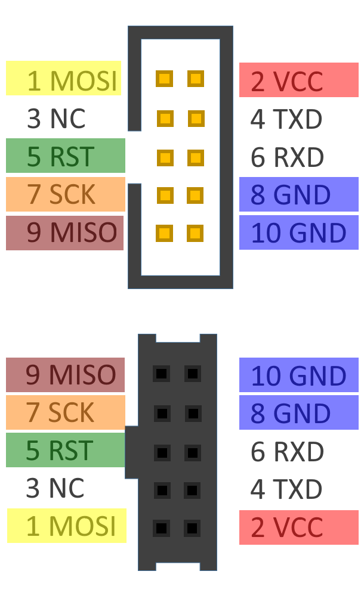
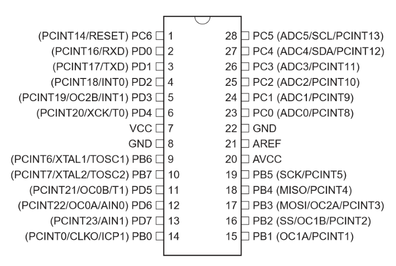

# AVR 入門

## AVRとは？
> AVR is a family of microcontrollers developed since 1996 by Atmel, acquired by Microchip Technology in 2016. These are modified Harvard architecture 8-bit RISC single-chip microcontrollers. AVR was one of the first microcontroller families to use on-chip flash memory for program storage, as opposed to one-time programmable ROM, EPROM, or EEPROM used by other microcontrollers at the time.  
> AVR microcontrollers find many applications as embedded systems. They are especially common in hobbyist and educational embedded applications, popularized by their inclusion in many of the Arduino line of open hardware development boards. (Wikipediaより引用)

組み込み用途で使われるマイコンの一種。  
もともとはAtmelという会社が作っていたが、2016年に競合他社であったMicrochip TechnologyにAtmelが買収され  
いまではそちらの製品になっている。  
Arduino UNOで使用されていることで有名。  

## 特徴
(以下ではAVRの特徴というよりも普通のCPUと比較したときのマイコンの特徴について述べる)

マイコンの基本的な仕組みは普通のCPU(ここではPCで使用されるx64やスマホで使われるARM Cortex Aシリーズなどを指す)と同じだが、  
使用される目的の違いにより普通のCPUと異なる多くの特徴を持っている。
普通のCPUの用途は計算が目的であり、基本的には  
1. 計算速度
1. セキュリティ

の2つの指標が重視される。  
計算速度が重視される理由は言うまでもないだろう(Twitterを見るだけでもっさりするスマホは誰も欲しがらない)。  
セキュリティについては，普通のCPUが使われる環境(PC、スマホ、サーバーなど)ではエンドユーザーが自由にアプリケーションをインストールして実行できるため  
バグのあるプログラムや悪意のあるプログラムが実行された場合にもシステム全体として正しく動作するために重要視される。  
　　
一方でマイコンは計算よりも制御のために使われることが多いので、計算速度よりも省電力性やリアルタイム性などの方が重要視される。  
普通のCPUでも省電力性は重視されるのでは？と思うかもしれないが，マイコンは製品によってはボタン電池1つで年単位で動作するような機器に用いられるということもあり，  
普通のCPUとは桁違いに省電力性能を求められる。  
リアルタイム性については，例えばロボットの制御などの用途を考えると重要性が分かるだろう。  
またマイコンが使われる環境では実行するプログラムが製品出荷時に決まっており、ユーザーが自由にプログラムをインストールできないことが多い  
(例えば炊飯器や洗濯機に別のプログラムをインストールして動作させるということは普通はしない)ので、セキュリティも重要視されない。  

ただし，最近はIoT機器の普及などの影響で組み込み向けであっても従来のマイコンよりも普通のCPUのような特徴を持つマイコンが使われるケースもあり，  
上の説明が当てはまらないこともある。  

- 単純なコア  
  キャッシュメモリ、多段の命令パイプライン、分岐予測、MMU、メモリ空間の分離などの仕組みが無い。  
  キャッシュメモリ、多段の命令パイプライン、分岐予測等は計算速度の向上のために，MMUとメモリ空間の分離等は  
  セキュリティの向上のためにある(それ以外の理由も無いわけではないが)ので，それらが重視されないマイコンではこのような仕組みは搭載されないことが多い。  
  またマイコンでは先述したようにリアルタイム性(最低応答時間)が重視されるが，これらの仕組みは理想的な状況下での計算の最高速度の向上には役に立つが，  
  ワーストケースでの計算速度は変わらないか，むしろ下がることがあり，リアルタイム性と相性が悪いということもある  
  (キャッシュがミスヒットした場合，パイプラインがストールした場合，分岐予測が外れた場合，ページテーブルの切り替えが発生した場合...など)。  
  AVRの場合命令パイプラインは実装されているが，命令フェッチ・デコードの前段と，実行・書き出しの後段の2段だけである。  
- (修正)ハーバードアーキテクチャ  
  普通のCPUはノイマンアーキテクチャといって、プログラムとデータが同じメモリ空間に置かれるが、  
  AVRはプログラムとデータが別のメモリ空間に配置される(これをハーバードアーキテクチャという)。  
  この方式のメリットとして，コアの構造がシンプルになる，命令の読み出しとデータの書き込みが同時に行えるので高速化しやすいという点がある  
  (このため普通のCPUでもキャッシュメモリから見るとハーバードアーキテクチャになっているものも多い)。  
  デメリットとしては、マイコンの実行中にメモリ上のプログラムを書き換えるられないという点が挙げられる。  
  これは普通のCPUとしては大きな問題で、例えば普通のPCでは起動後にストレージに保存してあるプログラムをメモリ上にロードして実行するということが当たり前にできるが、  
  ハーバードアーキテクチャの場合は起動前にメモリ上に書き込んだもの以外のプログラムは原理的に実行できない。  
  それ以外でも，JITコンパイラの使用やスタックを利用したトランポリンなども不可能である。  
  ただし，AVRの場合は専用の命令を使うことでプログラムメモリへのload/storeを行うことも一応できる  
  (このような制約付きながらプログラムメモリの書き換えができるアーキテクチャのことを修正ハーバードアーキテクチャというらしい)。  
  しかし，AVRの場合データメモリの実装はSRAMを使用しているのに対しプログラムメモリはFlashROMを使用しているので，  
  メモリの書き換え速度や耐用回数の面から考えてプログラムの実行中に頻繁にプログラムメモリを書き換えるということは現実的ではない  
  (ただし，プログラムメモリからの定数値の読み込みはデータメモリの節約のために頻繁に行われる)。  
- オールインワンのパッケージ  
  CPUだけでなく、メモリ(SRAM, FlashROM, EEPROM)、オシレータ、A/Dコンバータ、タイマーなどが乗っている。  

## 環境構築
1. マイコンとライターを購入
   マイコンは秋月電子などで購入できる。  
   今回は Atmega328p(http://akizukidenshi.com/catalog/g/gI-03142/) を使用する。  
   ライターも以前は秋月電子で購入できたのだが、今は何故か1万円程度の無駄に高級なものしか販売していないので、amazonで適当に安いのを買う。  
   今回はこちら(https://www.amazon.co.jp/gp/product/B011DT3MIS/)のライターを買ったのでこれを使う。
2. ライターのドライバとコンパイラをインストール  
   まずライターのドライバだが，[Zadig](https://zadig.akeo.ie/)というツールを使ってインストールする。  
   MacやLinuxの場合はドライバのインストールは不要らしい。  
   コンパイラなどのツールチェインについてはMicrochip社が公開しているAtmel StudioというIDEが存在するのだが，  
   面倒なのでコンソールで使えるコマンドラインツールだけインストールする。  
   Microchip社のホームページ[https://www.microchip.com/mplab/avr-support/avr-and-arm-toolchains-c-compilers]からダウンロードする。  
   アカウントの登録が必要なのだが，面倒な人はSourceforge[https://sourceforge.net/projects/winavr/]から古いツールチェインを落としてもよい。  
   ちなみに公式から提供されているこれらのコンパイラはGCCベースだが，有志によるclang/llvmベースのコンパイラもあるらしい。  
   Ubuntuの場合はaptでもインストールできるのでそれでよいだろう。
   Macの場合はhomebrewでインストールできる。

Ubuntu
```bash
$ sudo apt install binutils-avr gcc-avr avr-libc avrdude
```
(コンパイルのコマンドは`avr-gcc`なのだがパッケージ名は何故か`gcc-avr`である。謎だ...)

Mac
```bash
$ brew tap osx-cross/avr
$ brew install avr-gcc avrdude
```
ちなみネットで検索すると，「Macの場合はCrosspack-avrというパッケージをインストールすればよい」という情報がヒットするが，  
Crosspack-avrは32bitアプリであり最新版のMacOSで動作しないのでやめた方がいい。  

#### Atmega328pとAtmega1284pのスペック   
||Atmega328p|AMD Ryzen5 3600|
|--|--|--|
|bit数|8|64|
|クロック|出荷時1MHz, 最大20MHz|3.6GHz(ブースト時4.2GHz)|
|メモリ|プログラムメモリ(FlashROM) 32kB, データメモリ(SRAM) 2kB, 拡張メモリ空間含めて64kB |L3キャッシュ32MB, SDRAM 最大数百GB程度|
|消費電力|0.4mw(ActiveMode, 1.8V動作時)|65w|
|価格|250円|23900円|

ATmega328pとATmega1284pの比較
| |328p|1284p|
|:--|:--|:--|
|FlashROM|32kB|128kB|
|SRAM|2kB|16kB|
|EEPROM|1kB|4kB|
|USART|1ch|2ch|
|Pin数|28本|40本|


## Lチカ
電子工作の世界でのHello WorldはLEDをチカチカさせると相場が決まっている(これをLチカという)ので，やってみる。  

1: 適当なエディタでコードを書いて保存する。  
```c
#include<avr/io.h>
#include<util/delay.h>

int main(void) {
   DDRD = 0xFF;      // ポートDの全ピンを出力モードに設定
   PORTD = 0x00;     // ポートDの全ピンの出力をLowに

   while(1) {
      _delay_ms(1000); // 1000ミリ秒ビジーウェイトする
      PORTD = 0x01;    // ポートDの1番ピンの出力をHighに，それ以外のピンをLowに
      _delay_ms(1000);
      PORTD = 0x00;    // ポートDの全ピンの出力をLowに
   }

   return 0;
}
```

2: コンパイルする。  
コンパイルのコマンド
```bash
$ avr-gcc -mmcu=atmega1284p ./lchika.c -Os -o lchika.elf
```
これでelf形式のバイナリができるが，マイコンに書き込むにはhex形式に変換しないといけないので  
次のコマンドで変換する。  
```bash
$ avr-objcopy -I elf32-avr -O ihex lchika.elf lchika.hex
```

3: ライターを経由してPCとマイコンを接続する。  
USBaspの場合はUSBでつなぐのでPCにそのまま挿せば良い。  
PCがUSBaspを認識しているかどうかは次のコマンドで確認できる。

```bash
$ avrdude -c usbasp
avrdude: No AVR part has been specified, use "-p Part"

Valid parts are:
  uc3a0512 = AT32UC3A0512
  c128     = AT90CAN128
  c32      = AT90CAN32
  ...(色々表示)
  x64d4    = ATxmega64D4
  x8e5     = ATxmega8E5
  ucr2     = deprecated, use 'uc3a0512'
```
コマンドを実行して上のような表示が出ればOK  
(これは本来はマイコンの指定がされていないエラー表示である)  
avrdudeはライターを操作するコマンドラインツールである。  

PC側が接続できたら、マイコン側を接続する。  
USBaspとATmega328pのピンアサインは下の画像の通りなので、それに合わせてジャンパーワイヤーなどで対応するピンを導通させる。  

USBaspのピンアサイン  


ATmega328pのピンアサイン  


SCK: Serial Clock  
MISO: Master In Slave Out  
MOSI: Master Out Slave In  

4: ライターを使ってプログラムを書き込む。
```bash
$ avrdude -c usbasp -P usb -p m1284p -U flash:w:lchika.hex -v 
```

1秒おきにLEDがチカチカしたら成功。

## アセンブラを見てみる
avrのアセンブラには次のような特徴がある。  
- 演算はレジスタ-レジスタ間のみ (x86の場合は算術命令のオペランドにメモリをとることができる)
- 即値の転送にはmovではなくldi命令を使う (x86の場合はmov)
- 間接参照に使えるレジスタはX, Y, Zの3つのみ (x86の場合は何でも)
- プログラムメモリへのload, storeはlpm, spmという専用命令を使う (x86の場合はプログラムメモリという概念は無いし，メモリアクセスもmov)
- スタックポインタやステータスレジスタがI/Oレジスタ扱いになっているためそれらにはin/out命令でアクセスする (x86の場合はmov)

実際にアセンブラを読んでいくが，先ほどのLチカの例は実のところ結構複雑なので  
もっと簡単な何もしないプログラムを書いてアセンブラを見てみよう。  

何もしないプログラム
```c
int main() { return 0; }
```

コンパイル結果
```S
	.file	"nop.c"
__SP_H__ = 0x3e
__SP_L__ = 0x3d
__SREG__ = 0x3f
__tmp_reg__ = 0
__zero_reg__ = 1
	.text
.global	main
	.type	main, @function
main:
/* prologue: function */
/* frame size = 0 */
/* stack size = 0 */
.L__stack_usage = 0
	ldi r24,0
	ldi r25,0
	ret
	.size	main, .-main
	.ident	"GCC: (GNU) 5.4.0"
```

まず，上の方の
```S
__SP_H__ = 0x3e
__SP_L__ = 0x3d
__SREG__ = 0x3f
__tmp_reg__ = 0
__zero_reg__ = 1
```
の部分は，スタックポインタやステータスレジスタのアドレスの設定をしている。  
レジスタのアドレスとは...(哲学)という感じだが，実はAVRはレジスタもメモリ空間にマップされているので，  
一部のレジスタへのアクセスはアドレス指定で行う(ただし汎用レジスタへのアクセスは普通にレジスタ名を指定する)。  
(メモリマップドI/OだからI/Oレジスタがメモリ空間にマップされているというのは分かるが，汎用レジスタまでメモリ空間にマップする必要があるのか，  
ステータスレジスタをI/Oレジスタ扱いする必要があるのか...ｺﾚｶﾞﾜｶﾗﾅｲ)

`__SP_H__``__SP_L__`はスタックポインタの上位8bit、下位8bitの意味で、　　
`__SREG__`はステータスレジスタ(キャリーフラグ、ゼロフラグなどの演算結果のフラグの他、割り込み許可フラグもここ)の意味。
AVRシリーズならこれらのアドレスは共通である。  


次にmain関数を見てみる。  
```S
main:
/* prologue: function */
/* frame size = 0 */
/* stack size = 0 */
.L__stack_usage = 0
	ldi r24,0
	ldi r25,0
	ret
	.size	main, .-main
	.ident	"GCC: (GNU) 5.4.0"
```
Intel記法なので，オペランドの順番は`op dest src`である。  
r24とr25のレジスタに0を割り当てているが、これはmain関数の戻り値が0なのでそうしている。  
AVR-GCCの関数呼び出し規約(calling convention)では、レジスタで収まる場合は戻り値はレジスタで返すことになっている。    
avr-gccではintは16bitだが，AVRのレジスタ長は8bitなのでr24とr25の2つのレジスタで戻り値を返している。  

## objdumpしたアセンブラを見てみる
次に，objdumpして実際にマイコンに書き込まれるバイナリを見てみよう。

```bash
$ avr-objdump -d nop.elf > nop.dump
```

```S
nop.elf:     file format elf32-avr

Disassembly of section .text:

00000000 <__vectors>:
   0:	0c 94 34 00 	jmp	0x68	; 0x68 <__ctors_end>
   4:	0c 94 3e 00 	jmp	0x7c	; 0x7c <__bad_interrupt>
   8:	0c 94 3e 00 	jmp	0x7c	; 0x7c <__bad_interrupt>
   c:	0c 94 3e 00 	jmp	0x7c	; 0x7c <__bad_interrupt>
  10:	0c 94 3e 00 	jmp	0x7c	; 0x7c <__bad_interrupt>
  14:	0c 94 3e 00 	jmp	0x7c	; 0x7c <__bad_interrupt>
  18:	0c 94 3e 00 	jmp	0x7c	; 0x7c <__bad_interrupt>
  1c:	0c 94 3e 00 	jmp	0x7c	; 0x7c <__bad_interrupt>
  20:	0c 94 3e 00 	jmp	0x7c	; 0x7c <__bad_interrupt>
  24:	0c 94 3e 00 	jmp	0x7c	; 0x7c <__bad_interrupt>
  28:	0c 94 3e 00 	jmp	0x7c	; 0x7c <__bad_interrupt>
  2c:	0c 94 3e 00 	jmp	0x7c	; 0x7c <__bad_interrupt>
  30:	0c 94 3e 00 	jmp	0x7c	; 0x7c <__bad_interrupt>
  34:	0c 94 3e 00 	jmp	0x7c	; 0x7c <__bad_interrupt>
  38:	0c 94 3e 00 	jmp	0x7c	; 0x7c <__bad_interrupt>
  3c:	0c 94 3e 00 	jmp	0x7c	; 0x7c <__bad_interrupt>
  40:	0c 94 3e 00 	jmp	0x7c	; 0x7c <__bad_interrupt>
  44:	0c 94 3e 00 	jmp	0x7c	; 0x7c <__bad_interrupt>
  48:	0c 94 3e 00 	jmp	0x7c	; 0x7c <__bad_interrupt>
  4c:	0c 94 3e 00 	jmp	0x7c	; 0x7c <__bad_interrupt>
  50:	0c 94 3e 00 	jmp	0x7c	; 0x7c <__bad_interrupt>
  54:	0c 94 3e 00 	jmp	0x7c	; 0x7c <__bad_interrupt>
  58:	0c 94 3e 00 	jmp	0x7c	; 0x7c <__bad_interrupt>
  5c:	0c 94 3e 00 	jmp	0x7c	; 0x7c <__bad_interrupt>
  60:	0c 94 3e 00 	jmp	0x7c	; 0x7c <__bad_interrupt>
  64:	0c 94 3e 00 	jmp	0x7c	; 0x7c <__bad_interrupt>

00000068 <__ctors_end>:
  68:	11 24       	eor	r1, r1
  6a:	1f be       	out	0x3f, r1	; 63
  6c:	cf ef       	ldi	r28, 0xFF	; 255
  6e:	d8 e0       	ldi	r29, 0x08	; 8
  70:	de bf       	out	0x3e, r29	; 62
  72:	cd bf       	out	0x3d, r28	; 61
  74:	0e 94 40 00 	call	0x80	; 0x80 <main>
  78:	0c 94 43 00 	jmp	0x86	; 0x86 <_exit>

0000007c <__bad_interrupt>:
  7c:	0c 94 00 00 	jmp	0	; 0x0 <__vectors>

00000080 <main>:
  80:	80 e0       	ldi	r24, 0x00	; 0
  82:	90 e0       	ldi	r25, 0x00	; 0
  84:	08 95       	ret

00000086 <_exit>:
  86:	f8 94       	cli

00000088 <__stop_program>:
  88:	ff cf       	rjmp	.-2      	; 0x88 <__stop_program>
```

`avr-gcc -S` でコンパイルした結果と `objdump` で逆アセンブルした結果が異なっている。  
これは実際にマイコン上で実行するバイナリには、各レジスタの初期化処理などのスタートアップルーチンなどがリンクされているからである。  
(これはAVRに限ったことではなく、普通のLinuxでC言語のコードをコンパイルして逆アセンブルしても同じように異なった結果になる)  
他に気付くこととして，x86のバイナリと違って機械語の列が縦に揃っている。  
これはAVRの機械語が16bitの固定長命令であるからである。  
ただし，即値のジャンプと関数呼び出しはジャンプ先のアドレスとして16bitの値を指定する必要があるので32bitになっている。  
Linuxで普通にコンパイル・リンクしたコードを逆アセンブルするとLibCやら何やらがリンクされてよく分からんという感じになるが、  
上のアセンブラ程度なら何をやっているのか読み解くのは難しくないので見ていこう。  

### `__vectors`
```S
00000000 <__vectors>:
   0:	0c 94 34 00 	jmp	0x68	; 0x68 <__ctors_end>
   4:	0c 94 3e 00 	jmp	0x7c	; 0x7c <__bad_interrupt>
   ...
```
これは割り込みベクタテーブルと呼ばれる部分である。  
これは割り込みが発生した際にどの関数を呼び出すかを決めている部分であり，今回は割り込みは使用しないので  
0番地(RESET)だけ`__ctors_end`のアドレスが設定されていて，それ以外は`__bad_interrupt`のアドレスが設定されている。  

### `__ctors_end`
```S
00000068 <__ctors_end>:
  68:	11 24       	eor	r1, r1            ; r1レジスタを0梅 (eorはオペランドのxorをとる命令)
  6a:	1f be       	out	0x3f, r1	; 63     ; SREG(ステータスレジスタ)を0梅
  6c:	cf ef       	ldi	r28, 0xFF	; 255 ; 即値をレジスタにload
  6e:	d8 e0       	ldi	r29, 0x08	; 8
  70:	de bf       	out	0x3e, r29	; 62  ; スタックポインタの上位8bitに0xFFを割り当て 
  72:	cd bf       	out	0x3d, r28	; 61  ; スタックポインタの下位8bitに0x08を割り当て(SP全体の値は0x08FF(=2303)になる)
  74:	0e 94 40 00 	call	0x80	; 0x80 <main>
  78:	0c 94 59 00 	jmp	0xb2	; 0xb2 <_exit>
```
`ctors`は`constructors`の略で，初期化処理をしている(なぜ`end`が付いているのか...コレガワカラナイ)。 

やっていることは  
- ステータスレジスタを0埋め
- スタックポインタの初期化

の2つである。  
AVRは起動時にステータスレジスタはハードウェア的に0に初期化されるが、ハードウェアの不具合の可能性も考えて念の為  
ソフトウェア的にも初期化している...らしい。  
スタックポインタの初期値は0x08FF(十進数で2303)になっているが、ATmega328pはSRAMが2048byteしかないのでSRAMからはみ出ている。  
これは、AVRの場合レジスタもメモリ空間にマップされているためで、このために実際のSRAMの大きさよりも有効なメモリ空間が少し大きくなっている。  
ATmega328pの場合は汎用レジスタ32個分 + I/Oレジスタ64個分 + 拡張I/Oレジスタ160個分の合計256個(byte)，アドレス0x00~0xFFまでがSRAMがマップされているアドレスよりも上位にあるので、  
レジスタ:256byte + SRAM:2048byte の合計2304byte分(0～2303)が有効なメモリアドレスということになる(データシートの19ページを参照)。  

余談だが，この`ctors`ブロックはAVR独特のものではない。  
GCCには独自機能としてconstructor属性，destructor属性というものがあり，  
main関数の実行前，実行後に実行するコードを記述することができる。  

constructor, destructorを使った例
```c
#include<stdio.h>

__attribute((constructor))
void start() {
   printf("Start\n");
}

__attribute((destructor))
void end() {
   printf("End\n");
}

int main() {
   printf("Hello World\n");
   return 0;
}
```

### `_exit`
```s
000000b2 <_exit>:
  b2:	f8 94       	cli
```
割り込み禁止を設定している(`cli`はclear intrruptの略)。  
これは，割り込みが有効だとプログラムが終了しても割り込みが発生すると割り込みハンドラにジャンプして  
もう一度プログラムの実行が始まってしまうことがあるからである。  

### `__stop_program`
```S
00000088 <__stop_program>:
  88:	ff cf       	rjmp	.-2      	; 0x88 <__stop_program> ; PC相対無条件ジャンプ
```
プログラムが終了した後に変なことが起きないよう無限ループしている。  
これ要るのか？と思うかもしれないが、マイコンのFlashROMの後ろにはハードウェアで使うプログラムが書き込まれていることがあり、  
プログラムの実行が続いてPCがそこまでたどり着いたりすると困ったことになるし、そもそもFlashROMの未使用領域を毎回NOPで埋めるのも無駄である。  

ただし、組み込みプログラムというのは基本的にアプリケーション側で無限ループするものがほとんど(GUIのアプリやサーバーのプログラムと同じ)であり、  
実際にここに到達するようなプログラムは(実用的なものでは)無いと考えてよい。  

## 入力
前回はAVRから信号の出力(Lチカ)を試したが，今度はAVRへ信号の入力を試してみよう。  
スイッチを押すとLEDが光るという回路を作ってみる。  
PORTBの0番ピンをプルアップしてスイッチに繋ぎ，PORTBの1番ピンをLEDに繋ぐ。  

```c
#include<avr/io.h>

int main() {
    DDRB = 0xFE;  // PORTBの0番ピンを入力モードに，それ以外のピンを出力モードに設定
    PORTB = 0x00; // 出力ピン: 出力をLowに
                  // 入力ピン: 内部プルアップを無効に

    while (1) {
        if (PINB & 0x01) { // PINBの最下位ビットをチェック
            PORTB = 0x02;
        } else {
            PORTB = 0x00;
        }        
    }
 
    return 0;
}
```

まず，今回はPORTBのピンを使用するので`DDRB`という変数へ値を書き込み，PORTBの0番ピンを入力モードに，それ以外のピンを出力モードに設定している。  
次に`PORTB = 0x00`の意味だが，これは対象のピンが出力モードか入力モードによって動作が異なる。  
ピンが出力モードの時は前回やったように`0`の時に出力がLow，`1`の時に出力がHighになるが，  
ピンが入力モードの時は`0`の時は内部プルアップが無効，`1`の時は内部プルアップが有効という意味になる。  
普通，マイコンの入力ピンは解放状態(回路的にどこにも繋がっていない状態)になると入力値が不定になってしまうので，Vcc又はGNDのどちらかには常に接続されているように回路を組む。  
このときに，Vcc側に接続することをプルアップ，GND側に接続するすることをプルダウンという。  
(この辺の事情をよりちゃんと知りたい人は『CPUの創りかた』を読むのをおすすめする)  

しかし，AVRには内部プルアップという機能があり，ピンが解放状態であってもマイコン内部でVccに繋げた状態にするということができる。  
これを使えばプルアップ抵抗を付けなくてもよいらしいのだが...使ったことがないのと何か不安なので今回は使わなかった。  

入力ピンの状態を知るには`PINB`という変数の値を調べればよい。  
今回はPORTBの0番ピンの状態を知りたいので`PINB`の最下位ビットの値を調べればよい(入力がHighなら1, Lowなら0になる)。  
出力モードのピンに該当する`PINB`のビットがどうなっているかよく分からないので，マスクをかけて最下位ビットだけ調べている。  

...が，実はビットの状態を調べるために`bit_is_set`と`bit_is_clear`という便利な関数が用意されているので，そちらを使ってもよい。  

```c
#include<avr/io.h>

int main() {
    DDRB = 0xFE;  // PORTBの0番ピンを入力モードに，それ以外のピンを出力モードに設定
    PORTB = 0x00; // 出力ピン: 出力をLowに
                  // 入力ピン: 内部プルアップを無効に

    while (1) {
        if (bit_is_set(PINB, PINB0)) { // PINBの最下位ビットをチェック
            PORTB = 0x02;
        } else {
            PORTB = 0x00;
        }        
    }
 
    return 0;
}
```

### 割り込み
上のコードでも動くことは動くのだが，実際の応用を考えると上のようなコードでは困ったことになる。  
というのも上のコードではPINBの入力をビジーループで監視しているので，他のタスクを実行することができない。  
かといって他のタスクを実行するとその間はPINBの入力を監視できない。  

> PINBを監視しなければ，入力を受け取れない。  
> PINBを監視したままでは，他のタスクが実行できない。  
> (Bleach 5巻 オサレポエム)  

そこで使われるのが割り込み(interrput)である。  
割り込みとはその名の通り，CPUが実行中の処理に割り込んで，今までの処理とは無関係にいきなり別の処理(関数)を実行させる機能である。  
割り込みにはハードウェア的に発生する外部割り込みと，ソフトウェア的に発生する内部割り込みの2種類があるが，AVRには内部割り込みは存在しない。  
ATmega328pで使用できる割り込みイベントの一覧を下に示す。  

|Vector No.|Program Address|Source|Interrupt Definition|
|:--|:--|:--|:--|
|1 |0x0000|RESET|External pin, power-on reset, brown-out reset and watchdog system reset|
|2 |0x0002|INT0|External interrupt request 0|
|3 |0x0004|INT1|External interrupt request 1|
|4 |0x0006|PCINT0|Pin change interrupt request 0|
|5 |0x0008|PCINT1|Pin change interrupt request 1|
|6 |0x000A|PCINT2|Pin change interrupt request 2|
|7 |0x000C|WDT|Watchdog time-out interrupt|
|8 |0x000E|TIMER2 COMPA|Timer/Counter2 compare match A|
|9 |0x0010|TIMER2 COMPB|Timer/Counter2 compare match B|
|10|0x0012|TIMER2 OVF|Timer/Counter2 overflow|
|11|0x0014|TIMER1 CAPT|Timer/Counter1 capture event|
|12|0x0016|TIMER1 COMPA|Timer/Counter1 compare match A|
|13|0x0018|TIMER1 COMPB|Timer/Counter1 compare match B|
|14|0x001A|TIMER1 OVF|Timer/Counter1 overflow|
|15|0x001C|TIMER0 COMPA|Timer/Counter0 compare match A|
|16|0x001E|TIMER0 COMPB|Timer/Counter0 compare match B|
|17|0x0020|TIMER0 OVF|Timer/Counter0 overflow|
|18|0x0022|SPI, STC|SPI serial transfer complete|
|19|0x0024|USART, RX|USART Rx complete|
|20|0x0026|USART, UDRE|USART, data register empty|
|21|0x0028|USART, TX|USART, Tx complete|
|22|0x002A|ADC|ADC conversion complete|
|23|0x002C|EE READY|EEPROM ready|
|24|0x002E|ANALOG|COMP Analog comparator|
|25|0x0030|TWI|2-wire serial interface|
|26|0x0032|SPM|READY Store program memory ready|
(ATmega328p Datasheet 49pより引用)

今回はINT0を使ってみる。
ATmega1284pのピン配置を見るとINT0に使えるのは16番ピン(PORTDの2番ピン)なので，スイッチを16番ピンに接続する。  

```c
#include<avr/io.h>
#include<util/delay.h>
#include<avr/interrupt.h>

ISR (INT0_vect) { 
   PORTB = PORTB ^ 0x01;    
}

int main() {
   DDRB = 0xFF;   // PORTBの全ピンを出力モードに
   PORTB = 0x00;  // PORTBの全ピンの出力をLowに
   DDRD = 0x00;   // PORTDの全ピンを入力モードに
   PORTD = 0x00;

   EIMSK = 0x01;  // INT0の割り込みを許可
   EICRA = 0x01;  // INT0ピンの論理変化で割り込みが発生するように設定

   sei();         // 全体の割り込み許可

   while(1) {}

   return 0;
}
```
`ISR`というキーワードが現れたが，これは`avr/interrupt.h`の中に定義されている関数形式マクロで，  
引数として割り込みのイベント名を指定し，この中に割り込みが発生した際にする処理を記述する。  
マクロの定義とマクロを展開した結果を見てみよう。  

マクロの定義
```c
define ISR(vector, ...) \
   void vector (void) __attribute__ ((signal,__INTR_ATTRS)) __VA_ARGS__; \
   void vector (void)
```

マクロを展開して整形したコード
```c
void __vector_1 (void) __attribute__ ((signal,used, externally_visible));
void __vector_1 (void) {
  (*(volatile uint8_t *)((0x05) + 0x20)) = (*(volatile uint8_t *)((0x05) + 0x20)) ^ 0x01;
}
```

やっていることは引数で指定された名前で関数を定義してattributeを設定しているだけである。  
このように，割り込みが発生した際に実行する関数のことを割り込みハンドラという(Webのイベントハンドラと同じ)。  
ここで指定されている3つのattributeの意味を下に示す。  
- `signal`: 割り込みハンドラであることを表す
- `used`: 関数が他のコードから参照されていなくても必ずコンパイル後のコードに出力することを表す
- `externally_visible`: 関数(シンボル)が他から参照できるようにすることを表す。普通は付けなくても問題ないが，
   `-fwhole-program`というオプションを指定された時に問題になるので付いている。  

注意点として，あくまで関数を定義しているだけなので割り込みイベント名をミスタイプしてもコンパイルエラーにならない。
ミスタイプしないように割り込みハンドラを書くときはavr-gccのリファレンスからコピペしてくるのが良い。  

[https://www.nongnu.org/avr-libc/user-manual/group__avr__interrupts.html]  

同じAVRであってもマイコンの種類によっては使える割り込みと使えない割り込みがあるので，使用するマイコンが  
どの割り込みに対応しているかも事前にこのページで調べておいた方がよい。  

コンパイル後のバイナリをobjdumpしてみよう。  

```s
int0_vec.elf:     file format elf32-avr


Disassembly of section .text:

00000000 <__vectors>:
   0: 0c 94 46 00    jmp   0x8c  ; 0x8c <__ctors_end>
   4: 0c 94 52 00    jmp   0xa4  ; 0xa4 <__vector_1>
   8: 0c 94 50 00    jmp   0xa0  ; 0xa0 <__bad_interrupt>
   c: 0c 94 50 00    jmp   0xa0  ; 0xa0 <__bad_interrupt>
   ...

000000a4 <__vector_1>:
  a4: 1f 92          push  r1
  a6: 0f 92          push  r0
  a8: 0f b6          in r0, 0x3f ; 63
  aa: 0f 92          push  r0
  ac: 11 24          eor   r1, r1
  ae: 8f 93          push  r24
  b0: 9f 93          push  r25
  b2: 95 b1          in r25, 0x05   ; 5
  b4: 81 e0          ldi   r24, 0x01   ; 1
  b6: 89 27          eor   r24, r25
  b8: 85 b9          out   0x05, r24   ; 5
  ba: 9f 91          pop   r25
  bc: 8f 91          pop   r24
  be: 0f 90          pop   r0
  c0: 0f be          out   0x3f, r0 ; 63
  c2: 0f 90          pop   r0
  c4: 1f 90          pop   r1
  c6: 18 95          reti
```

__vector_1という関数(シンボル)が割り込みベクタテーブルにあることが分かる。  

## タイマー割り込みでLチカ
前回サンプルで示したLチカのコードでは`_delay_ms`という関数を使っていたが，これはCPUを指定時間に相当する回数だけ
ビジーループさせて待つという実装になっているので，上で最初に示したコードと同様の問題を抱えている。  
そこでこちらでも割り込みを使ってみよう。  

指定時間事に割り込みを実行するにはいろいろな方法があるが，今回はTimer0のオーバーフローイベントを使う。  
AVRのタイマーは8bitで1クロックごとにカウントアップし，255を超えると0に戻り，その際に割り込みが発生する。  
現在のCPUのクロックは1MHz(= 10^6 Hz)なので，255 uSec(= 0.255 mSec) ごとに割り込みが発生することになる。  

このままでは少々扱い辛いのでプリスケーラというものを使う。  
これはタイマーのクロックを下げる機能で，最低でシステムのクロックの1024分の1に設定できる。  
こうすると割込み発生の間隔はおよそ10^3倍になるので，だいたい250mSecごとに割り込みが発生することになる。  

```c
#include<avr/io.h>
#include<util/delay.h>
#include<avr/interrupt.h>

ISR (TIMER0_OVF_vect) { 
    PORTB = PORTB ^ 0x01;    
}

int main() {
    DDRB = 0xFF;   // PORTBの全ピンを出力モードに
    PORTB = 0x00;  // PORTBの全ピンの出力をLowに
    TCNT0 = 0;     // Timer0のカウントを0に
    // TCCR0A = 0x00;
    TCCR0B = 0b00000101; // プリスケーラの設定を CLK/1024 に
    TIMSK0 = 0x01; // TIMER0 OVF の割り込みを許可

    sei();        // 全体の割り込み許可

    while(1) {}

    return 0;
}
```

## 参考資料
USBaspについて [https://ht-deko.com/arduino/usbasp.html]  
AVR命令セット [http://www.cs.shinshu-u.ac.jp/~haeiwa/m-com/instruction.html]  
Ubuntu 14.04.3 LTSでAVRマイコン開発 [https://qiita.com/kktk-KO/items/5098edfb95c2b71996b0]  
AVR-GCC initialization code [https://electronics.stackexchange.com/questions/383026/avr-gcc-initialization-code]  
GCC Wiki avr-gcc [https://gcc.gnu.org/wiki/avr-gcc]  
AVR命令一式手引書 [https://avr.jp/user/DS/PDF/AVRinst.pdf]  
ATmega328/328p データシート(日本語訳) [https://avr.jp/user/DS/PDF/mega328P.pdf]  
Mac OSXにおける近代的なAVRマイコン開発環境 [http://shokai.org/blog/archives/5557]  
AVR Wiki [https://dbpro.xyz/avrwiki/wiki.cgi?page=FrontPage]  
