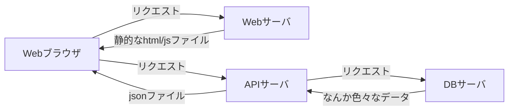
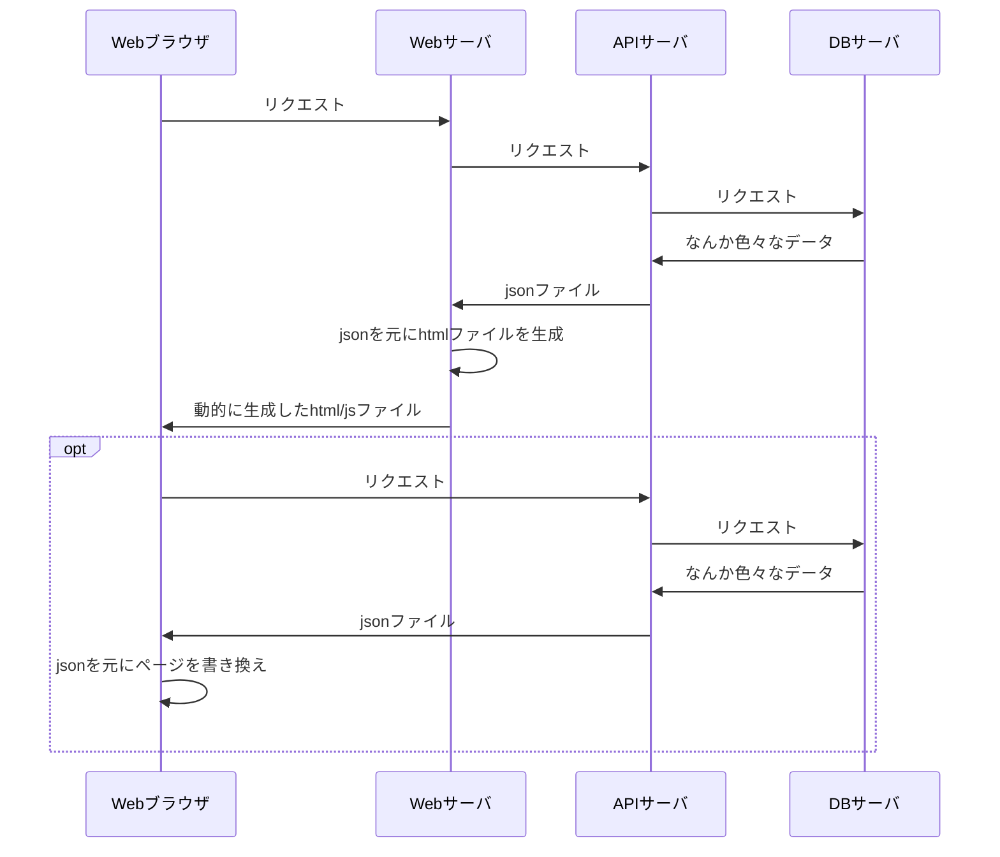
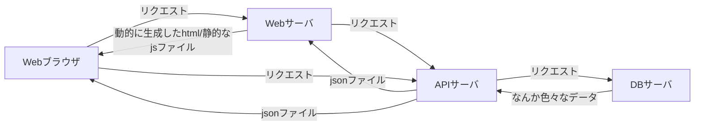
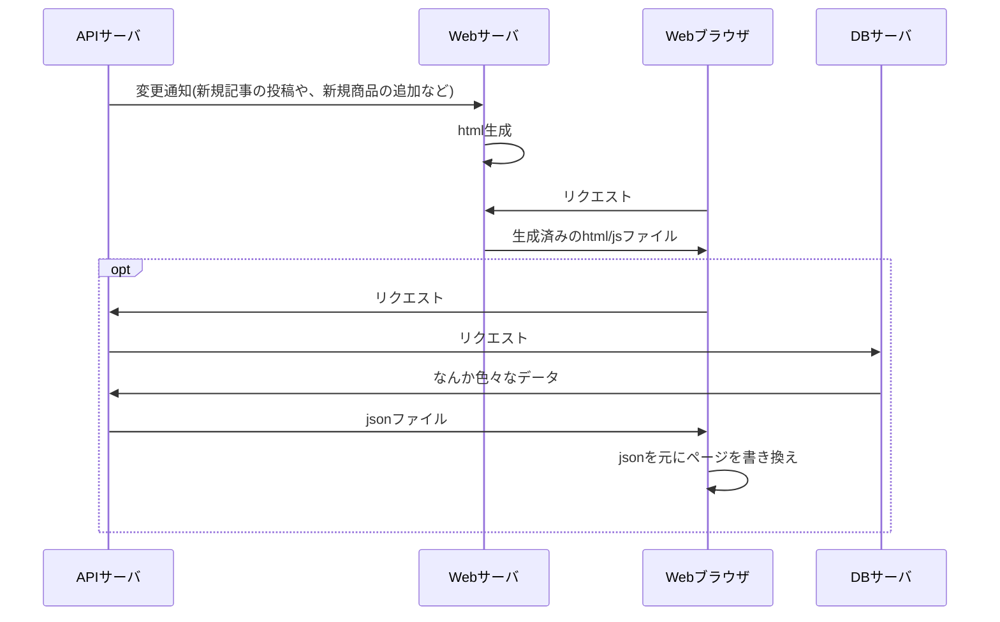

# Next.js 入門

> The React Framework for Production
> Next.js gives you the best developer experience with all the features you need for production: hybrid static & server rendering, TypeScript support, smart bundling, route pre-fetching, and more. No config needed.

## はじめに
Next.jsとは vercelという会社が作っているReact製のフレームワークである。  
素のReactでWebアプリを作ろうとすると、大体webpackやtypescriptの設定で詰まったり、cssどうするか問題に直面したり、ルーティングどうする問題に直面したりするのだが、Next.jsを使うとこの辺を最初からいい感じにしてくれる。
これだけだとメリットが薄い気がするが、他のありがたい特徴としてSSR/SSGをサポートしているというのがある。

### SSG/SSR
ReactのようなSPAフレームワークで作成したページは最終的に静的なhtml/javascriptに変換され、実際のページの表示はブラウザ上のjavascriptによって行われる。  
これにより、ページ遷移が高速化する、ページ遷移時に画面をリフレッシュしないのでUXが向上する(ほんまか？)、ネイティブアプリと設計を共通化できる等の利点が生まれる訳だが、一方でSPAゆえの欠点も生まれる。

例えば...
- 一般的にSPAではアプリ全体が単一のhtml/javascriptとしてビルドされる(code splittingをしない場合)ので、ビルド後のファイルが大きくなり初回のページ表示に時間がかかる
- UXがクライアント側の性能に左右されやすい
- クローラと相性が悪い
  - GoogleのクローラはJavaScriptを解釈するのでSEO的にはSPAが不利になることは無いらしい
  - TwitterやFacebookのクローラはJavaScriptを解釈しないので、そのままでは動的にOGPを設定することができない
  - Internet Archiveのwayback machine、Web魚拓、ブラウザの「ページを保存」機能などとも相性が悪い

そこで、これらの欠点を解消するために SSR(Server Side Renderring) という技術が存在する。  
要するに「初回のページ読み込み時はサーバーで生成した完成済みのhtmlファイルを返し、一度ページを表示した後のアプリ内のページ遷移はクライアント側のJavaScriptで行う」という発想である。
これによりSPAとMPA(Multi Page Application、SPAでない普通のWebサイトのこと)のいいとこ取りができる。  

またECサイトの商品ページやブログ記事のように一度生成されたら内容が変わらないページの場合は、あらかじめhtmlファイルを生成しておき、クライアントからのリクエストが来た時点で完成済みのhtmlを返すようにするということもできる。  
このような技術を SSG(Server Side Generation) という。

(普通SSRといった場合は上の説明のようにSPAの初回レンダリングをサーバーで行うことを指すが、時々Ruby on RailsやLaravelのような普通のサーバーサイドフレームでWebページを生成することも含めてSSRと呼ぶ人もいるので言葉の使い方に注意が必要である)

図

俺たちの愛した90~00年代前半のWebサイト


動的なWebサイト(MPA)


SPA 


SPA (SSRあり)




SPA (SSGあり)


## やってみる
`create-next-app`でプロジェクトを生成できる。
```bash
$ npx create-next-app@latest next-sandbox --typescript
$ cd next-sandbox
$ npm i
```

コマンドの実行が終わると以下のような構成でディレクトリが作られる。
```
.
├── README.md
├── next-env.d.ts
├── next.config.js
├── node_modules
├── package.json
├── pages
│   ├── _app.tsx
│   ├── api
│   └── index.tsx
├── public
│   ├── favicon.ico
│   └── vercel.svg
├── styles
│   ├── Home.module.css
│   └── globals.css
├── tsconfig.json
└── yarn.lock
```

### Routing
Next.jsはファイルシステムベースのルーティングを採用しており、`pages`ディレクトリ以下にファイルを作ると自動的にそのパスにルーティングされるようになっている。  
例えば、`pages`以下に下のような`about.tsx`というファイルを作成すると、`/about`に
```typescript
function About(): JSX.Element {
  return <div>About</div>;
}
export default About;
```

動的なルーティングをしたい場合は`[id].tsx`のように、`[]`を使ったファイル名でファイルを作成する。
```typescript
import { useRouter } from 'next/router';

function Post() {
  const router = useRouter();

  return <div>{router.query.id}</div>
}

export default Post;
```

### SSR
先程作った`about`コンポーネントのように、外部データやパスに依存しないページの場合は何もしなくてもSSRされる。

`[id].tsx`のようにパスの一部や外部APIのデータを使う場合には、`getServerSideProps`という関数を定義してそこでコンポーネントに渡すpropsを作成することができる。
```typescript
import { GetServerSideProps } from 'next';

function Post(props: { id: string | undefined }) {
  return <div>{props?.id}</div>
}

export const getServerSideProps: GetServerSideProps = async context => {
  const id = context.params?.id

  return {
    props: {
      id
    }
  }
}

export default Post;
```

### SSG
`npm run build`でビルドを行うと、静的生成可能なページのhtmlが生成される。  
ビルド時にパスの一部や外部APIのデータが必要な場合は`getStaticPaths`と`getStaticProps`という関数を定義して、コンポーネントに渡すpropsを作成することができる。

SSRとの違いとして、当然ビルド時に存在するデータしか使えないので新しいページが必要になったタイミング(ブログだったら新規記事の追加、ECサイトなら新規商品の追加など)で新しいページをビルドする必要がある。
