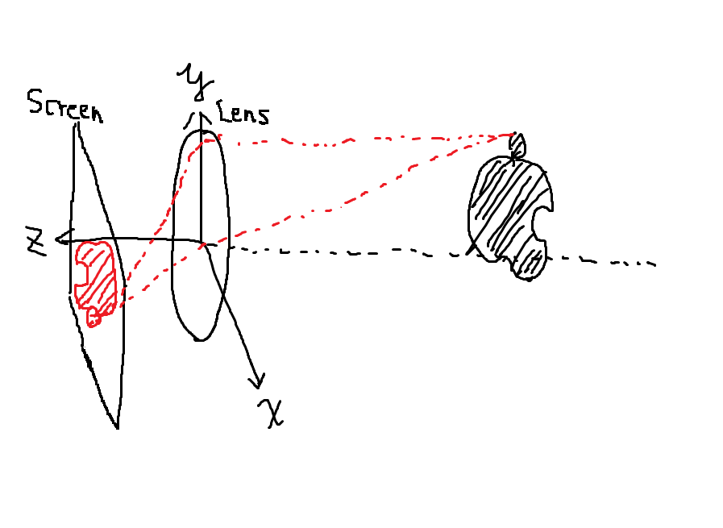
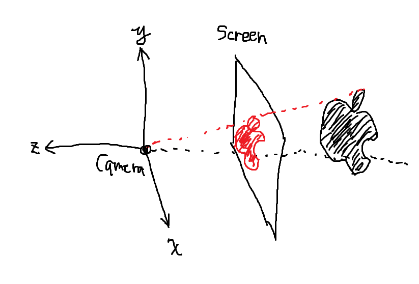

# Rust で週末レイトレーシング

## 前回のお詫び
前回の発表で、「TypeScriptで2秒程度かかっていたマンデルブロ集合の描画がWasmでは75秒程度かかる」と言っていたが、  
あれはwebpack-dev-serverが悪さをしていただけで、別のサーバーでホストしたら1秒程度でマンデルブロ集合が描画されました。  
(全部webpackが悪い)

## はじめに
Ray Tracing in One Weekend [https://raytracing.github.io/books/RayTracingInOneWeekend.html]  
という、週末の1~2日間程度でさくっとレイトレーシングの仕組みを理解して実装してみようぜというあるのだが、  
これの最初の方をRustやってみたので紹介する。  
原典ではC++でPPM形式の画像を出力するというやり方で進めているのだが、今回はRust(wasm)+Canvasでやっていく。  

余談だが、自分は3年前にこれの日本語訳(https://tatsu-zine.com/books/ray-tracing-part1)を買ったのだが、  
今調べると別の人が無料で公開している別の翻訳版(https://inzkyk.xyz/ray_tracing_in_one_weekend)があった。  
こういうことがあるので YAGNI(You ain't gonna need it)原則 は重要なのだなぁと思った(:sob:)。

## レイトレーシングとは？
レイトレーシングとは、カメラからスクリーンに向けてレイ(南斗聖拳の使い手ではない)を投げて、  
スクリーンを通った後のレイを追跡するシミュレーション手法である。  

普通のカメラ


レイトレーシング


その性質から光の反射・屈折も含めたリアルな画像を生成することができるが、計算量が多くなる。  
なので基本的にプリレンダリングのために使われることが多く、ゲーム用途のようなリアルタイムレンダリングではあまり使われない…  
というのが常識だったのだが、最近のグラボではレイトレーシングを高速に計算できるような回路が載っていて、  
それに対応したゲームではリアルタイムレイトレーシングが使われてたりするとかなんとか。  

### 普通のCGのレンダリング
レイトレとの比較で普通のCG(ラスタライズ法)でのレンダリングがどのように行われているのかも一応説明しておく。  

1. 透視投影: 3次元空間の各ポリゴンがスクリーンにどのように投影されるかを計算する (これでいわゆるワイヤーフレームができる)
1. 隠面消去: あるポリゴンの手前に別のポリゴンがあったらそれを隠すという処理をする (Zバッファ、Zオーダー法など)
1. シェーディング: 陰影(Shade)を付ける
1. シャドウイング: 影(Shadow)を付ける
1. テクスチャマッピング: テクスチャを付ける

ラスタライズ法では直接光(光源から直接放たれた光)の反射はシェーディングでシミュレーションするが、  
間接光(他の物体で反射した光)の反射はシミュレーションできない。  
そのため「金属や水面に周囲の風景が映る」ようなシーンは[環境マップ](https://ja.wikipedia.org/wiki/%E7%92%B0%E5%A2%83%E3%83%9E%E3%83%83%E3%83%94%E3%83%B3%E3%82%B0)などのアドホックな工夫によって描画される。  

## 環境構築
前回説明したように cargo で wasm のプロジェクトを作る。  
(前回説明したので省略)

## 下準備
レイトレーシングをする前に必要な構造体などを定義する。  

3次元ベクトルを表す構造体
```rust
use std::ops::{Add, Sub, Mul, Div};

#[derive(Clone, Copy)]
pub struct Vec3 {
    pub x: f32,
    pub y: f32,
    pub z: f32,
}

impl Vec3 {
    pub fn new(x: f32, y: f32, z: f32) -> Vec3 {
        Vec3 { x: x, y: y, z: z }
    }
    /// ベクトルの長さの2乗を返す
    pub fn len2(self) -> f32 {
        self.x * self.x  + self.y * self.y + self.z * self.z
    }
    /// ベクトルの長さを返す
    pub fn len(self) -> f32 {
        self.len2().sqrt()
    }
    /// 内積を返す
    pub fn dot(self, rhs: Vec3) -> f32 {
        self.x * rhs.x + self.y * rhs.y + self.z * rhs.z
    }
    /// 外積を返す
    pub fn cross(self, rhs: Vec3) -> Vec3 {
        Vec3 {
            x: self.y * rhs.z - self.z * rhs.y,
            y: -self.x * rhs.z + self.z * rhs.x,
            z: self.x * rhs.y - self.y * rhs.x
        }
    }
    /// 同じ方向の単位ベクトルを返す
    pub fn unit(self) -> Vec3 {
        self / self.len()
    }
}

// 演算子オーバーロードたち
impl Add<Vec3> for Vec3 {
    type Output = Vec3;
    fn add(self, rhs: Vec3) -> Vec3 {
        Vec3 { x: self.x + rhs.x, y: self.y + rhs.y, z: self.z + rhs.z }
    }
}
impl Sub<Vec3> for Vec3 {
    type Output = Vec3;
    fn sub(self, rhs: Vec3) -> Vec3 {
        Vec3 { x: self.x - rhs.x, y: self.y - rhs.y, z: self.z - rhs.z }
    }
}
impl Mul<f32> for Vec3 {
    type Output = Vec3;
    fn mul(self, rhs: f32) -> Vec3 {
        Vec3 { x: self.x * rhs, y: self.y * rhs, z: self.z * rhs }
    }
}
impl Mul<Vec3> for f32 {
    type Output = Vec3;
    fn mul(self, rhs: Vec3) -> Vec3 {
        Vec3 { x: self * rhs.x, y: self * rhs.y, z: self * rhs.z }
    }
}
impl Div<f32> for Vec3 {
    type Output = Vec3;
    fn div(self, rhs: f32) -> Vec3 {
        Vec3 { x: self.x / rhs, y: self.y / rhs, z: self.z / rhs }
    }
}
impl Neg for Vec3 {
    type Output = Vec3;
    fn neg(self) -> Vec3 { -1. * self }
}
```

色を表す構造体
```rust
#[derive(Clone, Copy)]
pub struct Color {
    pub r: u8,
    pub g: u8,
    pub b: u8
}
impl Color {
    /// rgb の各値を 0~1 で指定する場合に使う。
    /// 1より大きい値を指定した場合は255に切りそろえられる
    pub fn new(r: f32, g: f32, b: f32) -> Color {
        Color {
            r: (r * 255 as f32) as u8,
            g: (g * 255 as f32) as u8,
            b: (b * 255 as f32) as u8,
        }
    }
    pub fn from_Vec3(v: Vec3) -> Color {
        Color::new(v.x, v.y, v.z)
    }
    pub fn to_string(self) -> String {
        format!("rgb({}, {}, {})", self.r, self.g, self.b)
    }
}
```

レイ(エバンゲリオンのパイロットではない)を表す構造体
```rust
/// 私が死んでも代わりはいるもの
/// p(t) = origin + t*direction
#[derive(Clone, Copy)]
pub struct Ray {
    pub origin: Vec3,
    pub direction: Vec3,
}

impl Ray {
    pub fn at(self, t: f32) -> Vec3 { self.origin + self.direction * t }
}
```

## レンダリング
とりあえず何も無い空間をレンダリングしてみよう。  
レンダリングを行うレンダラー構造体を作る。  

レンダラー構造体
```rust
pub struct Renderer {
    pub output_h: u32, // 出力する画像の高さ(ピクセル数)
    pub output_w: u32, // 出力する画像の幅(ピクセル数)

    pub vp_h: f32, // 3次元空間でのスクリーンの高さ
    pub vp_w: f32, // 3次元空間でのスクリーンの幅
    pub focus_len: f32, // レイ(ガンダムのパイロットではない)の放射点からスクリーンまでの距離
    pub orig: Vec3, // レイの放射点の座標
    pub horizontal: Vec3, // スクリーンの横方向(u方向)を表すベクトル
    pub vertical: Vec3, // スクリーンの縦方向(v方向)を表すベクトル
}

impl Renderer {
    // レイ(セーラーマーズではない) の色を計算する関数
    // 今回はレイの高さ方向によってグラデーションした水色を返すようにする
    fn color(r: Ray) -> Color {
        let unit_dir = r.direction.unit();
        let t = 0.5 * (unit_dir.y + 1.0);
        Color::from_Vec3((1.0 - t) * Vec3::new(0.5, 0.7, 1.0) + t * Vec3::new(1.,1.,1.))
    }
    // 3次元空間でのスクリーン左上の座標を返す
    fn upper_left(&self) -> Vec3 {
        self.orig - self.horizontal/2. + self.vertical/2. - Vec3::new(0., 0., self.focus_len)
    }
    // Canvasへの描画を行う関数
    pub fn render(&self, ctx: web_sys::CanvasRenderingContext2d) {
        for j in 0..self.output_h {
            for i in 0..self.output_w {
                let u = i as f32 / self.output_w as f32;
                let v = j as f32 / self.output_h as f32;

                let r = Ray {
                    origin: self.orig,
                    direction: (self.upper_left() + u * self.horizontal - v * self.vertical) - self.orig
                };
                let color = Renderer::color(r);
                ctx.set_fill_style(&wasm_bindgen::JsValue::from(color.to_string()));
                ctx.fill_rect(i as f64, j as f64, 1., 1.);
            }
        }
    }
}
```

エントリーポイント
```rust
#[wasm_bindgen(start)]
pub fn main_js() -> Result<(), JsValue> {
    #[cfg(debug_assertions)]
    console_error_panic_hook::set_once();

    // Your code goes here!
    console::log_1(&JsValue::from_str("Hello world!"));
    
    // Canvas の 2DContext を取得
    let context = web_sys::window()
        .unwrap()
        .document()
        .unwrap()
        .get_element_by_id("canvas")
        .unwrap()
        .dyn_into::<web_sys::HtmlCanvasElement>()
        .unwrap()
        .get_context("2d")
        .unwrap()
        .unwrap()
        .dyn_into::<web_sys::CanvasRenderingContext2d>()
        .unwrap(); 

    let asp_ratio = 480. / 640.;
    let vp_h = 2.;
    let vp_w = vp_h * asp_ratio;
    let renderer = Renderer {
        output_h: 480,
        output_w: 640,
        vp_h: vp_h,
        vp_w: vp_w,
        focus_len: 1.0,

        orig: Vec3::new(0., 0., 0.),
        horizontal: Vec3::new(vp_h, 0., 0.),
        vertical: Vec3::new(0., vp_w, 0.),
    };

    renderer.render(context);

    Ok(())
}
```
これでCanvasに何もない水色の画像が描画される。

### 球体を追加してみる
球を表す構造体を作る。  
```rust
struct Sphere {
    pub center: Vec3,
    pub radius: f32,
}
```

次に、レイと球体が衝突するかどうかを判定する関数を作る。  
高校レベルの数学なので分かると思うが一応解説すると、
まず球の中心の位置ベクトルを $ \vec{C} = (C_x, C_y, C_z) $、半径を $ r $ とする。  
すると球の中心から3次元空間上のある点 $ \vec{P} = (x, y, z) $ へのベクトルは $ \vec{P} - \vec{C} $ と表せる。  
ベクトル自身の内積はベクトルの大きさの自乗になるので、 $ (\vec{P} - \vec{C}) \cdot (\vec{P} - \vec{C}) = r^2 $ を満たすような点Pが球上の点になる。  
ここで、レイ上の点は $ \vec{R}(t) = \vec{A} + t \cdot \vec{B} $ と表せるので、上の式に代入すると、  
$ (\vec{A} + t \cdot \vec{B} - \vec{C}) \cdot (\vec{A} + t \cdot \vec{B} - \vec{C}) = r^2 $ を得る。  
これを展開して整理すると  
$ t^2 \vec{B} \cdot \vec{B} + 2t\vec{B} \cdot (\vec{A} - \vec{C}) + (\vec{A} - \vec{C}) \cdot (\vec{A} - \vec{C}) - r^2 = 0 $  
となる。  
これはただの2次方程式なので、あとは判別式を使って解の有無を調べればよい。

```rust
impl Sphere {
    // レイ(レイズナーの戦闘AIではない)と球との当たり判定を行う関数
    #[allow(non_snake_case)]
    fn is_hit(self, r: Ray) -> bool {
        let A = r.origin;
        let B = r.direction;
        let C = self.center;
        let R = self.radius;

        let a = B.len2();
        let b = 2. * (A - C).dot(B);
        let c = (A - C).len2() - R * R;

        b * b - 4. * a * c > 0.
    }
}
```

レンダラー
```rust
pub struct Renderer {
    pub output_h: u32,
    pub output_w: u32,

    pub vp_h: f32,
    pub vp_w: f32,
    pub focus_len: f32,
    pub orig: Vec3,
    pub horizontal: Vec3,
    pub vertical: Vec3,
}

impl Renderer {   
   fn color(r: Ray) -> Color {
      let sp = Sphere {
         center: Vec3::new(0., 0., -2.), 
         radius: 0.5,
      };

      // レイと球が衝突したら赤く塗る
      if sp.is_hit(r) {
         return Color::new(1.0, 0., 0.);
      }

      // 衝突しなかったらそのまま水色を塗る
      let unit_dir = r.direction.unit();
      let t = 0.5 * (unit_dir.y + 1.0);
      Color::from_Vec3((1.0 - t) * Vec3::new(0.5, 0.7, 1.0) + t * Vec3::new(1.,1.,1.))
   }

    fn upper_left(&self) -> Vec3 {
        self.orig - self.horizontal/2. + self.vertical/2. - Vec3::new(0., 0., self.focus_len)
    }

   pub fn render(&self, ctx: web_sys::CanvasRenderingContext2d) {
      for j in 0..self.output_h {
         for i in 0..self.output_w {
               let u = i as f32 / self.output_w as f32;
               let v = j as f32 / self.output_h as f32;

               let r = Ray {
                  origin: self.orig,
                  direction: (self.upper_left() + u * self.horizontal - v * self.vertical) - self.orig
               };
               let color = Renderer::color(r);
               ctx.set_fill_style(&wasm_bindgen::JsValue::from(color.to_string()));
               ctx.fill_rect(i as f64, j as f64, 1., 1.);
         }
      }
   }
}
```

## 参考資料
Ray Tracing in One Weekend [https://raytracing.github.io/books/RayTracingInOneWeekend.html]  
日本語版(無料) [https://inzkyk.xyz/ray_tracing_in_one_weekend]  
日本語版(有料): [https://tatsu-zine.com/books/ray-tracing-part1]  
