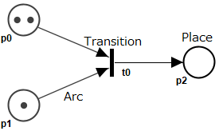
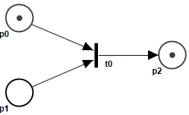
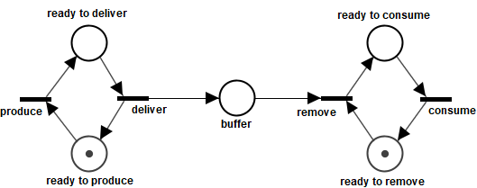
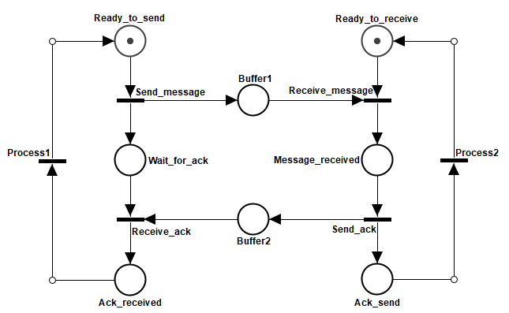
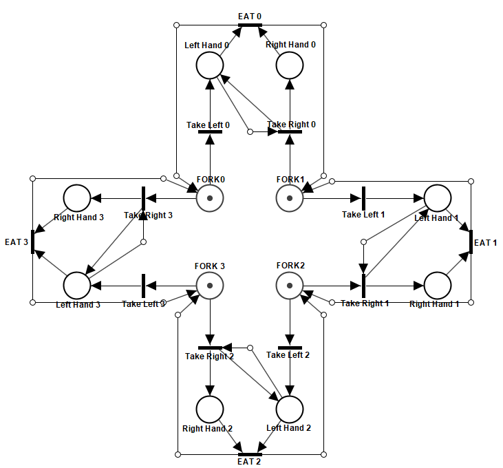

# Petri Netsの紹介
## Petri Netsとは？
[Petri Nets World, FAQ](http://www.informatik.uni-hamburg.de/TGI/PetriNets/faq/)より

> Petri Nets is a formal and graphical appealing language which is appropriate for modelling systems with concurrency and resource sharing.

## 例題
### 生産者 / 消費者モデル

### 通信モデル

### 食事する哲学者

## 非決定実行の検証

## Petri Netsの派生
- Coloured Petri net
- Timed Petri net

## 参考文献
- Petri Nets World, http://www.informatik.uni-hamburg.de/TGI/PetriNets/
- Oris Tool - Analysis of Timed and Stochastic Petri Nets, https://www.oris-tool.org/
