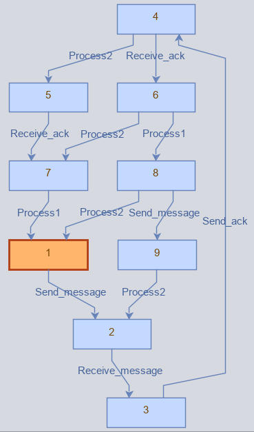

# Petri Netsの紹介
## Petri Nets とは？
[Petri Nets World, FAQ](http://www.informatik.uni-hamburg.de/TGI/PetriNets/faq/)より

> Petri Nets is a formal and graphical appealing language which is appropriate for modelling systems with concurrency and resource sharing.

Petri Nets は並行システムをグラフィカルにモデリングするためのモデル記述言語である。
モデリングした並行システムについてツールを用いてシミュレートや解析をすることによってシステムの検証を行う。

### Petri Nets の構成
Petri Nets は２種類のノード Place/Transition と，それらを接続する Arc によって構成される。
また、Place は０個以上の token を持つ。

### Petri Nets の計算
Petri Nets は token の移動によって計算を表す。
- Transition のすべての入力側の Place に１個以上の token があるとき
- Transition のすべての入力側の Place の token を１個消費して、Transition のすべての出力側の Place に１個 token を生成する

## 例題
### 生産者 / 消費者モデル

### 通信モデル

### 食事する哲学者

## 非決定実行による検証

## Petri Netsの派生
- Coloured Petri net
- Timed Petri net

## 参考文献
- Petri Nets World, http://www.informatik.uni-hamburg.de/TGI/PetriNets/
- Oris Tool - Analysis of Timed and Stochastic Petri Nets, https://www.oris-tool.org/
