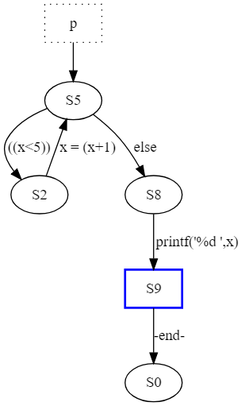

前回のPromelaによるModel Checkingの話の続き

## プログラムの状態遷移
Promelaのプログラムは有限オートマトンで表すことができる。

```
proctype gcd(int x, y) {
  do
    :: x > y -> x = x - y
    :: x < y -> y = y - x
    :: else -> break
  od;
  printf("%d %d\n", x, y)
}

init { run gcd (72,16) }
```
http://www.ueda.info.waseda.ac.jp/oess/RS2018/Html/class_rsc/materials/RS2018-spin1-e.pdf より引用

例えば上のGCDを計算するプログラムについて次のコマンドを実行すると各プロセスの状態遷移が表示される。
```
$ spin -o3 -search gcd.pml
$ ./pan -d
proctype gcd
        state   7 -(tr   5)-> state   2  [id   0 tp   2] [----L] gcd.pml:3 => ((x>y))
        state   7 -(tr   7)-> state   4  [id   2 tp   2] [----L] gcd.pml:3 => ((x<y))
        state   7 -(tr   2)-> state  10  [id   4 tp   2] [----L] gcd.pml:3 => else
        state   2 -(tr   6)-> state   7  [id   1 tp   2] [----L] gcd.pml:3 => x = (x-y)
        state   4 -(tr   8)-> state   7  [id   3 tp   2] [----L] gcd.pml:4 => y = (y-x)
        state  10 -(tr   9)-> state  11  [id   9 tp   2] [----L] gcd.pml:7 => printf('%d %d\n',x,y)
        state  11 -(tr  10)-> state   0  [id  10 tp 3500] [--e-L] gcd.pml:8 => -end-
init
        state   1 -(tr   3)-> state   2  [id  11 tp   2] [----L] gcd.pml:10 => (run gcd(72,16))
        state   2 -(tr   4)-> state   0  [id  12 tp 3500] [--e-L] gcd.pml:10 => -end-

Transition Type: A=atomic; D=d_step; L=local; G=global
Source-State Labels: p=progress; e=end; a=accept;

pan: elapsed time 2.06e+07 seconds
pan: rate         0 states/second
```

`pan -D`とするとdot形式で出力してくれる。



gcdのプログラムを次のように間違って書いてしまうと無限ループが発生してしまう。
```
proctype gcd(int x, y) {
  do
    :: x > y -> x = x - y
    :: x < y -> y = y     /* 無限ループ */
    :: else -> break
  od;
  printf("%d %d\n", x, y)
}

init { run gcd (72,16) }
```

実行結果。
```
$ spin -p -l -u20 gcd-bug.p
ml 
  0:    proc  - (:root:) creates proc  0 (:init:)
Starting gcd with pid 1
  1:    proc  0 (:init::1) creates proc  1 (gcd)
  1:    proc  0 (:init::1) gcd-accept.pml:10 (state 1)  [(run gcd(72,16))]
  2:    proc  1 (gcd:1) gcd-accept.pml:3 (state 1)      [((x>y))]
  3:    proc  1 (gcd:1) gcd-accept.pml:3 (state 2)      [x = (x-y)]
                gcd(1):x = 56
  4:    proc  1 (gcd:1) gcd-accept.pml:7 (state 8)      [.(goto)]
  5:    proc  1 (gcd:1) gcd-accept.pml:3 (state 1)      [((x>y))]
  6:    proc  1 (gcd:1) gcd-accept.pml:3 (state 2)      [x = (x-y)]
                gcd(1):x = 40
  7:    proc  1 (gcd:1) gcd-accept.pml:7 (state 8)      [.(goto)]
  8:    proc  1 (gcd:1) gcd-accept.pml:3 (state 1)      [((x>y))]
  9:    proc  1 (gcd:1) gcd-accept.pml:3 (state 2)      [x = (x-y)]
                gcd(1):x = 24
 10:    proc  1 (gcd:1) gcd-accept.pml:7 (state 8)      [.(goto)]
 11:    proc  1 (gcd:1) gcd-accept.pml:3 (state 1)      [((x>y))]
 12:    proc  1 (gcd:1) gcd-accept.pml:3 (state 2)      [x = (x-y)]
                gcd(1):x = 8
 13:    proc  1 (gcd:1) gcd-accept.pml:7 (state 8)      [.(goto)]
 14:    proc  1 (gcd:1) gcd-accept.pml:4 (state 3)      [((x<y))]
 15:    proc  1 (gcd:1) gcd-accept.pml:4 (state 4)      [y = y]
                gcd(1):y = 16
 16:    proc  1 (gcd:1) gcd-accept.pml:7 (state 8)      [.(goto)]
 17:    proc  1 (gcd:1) gcd-accept.pml:4 (state 3)      [((x<y))]
 18:    proc  1 (gcd:1) gcd-accept.pml:4 (state 4)      [y = y]
                gcd(1):y = 16
 19:    proc  1 (gcd:1) gcd-accept.pml:7 (state 8)      [.(goto)]
 20:    proc  1 (gcd:1) gcd-accept.pml:4 (state 3)      [((x<y))]
-------------
depth-limit (-u20 steps) reached
#processes: 2
 20:    proc  1 (gcd:1) gcd-accept.pml:4 (state 4)
 20:    proc  0 (:init::1) gcd-accept.pml:10 (state 2) <valid end state>
2 processes created
```

このような無限ループが発生するようなプログラムを`accept`ラベルによって検証できる。
次のように検証したいループに`accept`ラベルを配置する。
```
proctype gcd(int x, y) {
accept:
  do
    :: x > y -> x = x - y
    :: x < y -> y = y     /* 無限ループ */
    :: else -> break
  od;
  printf("%d %d\n", x, y)
}

init { run gcd (72,16) }
```

そして、次のコマンドで検証する。
```
$ spin -search -a gcd-accept.pml
pan:1: acceptance cycle (at depth 5)
pan: wrote gcd-accept.pml.trail

(Spin Version 6.4.5 -- 1 January 2016)
Warning: Search not completed
        + Partial Order Reduction

Full statespace search for:
        never claim             - (none specified)
        assertion violations    +
        acceptance   cycles     + (fairness disabled)
        invalid end states      +

State-vector 28 byte, depth reached 5, errors: 1
        6 states, stored
        0 states, matched
        6 transitions (= stored+matched)
        0 atomic steps
hash conflicts:         0 (resolved)

Stats on memory usage (in Megabytes):
    0.000       equivalent memory usage for states (stored*(State-vector + overhead))
    0.291       actual memory usage for states
  128.000       memory used for hash table (-w24)
    0.534       memory used for DFS stack (-m10000)
  128.730       total actual memory usage


pan: elapsed time 0 seconds
```
検証出力に`pan:1: acceptance cycle (at depth 5)`が表示され`errors: 1`と検出することができる。

## SaftyとLiveness
プログラムの検証について述べるとき、SaftyとLivenessと呼ばれる性質がある。

### Safty
望ましくない事象が発生しないという性質。
- 例) デッドロックが発生しない
- プログラムの各状態について検証する

### Liveness
期待する事象がいずれは発生するという性質。
- 例) あるリクエストについて、いずれレスポンスが返ってくる
- プログラムの経路について検証する


SpinではSaftyを満たすかどうかを`assert`によって検証する。
LivenessについてはNever claimsによって検証する。

### ラベル
「Pを満たす状態からQを満たす状態へ到達可能である」を検証しようとするにはどうしたらよいか？

例えば次のような「Pが成り立ったあとQが成り立たない状態が繰り返される」ことが検出されたら上の性質は成り立たないことが検証できそうである。
⇒ しかし、「Pが成り立ったあとQと!Qを繰り返す」でもこのmonitorに引っかかってしまう。
```
active proctype monitor () {
        (P) ->
accept: do
        :: !(Q)
        od
}
```
### Never claims
SPINには決して起きない挙動を記述するためにNever Claimsと呼ばれる記法がある。

A never claim causes an error if a model completely matches the finite or infinite behavior specified in the claim {...}.

## 線形時相論理
LTL(Linear-time Temporal Logic)とは、時間の概念が取り入れられた論理である。
LTLの構文をいかに示す。
命題論理に`[]`, `<>`, `X`, `U`という論理演算子が加わっている。
```
φ,Ψ ::= ¬ φ | φ ∧ Ψ | φ ∨ Ψ | φ ⇒ Ψ
      | [] φ  (always φ)
      | <> φ  (eventually φ)
      | X  φ  (φ holds next)
      | φ U Ψ (φ until Ψ)
```

|LTL式|意味|
----|---- 
| `[] φ` | 現時点から常に`φ`が成り立つ |
| `<> φ` | いつか`φ`が成り立つ |
| `X  φ` | 次に`φ`が成り立つ |
| `φ U Ψ` | `Ψ`が成り立つまで`φ`が成り立つ |


## Channel Communication
Channel Communicationは並行処理においてプロセス間でデータの受け渡しをする仕組みである。

Promelaでは`chan name=[n] of {T1, T2, ...}`でチャネルを生成して使う。`n`はバッファ数、`T`はチャネルで受け渡すデータの型を指定する。

チャネルを`c`、受け渡すデータ(メッセージ)を`m`とすると、
- `c!m`でチャネル`c`へメッセージ`m`を送る
- `c?m`でチャネル`c`からメッセージ`m`を受け取る

と書ける。

チャネルを使った送受信をする２つのプロセスのモデル。
```
chan c=[0] of {int}

active proctype snd() {
  int sn=0;
  do
    :: c!sn; sn++
  od
}

active proctype rec() {
  int rn;
  do
    :: c?rn; printf("rec : %d\n", rn)
  od
}
```

実行結果。
```
$ spin -p -l -u10 channel.pml 
  0:    proc  - (:root:) creates proc  0 (snd)
  0:    proc  - (:root:) creates proc  1 (rec)
  1:    proc  0 (snd:1) channel.pml:6 (state 1) [c!sn]
  1:    proc  1 (rec:1) channel.pml:13 (state 1)        [c?rn]
                rec(1):rn = 0
  2:    proc  0 (snd:1) channel.pml:6 (state 2) [sn = (sn+1)]
                snd(0):sn = 1
          rec : 0
  3:    proc  1 (rec:1) channel.pml:13 (state 2)        [printf('rec : %d\\n',rn)]
  4:    proc  1 (rec:1) channel.pml:15 (state 4)        [.(goto)]
  5:    proc  0 (snd:1) channel.pml:8 (state 4) [.(goto)]
  6:    proc  0 (snd:1) channel.pml:6 (state 1) [c!sn]
  6:    proc  1 (rec:1) channel.pml:13 (state 1)        [c?rn]
                rec(1):rn = 1
  7:    proc  0 (snd:1) channel.pml:6 (state 2) [sn = (sn+1)]
                snd(0):sn = 2
          rec : 1
  8:    proc  1 (rec:1) channel.pml:13 (state 2)        [printf('rec : %d\\n',rn)]
  9:    proc  1 (rec:1) channel.pml:15 (state 4)        [.(goto)]
 10:    proc  0 (snd:1) channel.pml:8 (state 4) [.(goto)]
-------------
depth-limit (-u10 steps) reached
#processes: 2
 10:    proc  1 (rec:1) channel.pml:12 (state 3)
 10:    proc  0 (snd:1) channel.pml:5 (state 3)
2 processes created
```

## 参考文献
- 早稲田大学 高信頼ソフトウェア, http://www.ueda.info.waseda.ac.jp/oess/RS2018/
- SPIN model checker, http://spinroot.com/spin/whatispin.html
