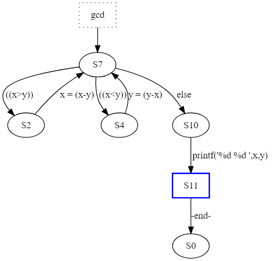
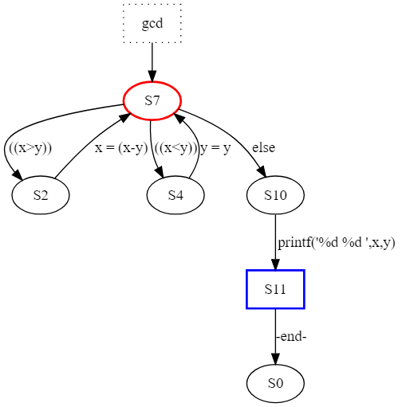
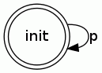
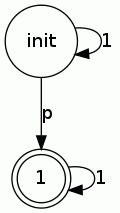
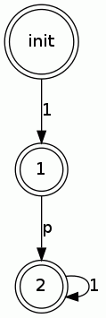
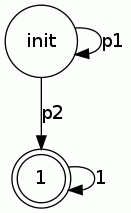

前回のPromelaによるModel Checkingの話の続き

```
$ spin -V
Spin Version 6.4.5 -- 1 January 2016
```

## モデルの性質
モデル検査で検証されるシステムの性質には次のようなものがある。

### 到達可能性(Reachability)
システムが初期状態からある特定の状態へ到達することができることを表す性質。

### 安全性(Safty)
システムにおいて望ましくない事象が発生しないというとこを表す性質。
- 例) デッドロックが発生しない

### 活性(Liveness)
システムにおいて期待する事象がいずれは発生するということを表す性質。
- 例) あるリクエストについて、いずれレスポンスが返ってくる

### 公平性(Fairness)
システムにおいて特定の事象が無限回起きることを表す性質。
- 例) プロセススケジューラーにおいて実行可能なプロセスは必ずそのうち実行される

SPINによるモデル検査では上記のような性質をassertionやラベル、Never Claim、 LTL式などによって記述して検証する。

## プログラムの状態遷移
Promelaのプログラムは有限オートマトンで表すことができる。

```
proctype gcd(int x, y) {
  do
    :: x > y -> x = x - y
    :: x < y -> y = y - x
    :: else -> break
  od;
  printf("%d %d\n", x, y)
}

init { run gcd (72,16) }
```
http://www.ueda.info.waseda.ac.jp/oess/RS2018/Html/class_rsc/materials/RS2018-spin1-e.pdf より引用

例えば上のGCDを計算するプログラムについて次のように実行すると各プロセスの状態遷移が表示される。
```
$ spin -o3 -search gcd.pml
$ ./pan -d
proctype gcd
        state   7 -(tr   5)-> state   2  [id   0 tp   2] [----L] gcd.pml:3 => ((x>y))
        state   7 -(tr   7)-> state   4  [id   2 tp   2] [----L] gcd.pml:3 => ((x<y))
        state   7 -(tr   2)-> state  10  [id   4 tp   2] [----L] gcd.pml:3 => else
        state   2 -(tr   6)-> state   7  [id   1 tp   2] [----L] gcd.pml:3 => x = (x-y)
        state   4 -(tr   8)-> state   7  [id   3 tp   2] [----L] gcd.pml:4 => y = (y-x)
        state  10 -(tr   9)-> state  11  [id   9 tp   2] [----L] gcd.pml:7 => printf('%d %d\n',x,y)
        state  11 -(tr  10)-> state   0  [id  10 tp 3500] [--e-L] gcd.pml:8 => -end-
init
        state   1 -(tr   3)-> state   2  [id  11 tp   2] [----L] gcd.pml:10 => (run gcd(72,16))
        state   2 -(tr   4)-> state   0  [id  12 tp 3500] [--e-L] gcd.pml:10 => -end-

Transition Type: A=atomic; D=d_step; L=local; G=global
Source-State Labels: p=progress; e=end; a=accept;

pan: elapsed time 2.06e+07 seconds
pan: rate         0 states/second
```

`./pan -D`とするとdot形式で出力してくれる。



gcdのプログラムを次のように間違って書いてしまうと無限ループが発生してしまう。
```
proctype gcd(int x, y) {
  do
    :: x > y -> x = x - y
    :: x < y -> y = y     /* 無限ループ */
    :: else -> break
  od;
  printf("%d %d\n", x, y)
}

init { run gcd (72,16) }
```

実行結果。
`x = 8`, `y = 16`の状態になると常に`y = y`が実行され続けてしまう。
```
$ spin -p -l -u20 gcd-bug.pml 
  0:    proc  - (:root:) creates proc  0 (:init:)
Starting gcd with pid 1
  1:    proc  0 (:init::1) creates proc  1 (gcd)
  1:    proc  0 (:init::1) gcd-accept.pml:10 (state 1)  [(run gcd(72,16))]
  2:    proc  1 (gcd:1) gcd-accept.pml:3 (state 1)      [((x>y))]
  3:    proc  1 (gcd:1) gcd-accept.pml:3 (state 2)      [x = (x-y)]
                gcd(1):x = 56
  4:    proc  1 (gcd:1) gcd-accept.pml:7 (state 8)      [.(goto)]
  5:    proc  1 (gcd:1) gcd-accept.pml:3 (state 1)      [((x>y))]
  6:    proc  1 (gcd:1) gcd-accept.pml:3 (state 2)      [x = (x-y)]
                gcd(1):x = 40
  7:    proc  1 (gcd:1) gcd-accept.pml:7 (state 8)      [.(goto)]
  8:    proc  1 (gcd:1) gcd-accept.pml:3 (state 1)      [((x>y))]
  9:    proc  1 (gcd:1) gcd-accept.pml:3 (state 2)      [x = (x-y)]
                gcd(1):x = 24
 10:    proc  1 (gcd:1) gcd-accept.pml:7 (state 8)      [.(goto)]
 11:    proc  1 (gcd:1) gcd-accept.pml:3 (state 1)      [((x>y))]
 12:    proc  1 (gcd:1) gcd-accept.pml:3 (state 2)      [x = (x-y)]
                gcd(1):x = 8
 13:    proc  1 (gcd:1) gcd-accept.pml:7 (state 8)      [.(goto)]
 14:    proc  1 (gcd:1) gcd-accept.pml:4 (state 3)      [((x<y))]
 15:    proc  1 (gcd:1) gcd-accept.pml:4 (state 4)      [y = y]
                gcd(1):y = 16
 16:    proc  1 (gcd:1) gcd-accept.pml:7 (state 8)      [.(goto)]
 17:    proc  1 (gcd:1) gcd-accept.pml:4 (state 3)      [((x<y))]
 18:    proc  1 (gcd:1) gcd-accept.pml:4 (state 4)      [y = y]
                gcd(1):y = 16
 19:    proc  1 (gcd:1) gcd-accept.pml:7 (state 8)      [.(goto)]
 20:    proc  1 (gcd:1) gcd-accept.pml:4 (state 3)      [((x<y))]
-------------
depth-limit (-u20 steps) reached
#processes: 2
 20:    proc  1 (gcd:1) gcd-accept.pml:4 (state 4)
 20:    proc  0 (:init::1) gcd-accept.pml:10 (state 2) <valid end state>
2 processes created
```

このような無限ループが発生するようなプログラムを`accept`ラベルによって検証できる。
次のようにプログラム中に`accept`ラベルを配置する。
```
proctype gcd(int x, y) {
accept:
  do
    :: x > y -> x = x - y
    :: x < y -> y = y     /* 無限ループ */
    :: else -> break
  od;
  printf("%d %d\n", x, y)
}

init { run gcd (72,16) }
```

`accept`ラベルを含むプログラムの状態遷移図を出力するとラベルのついた状態が赤く表示される。


SPINは`accept`ラベルがついた状態を含む無限ループが存在するかどうかを検証することができる。
```
$ spin -o3 -search -a gcd-accept.pml
pan:1: acceptance cycle (at depth 9)
pan: wrote gcd-accept.pml.trail

(Spin Version 6.4.5 -- 1 January 2016)
Warning: Search not completed
        + Partial Order Reduction

Full statespace search for:
        never claim             - (none specified)
        assertion violations    +
        acceptance   cycles     + (fairness disabled)
        invalid end states      +

State-vector 28 byte, depth reached 10, errors: 1
       11 states, stored
        0 states, matched
       11 transitions (= stored+matched)
        0 atomic steps
hash conflicts:         0 (resolved)

Stats on memory usage (in Megabytes):
    0.001       equivalent memory usage for states (stored*(State-vector + overhead))
    0.291       actual memory usage for states
  128.000       memory used for hash table (-w24)
    0.534       memory used for DFS stack (-m10000)
  128.730       total actual memory usage


pan: elapsed time 0.01 seconds
```
検証出力に`pan:1: acceptance cycle (at depth 9)`と表示され`accept`ラベルを含む無限ループがあることが検出された。

`-t`をつけて実行シミュレーションすると検出された無限ループの場所が表示される。
```
$ spin -p -t -l gcd-accept.pml
Starting gcd with pid 1
  1:    proc  0 (:init::1) gcd-accept.pml:11 (state 1)  [(run gcd(72,16))]
  2:    proc  1 (gcd:1) gcd-accept.pml:4 (state 1)      [((x>y))]
  3:    proc  1 (gcd:1) gcd-accept.pml:4 (state 2)      [x = (x-y)]
                gcd(1):x = 56
  4:    proc  1 (gcd:1) gcd-accept.pml:4 (state 1)      [((x>y))]
  5:    proc  1 (gcd:1) gcd-accept.pml:4 (state 2)      [x = (x-y)]
                gcd(1):x = 40
  6:    proc  1 (gcd:1) gcd-accept.pml:4 (state 1)      [((x>y))]
  7:    proc  1 (gcd:1) gcd-accept.pml:4 (state 2)      [x = (x-y)]
                gcd(1):x = 24
  8:    proc  1 (gcd:1) gcd-accept.pml:4 (state 1)      [((x>y))]
  9:    proc  1 (gcd:1) gcd-accept.pml:4 (state 2)      [x = (x-y)]
                gcd(1):x = 8
  <<<<<START OF CYCLE>>>>>
 10:    proc  1 (gcd:1) gcd-accept.pml:5 (state 3)      [((x<y))]
 11:    proc  1 (gcd:1) gcd-accept.pml:5 (state 4)      [y = y]
                gcd(1):y = 16
spin: trail ends after 11 steps
#processes: 2
 11:    proc  1 (gcd:1) gcd-accept.pml:3 (state 7)
                gcd(1):y = 16
 11:    proc  0 (:init::1) gcd-accept.pml:11 (state 2) <valid end state>
2 processes created
```

## Never claims
never claimは「決して起きてはいけない挙動」をオートマトンとして記述し、検証したい性質を表現する。

```
never {
}
```

## 線形時相論理
LTL(Linear-time Temporal Logic)とは、時間の概念が取り入れられた論理である。
`[]`, `<>`, `X`, `U`という論理演算子がある。
```
φ,Ψ ::= ¬ φ | φ ∧ Ψ | φ ∨ Ψ | φ ⇒ Ψ
      | [] φ  (always φ)
      | <> φ  (eventually φ)
      | X  φ  (φ holds next)
      | φ U Ψ (φ until Ψ)
```

|LTL式|意味|
----|---- 
| `[] φ` | 現時点から常に`φ`が成り立つ |
| `<> φ` | いつか`φ`が成り立つ |
| `X  φ` | 次に`φ`が成り立つ |
| `φ U Ψ` | `Ψ`が成り立つまで`φ`が成り立つ |

### LTL式とBüchi Automata





## 参考文献
- 早稲田大学 高信頼ソフトウェア, http://www.ueda.info.waseda.ac.jp/oess/RS2018/
- 吉岡信和; 青木利晃; 田原康之. SPIN による設計モデル検証―モデル検査の実践ソフトウェア検証 (トップエスイー実践講座). 2008.
- SPIN model checker, http://spinroot.com/spin/whatispin.html
- LTL2BA, http://www.lsv.fr/~gastin/ltl2ba/index.php
