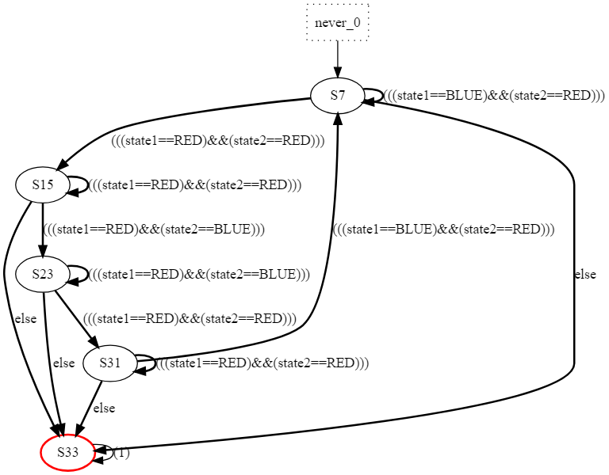
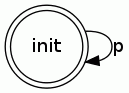
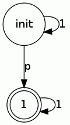
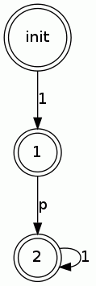
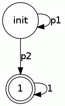

前回のPromelaによるModel Checkingの話の続き

```
$ spin -V
Spin Version 6.4.5 -- 1 January 2016
```

前回は、プログラムがオートマトンで表すことができて、そこに無限ループがあるかどうかを検証する手法を紹介した。
今回は、プログラムがあるオートマトンに受理されるかどうかを検証する手法を紹介する。

## 信号機のモデル
```
mtype = {BLUE, RED, LOCKED, UNLOCKED};
mtype mutex1 = LOCKED;
mtype mutex2 = LOCKED;
mtype state1 = BLUE, state2 = RED;

inline lock(m) {
  d_step{m == UNLOCKED -> m = LOCKED}
}

inline unlock(m){
  m = UNLOCKED
}

active proctype signal1(){
  do
    :: state1 = RED;
       unlock(mutex2);
       lock(mutex1);
       state1 = BLUE
  od
}

active proctype signal2(){
  do
    :: lock(mutex2);
       state2 = BLUE;
       state2 = RED;
       unlock(mutex1)
  od
}
```
吉岡信和; 青木利晃; 田原康之. SPIN による設計モデル検証―モデル検査の実践ソフトウェア検証 (トップエスイー実践講座). 2008. pp86. 図4.19

## Never claims
never claimは「決して起きてはいけない挙動」をオートマトンとして記述し、検証したい性質を表現する。
このnever claimによってプログラムが受理されてしまった場合、そのプログラムは満たしてほしくない性質を持つことがわかる。

```
never{
BLUE_RED:
  if
    :: state1 == BLUE && state2 == RED  -> goto BLUE_RED
    :: state1 == RED  && state2 == RED  -> goto RED_RED
    :: else -> goto accept
  fi;

RED_RED:
  if
    :: state1 == RED  && state2 == RED  -> goto RED_RED
    :: state1 == RED  && state2 == BLUE -> goto RED_BLUE
    :: else -> goto accept
  fi;

RED_BLUE:
  if
    :: state1 == RED  && state2 == BLUE -> goto RED_BLUE
    :: state1 == RED  && state2 == RED  -> goto RED_RED2
    :: else -> goto accept
  fi;

RED_RED2:
  if
    :: state1 == RED  && state2 == RED  -> goto RED_RED2
    :: state1 == BLUE && state2 == RED  -> goto BLUE_RED
    :: else -> goto accept
  fi;

accept:
  skip;
  goto accept
}
```
吉岡信和; 青木利晃; 田原康之. SPIN による設計モデル検証―モデル検査の実践ソフトウェア検証 (トップエスイー実践講座). 2008. pp89. 図4.21



## 線形時相論理
LTL(Linear-time Temporal Logic)とは、時間の概念が取り入れられた論理である。
`[]`, `<>`, `X`, `U`という論理演算子がある。
```
φ,Ψ ::= ¬ φ | φ ∧ Ψ | φ ∨ Ψ | φ ⇒ Ψ
      | [] φ  (always φ)
      | <> φ  (eventually φ)
      | X  φ  (φ holds next)
      | φ U Ψ (φ until Ψ)
```

|LTL式|意味|
----|---- 
| `[] φ` | 現時点から常に`φ`が成り立つ |
| `<> φ` | いつか`φ`が成り立つ |
| `X  φ` | 次に`φ`が成り立つ |
| `φ U Ψ` | `Ψ`が成り立つまで`φ`が成り立つ |

### LTL式とBüchi Automata





### LTL式で書ける性質
|性質|LTL式|
----|----
|応答性|`[](req -> <> ack)`|
|進行性|`[]<>myTurn`|

## 参考文献
- 早稲田大学 高信頼ソフトウェア, http://www.ueda.info.waseda.ac.jp/oess/RS2018/
- 吉岡信和; 青木利晃; 田原康之. SPIN による設計モデル検証―モデル検査の実践ソフトウェア検証 (トップエスイー実践講座). 2008.
- SPIN model checker, http://spinroot.com/spin/whatispin.html
- LTL2BA, http://www.lsv.fr/~gastin/ltl2ba/index.php

