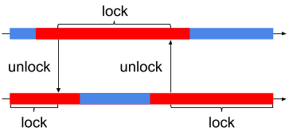

前回のPromelaによるModel Checkingの話の続き

```
$ spin -V
Spin Version 6.4.5 -- 1 January 2016
```

前回は、プログラムに無限ループがあるかどうかを検証する手法を紹介した。

今回は、プログラムがあるオートマトンに受理されるかどうかを検証する手法を紹介する。

## 信号機のモデル
今回の検証対象のモデルを以下に示す。
```
mtype = {BLUE, RED, LOCKED, UNLOCKED};
mtype mutex1 = LOCKED;
mtype mutex2 = LOCKED;
mtype state1 = BLUE, state2 = RED;

inline lock(m) {
  d_step{m == UNLOCKED -> m = LOCKED}
}

inline unlock(m){
  m = UNLOCKED
}

active proctype signal1(){
  do
    :: state1 = RED;
       unlock(mutex2);
       lock(mutex1);
       state1 = BLUE
  od
}

active proctype signal2(){
  do
    :: lock(mutex2);
       state2 = BLUE;
       state2 = RED;
       unlock(mutex1)
  od
}
```
吉岡信和; 青木利晃; 田原康之. SPIN による設計モデル検証―モデル検査の実践ソフトウェア検証 (トップエスイー実践講座). 2008. pp86. 図4.19

これは２つの信号機（２色）を交互に切り替えるモデルである。
このモデルは次のように定義されている。
- 信号機の状態は`BLUE`と`RED`で表され、プロセス`signal1`, `signal2`はそれぞれの信号機の状態変数`state1`, `state2`の切り替えを繰り返す。
- ...

このモデルは下図のような「２つの信号機は交互に赤と青を繰り返し、２つ同時に青になることはない」ような振る舞いが期待されている。



シミュレーション実行をしてみると期待通りの振る舞いをしているように見える。
しかし、検証をしてみないとわからないのでこうした振る舞いについての検証をSPINによって行う。

```
$ spin -p -g -u11 signal.pml 
  0:    proc  - (:root:) creates proc  0 (signal1)
  0:    proc  - (:root:) creates proc  1 (signal2)
warning: never claim not used in random simulation
  1:    proc  0 (signal1:1) signal.pml:16 (state 1)     [state1 = RED]
                state1 = RED
  2:    proc  0 (signal1:1) signal.pml:11 (state 2)     [mutex2 = UNLOCKED]
                mutex2 = UNLOCKED
  4:    proc  1 (signal2:1) signal.pml:7 (state 2)      [mutex2 = LOCKED]
                mutex2 = LOCKED
  5:    proc  1 (signal2:1) signal.pml:26 (state 5)     [state2 = BLUE]
                state2 = BLUE
  6:    proc  1 (signal2:1) signal.pml:27 (state 6)     [state2 = RED]
                state2 = RED
  7:    proc  1 (signal2:1) signal.pml:11 (state 7)     [mutex1 = UNLOCKED]
                mutex1 = UNLOCKED
  8:    proc  1 (signal2:1) signal.pml:30 (state 10)    [.(goto)]
 10:    proc  0 (signal1:1) signal.pml:7 (state 5)      [mutex1 = LOCKED]
                mutex1 = LOCKED
 11:    proc  0 (signal1:1) signal.pml:19 (state 8)     [state1 = BLUE]
                state1 = BLUE
-------------
depth-limit (-u11 steps) reached
#processes: 2
                mutex1 = LOCKED
                mutex2 = LOCKED
                state1 = BLUE
                state2 = RED
 11:    proc  1 (signal2:1) signal.pml:24 (state 9)
 11:    proc  0 (signal1:1) signal.pml:21 (state 10)
2 processes created
```

## Never Claim
SPINにおけるモデルの振る舞いについての検証はNever Claimが用いられる。

Never ClaimはSPINにおいて特別な扱いを受けるプロセスで、「決して起きてはいけない振る舞い」をプログラムとして記述する。
信号機のモデルにおけるNever Claimの例を以下に示す。

```
never{
BLUE_RED:
  if
    :: state1 == BLUE && state2 == RED  -> goto BLUE_RED
    :: state1 == RED  && state2 == RED  -> goto RED_RED
    :: else -> goto accept
  fi;

RED_RED:
  if
    :: state1 == RED  && state2 == RED  -> goto RED_RED
    :: state1 == RED  && state2 == BLUE -> goto RED_BLUE
    :: else -> goto accept
  fi;

RED_BLUE:
  if
    :: state1 == RED  && state2 == BLUE -> goto RED_BLUE
    :: state1 == RED  && state2 == RED  -> goto RED_RED2
    :: else -> goto accept
  fi;

RED_RED2:
  if
    :: state1 == RED  && state2 == RED  -> goto RED_RED2
    :: state1 == BLUE && state2 == RED  -> goto BLUE_RED
    :: else -> goto accept
  fi;

accept:
  skip;
  goto accept
}
```
吉岡信和; 青木利晃; 田原康之. SPIN による設計モデル検証―モデル検査の実践ソフトウェア検証 (トップエスイー実践講座). 2008. pp89. 図4.21

このNever Claimプロセスは２つの信号機の状態変数の`state1`, `state2`についての振る舞いを記述している。

Never Claimプロセスをオートマトンとして出力したものを下図に示す。


SPINはモデルとして記述されたプロセスと並行にNever Claimプロセスを実行して、`accept`ラベルを無限回通るような実行があったときエラーとして報告する。
言い換えるとNever Claimプロセスであらわされたオートマトンに受理される実行列が存在するときエラーとして報告される。

SPINで検証するときは上記のNever Calimを信号機のモデルに追加して、以下のコマンドで検証する。

```
$ spin -o3 -search -a signal.pml 
warning: for p.o. reduction to be valid the never claim must be stutter-invariant
(never claims generated from LTL formulae are stutter-invariant)

(Spin Version 6.4.5 -- 1 January 2016)
        + Partial Order Reduction

Full statespace search for:
        never claim             + (never_0)
        assertion violations    + (if within scope of claim)
        acceptance   cycles     + (fairness disabled)
        invalid end states      - (disabled by never claim)

State-vector 36 byte, depth reached 17, errors: 0
        9 states, stored
        1 states, matched
       10 transitions (= stored+matched)
        0 atomic steps
hash conflicts:         0 (resolved)

Stats on memory usage (in Megabytes):
    0.001       equivalent memory usage for states (stored*(State-vector + overhead))
    0.286       actual memory usage for states
  128.000       memory used for hash table (-w24)
    0.534       memory used for DFS stack (-m10000)
  128.730       total actual memory usage


unreached in proctype signal1
        signal.pml:21, state 12, "-end-"
        (1 of 12 states)
unreached in proctype signal2
        signal.pml:30, state 12, "-end-"
        (1 of 12 states)
unreached in claim never_0
        signal.pml:64, state 35, "-end-"
        (1 of 35 states)

pan: elapsed time 0 seconds
```

検証結果は`errors: 0`であり、Never Claimに受理されるような実行列は存在しないつまり「決して起きてはいけない振る舞い」は発生しないことがわかる。

わざと`mutex1`に対する`lock`, `unlock`を取り除いたプログラムに同じNever Claimを検証した結果を以下に示す。

```
$ spin -o3 -search -a signal-err.pml 
warning: for p.o. reduction to be valid the never claim must be stutter-invariant
(never claims generated from LTL formulae are stutter-invariant)
pan:1: acceptance cycle (at depth 12)
pan: wrote signal-err.pml.trail

(Spin Version 6.4.5 -- 1 January 2016)
Warning: Search not completed
        + Partial Order Reduction

Full statespace search for:
        never claim             + (never_0)
        assertion violations    + (if within scope of claim)
        acceptance   cycles     + (fairness disabled)
        invalid end states      - (disabled by never claim)

State-vector 36 byte, depth reached 23, errors: 1
       14 states, stored
        1 states, matched
       15 transitions (= stored+matched)
        0 atomic steps
hash conflicts:         0 (resolved)

Stats on memory usage (in Megabytes):
    0.001       equivalent memory usage for states (stored*(State-vector + overhead))
    0.287       actual memory usage for states
  128.000       memory used for hash table (-w24)
    0.534       memory used for DFS stack (-m10000)
  128.730       total actual memory usage


pan: elapsed time 0 seconds
```

検証結果は`errors: 1`であり`pan:1: acceptance cycle (at depth 12)`とも表示される。
Never Claimに受理されるような実行列は存在することがわかる。

Never Claimに受理された実行列を以下に示す。

```
$ spin -p -t -g signal-err.pml
starting claim 2
Never claim moves to line 35    [(((state1==BLUE)&&(state2==RED)))]
  2:    proc  0 (signal1:1) signal-err.pml:16 (state 1) [state1 = RED]
                state1 = RED
Never claim moves to line 36    [(((state1==RED)&&(state2==RED)))]
  4:    proc  0 (signal1:1) signal-err.pml:11 (state 2) [mutex2 = UNLOCKED]
                mutex2 = UNLOCKED
Never claim moves to line 42    [(((state1==RED)&&(state2==RED)))]
  6:    proc  1 (signal2:1) signal-err.pml:7 (state 3)  [((mutex2==UNLOCKED))]
  6:    proc  1 (signal2:1) signal-err.pml:7 (state 2)  [mutex2 = LOCKED]
                mutex2 = LOCKED
  8:    proc  1 (signal2:1) signal-err.pml:26 (state 5) [state2 = BLUE]
                state2 = BLUE
Never claim moves to line 43    [(((state1==RED)&&(state2==BLUE)))]
 10:    proc  0 (signal1:1) signal-err.pml:19 (state 4) [state1 = BLUE]
                state1 = BLUE
Never claim moves to line 51    [else]
 12:    proc  1 (signal2:1) signal-err.pml:27 (state 6) [state2 = RED]
                state2 = RED
  <<<<<START OF CYCLE>>>>>
Never claim moves to line 62    [(1)]
 14:    proc  0 (signal1:1) signal-err.pml:16 (state 1) [state1 = RED]
                state1 = RED
 16:    proc  0 (signal1:1) signal-err.pml:11 (state 2) [mutex2 = UNLOCKED]
                mutex2 = UNLOCKED
 18:    proc  1 (signal2:1) signal-err.pml:7 (state 3)  [((mutex2==UNLOCKED))]
 18:    proc  1 (signal2:1) signal-err.pml:7 (state 2)  [mutex2 = LOCKED]
                mutex2 = LOCKED
 20:    proc  1 (signal2:1) signal-err.pml:26 (state 5) [state2 = BLUE]
                state2 = BLUE
 22:    proc  1 (signal2:1) signal-err.pml:27 (state 6) [state2 = RED]
                state2 = RED
 24:    proc  0 (signal1:1) signal-err.pml:19 (state 4) [state1 = BLUE]
                state1 = BLUE
spin: trail ends after 24 steps
#processes: 2
                mutex1 = LOCKED
                mutex2 = LOCKED
                state1 = BLUE
                state2 = RED
 24:    proc  1 (signal2:1) signal-err.pml:24 (state 7)
 24:    proc  0 (signal1:1) signal-err.pml:15 (state 5)
 24:    proc  - (never_0:1) signal-err.pml:62 (state 33)
2 processes created
```

## 線形時相論理
Never Claimを記述することで振る舞いの検証を行うことができたが、検証したい性質をNever Claimとして書き起こすことは容易ではない。
そこでSPINではLTLと呼ばれる論理式で検証したい性質を表し、そこからNever Claimを自動生成する手法がある。

LTL(Linear-time Temporal Logic)とは、時間の概念が取り入れられた論理である。
`[]`, `<>`, `X`, `U`という論理演算子がある。
```
φ,Ψ ::= ¬ φ | φ ∧ Ψ | φ ∨ Ψ | φ ⇒ Ψ
      | [] φ  (always φ)
      | <> φ  (eventually φ)
      | X  φ  (φ holds next)
      | φ U Ψ (φ until Ψ)
```

|LTL式|意味|
----|---- 
| `[] φ` | 現時点から常に`φ`が成り立つ |
| `<> φ` | いつか`φ`が成り立つ |
| `X  φ` | 次に`φ`が成り立つ |
| `φ U Ψ` | `Ψ`が成り立つまで`φ`が成り立つ |

SPINでは以下のようにLTL式からNever Claimを生成することができる。
```
$ spin -f '[]p'
never  {    /* []p */
accept_init:
T0_init:
        do
        :: ((p)) -> goto T0_init
        od;
}
```

それぞれのLTL式から生成されたNever Claimを表すオートマトンを以下に示す。

|LTL式|`[] φ`|`<> φ`|`X  φ`|`φ U Ψ`|
-----|----|----|----|---- 
|オートマトン|||||

例えば信号機のモデルにおいて「２つの信号機が同時に青にならない」という性質は以下のようなLTL式で表現できる。
```
p : state1 == BLUE
q : state2 == BLUE
[]!(p && q)
```
このLTL式の性質が**満たされない**ときエラーとして報告してほしい場合、このLTL式を否定した`!([]!(p && q))`から生成されたNever Claimを使う。
```
$ spin -f '!([]!(p && q))'
never  {    /* !([]!(p && q)) */
T0_init:
        do
        :: atomic { ((p && q)) -> assert(!((p && q))) }
        :: (1) -> goto T0_init
        od;
accept_all:
        skip
}
```

生成されたNever Claimと`p`, `q`の定義を検証したいプログラムに追加する。
```
#define p state1 == BLUE
#define q state2 == BLUE

never  {    /* !([]!(p && q)) */
T0_init:
  do
    :: atomic { ((p && q)) -> assert(!((p && q))) }
    :: (1) -> goto T0_init
  od;
accept_all:
  skip
}
```

そして以下のコマンドで検証する。

```
$ spin -o3 -search -a signal-ltl.pml 
warning: for p.o. reduction to be valid the never claim must be stutter-invariant
(never claims generated from LTL formulae are stutter-invariant)

(Spin Version 6.4.5 -- 1 January 2016)
        + Partial Order Reduction

Full statespace search for:
        never claim             + (never_0)
        assertion violations    + (if within scope of claim)
        acceptance   cycles     + (fairness disabled)
        invalid end states      - (disabled by never claim)

State-vector 36 byte, depth reached 15, errors: 0
        8 states, stored
        1 states, matched
        9 transitions (= stored+matched)
        0 atomic steps
hash conflicts:         0 (resolved)

Stats on memory usage (in Megabytes):
    0.000       equivalent memory usage for states (stored*(State-vector + overhead))
    0.289       actual memory usage for states
  128.000       memory used for hash table (-w24)
    0.534       memory used for DFS stack (-m10000)
  128.730       total actual memory usage


unreached in proctype signal1
        signal-ltl.pml:21, state 12, "-end-"
        (1 of 12 states)
unreached in proctype signal2
        signal-ltl.pml:30, state 12, "-end-"
        (1 of 12 states)
unreached in claim never_0
        signal-ltl.pml:38, state 2, "assert(!(((state1==BLUE)&&(state2==BLUE))))"
        signal-ltl.pml:43, state 10, "-end-"
        (2 of 10 states)

pan: elapsed time 0 seconds
```

検証結果から`errors: 0`であり、LTL式で記述された性質をこのモデルは満たしていることがわかる。

## 参考文献
- 早稲田大学 高信頼ソフトウェア, http://www.ueda.info.waseda.ac.jp/oess/RS2018/
- 吉岡信和; 青木利晃; 田原康之. SPIN による設計モデル検証―モデル検査の実践ソフトウェア検証 (トップエスイー実践講座). 2008.
- SPIN model checker, http://spinroot.com/spin/whatispin.html
- LTL2BA, http://www.lsv.fr/~gastin/ltl2ba/index.php

