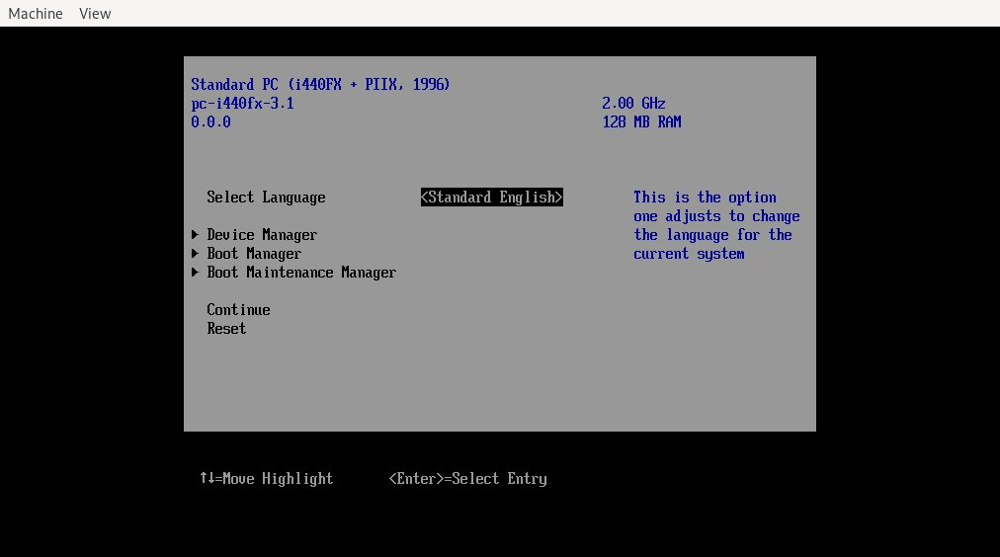

# UEFIアプリケーションの紹介

## UEFIとは？
> ## WHAT IS UEFI?
> UEFI stands for "Unified Extensible Firmware Interface." The UEFI Specification defines a new model for the interface between personal-computer operating systems and platform firmware. The interface consists of data tables that contain platform-related information, plus boot and runtime service calls that are available to the operating system and its loader. Together, these provide a standard environment for booting an operating system and running pre-boot applications.
> 
> [UEFI Forum](https://uefi.org/)

ファームウェアとOSの間のインターフェース仕様。
OSの起動や、起動する前のアプリケーションを実行するための環境を提供する。

[UEFI Forum](https://uefi.org/)によって仕様が定められている。
- [UEFI Specification Version 2.7 (Errata A)](http://www.uefi.org/sites/default/files/resources/UEFI%20Spec%202_7_A%20Sept%206.pdf)

UEFIは次のようなブートプロセスを実行する。

> ### UEFI のブートプロセス
> 1. システムのスイッチが入る - POST (Power On Self Test) プロセス
> 1. UEFI ファームウェアがロードされます。ファームウェアは起動に必要なハードウェアを初期化します
> 1. 次にファームウェアはブートマネージャのデータを読み込みどの UEFI アプリケーションをどこから (つまりどのディスク・パーティションから) 起動するか決定します
> 1. ファームウェアのブートマネージャのブートエントリに定義されているように UEFI アプリケーションをファームウェアが起動します
> 1. 起動した UEFI アプリケーションは設定によって他のアプリケーション (UEFI シェルや rEFInd の場合) やカーネルと initramfs (GRUB などのブートローダの場合) を起動します
> 
> [UEFI - ArchWiki - Arch Linux](https://wiki.archlinux.jp/index.php/Unified_Extensible_Firmware_Interface)

UEFIはESP(EFI System Partition)という名前の特別なパーティションの中にあるUEFIアプリケーションを起動する。

例えば自分のArch Linuxでは`/dev/sda2`がESPである。（Windowsとデュアルブートしているため見にくいが）
```
% lsblk -o NAME,MOUNTPOINT,PARTLABEL,FSTYPE /dev/sda 
NAME   MOUNTPOINT PARTLABEL                    FSTYPE
sda                                            
├─sda1            Basic data partition         ntfs
├─sda2 /boot      EFI system partition         vfat
├─sda3            Microsoft reserved partition 
├─sda4            Basic data partition         ntfs
└─sda5 /                                       ext4
```
各ベンダーはUEFIアプリケーションを`<EFI SYSTEM PARTITION>/EFI/<VENDOR NAME>/`以下に配置している。
```
% ls /boot/EFI/              
Boot  grub  Microsoft
% file /boot/EFI/grub/grubx64.efi 
/boot/EFI/grub/grubx64.efi: PE32+ executable (EFI application) x86-64 (stripped to external PDB), for MS Windows
```
UEFIアプリケーションはEFIファームウェアアーキテクチャ対応してコンパイルされている必要がある。

## VMでUEFIの起動
毎回実機でUEFIを確認するのは大変なので、VMでUEFI環境を構築する。

> OVMF is an EDK II based project to enable UEFI support for Virtual Machines. OVMF contains sample UEFI firmware for QEMU and KVM.
> 
> [OVMF · tianocore/tianocore.github.io Wiki · GitHub](https://github.com/tianocore/tianocore.github.io/wiki/OVMF)

OVMFはVM上で動作するUEFIファームウェアで、これをqemuで起動する。



## UEFI shell

## UEFIアプリケーション

## 参考文献
- [UEFI Forum](https://uefi.org/)
- [UEFI - ArchWiki - Arch Linux](https://wiki.archlinux.jp/index.php/Unified_Extensible_Firmware_Interface)
- [EDK II で UEFI アプリケーションを作る — osdev-jp](https://osdev-jp.readthedocs.io/ja/latest/2017/create-uefi-app-with-edk2.html)
