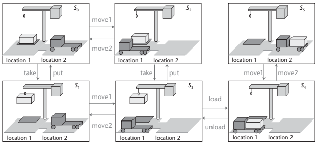

# PDDLの紹介

Planning Domain Definition Language (PDDL)はAutomated planning and schedulingをモデリングするための言語である。

Automated planning and schedulingとは



入力
1. アクションの定義
```
;;;;;;;;;;;;;;;;;;;;;;;;;;;;;;;;;;;;;;;;
;;; 4 Op-blocks world
;;;;;;;;;;;;;;;;;;;;;;;;;;;;;;;;;;;;;;;;

(define (domain BLOCKS)
  (:requirements :strips)

  ;; 述語の定義
  (:predicates (on ?x ?y)    ;; x が y の上に乗っている
	           (ontable ?x)  ;; x がテーブルの上にある
	           (clear ?x)    ;; x の上には何も乗っていない
	           (handempty)   ;; アームは何もつかんでいない
	           (holding ?x)) ;; アームが x をつかんでいる

  
  (:action pick-up
	     :parameters (?x)
	     :precondition (and (clear ?x) (ontable ?x) (handempty))
	     :effect
	     (and (not (ontable ?x))
		      (not (clear ?x))
		      (not (handempty))
		      (holding ?x)))

  (:action put-down
	     :parameters (?x)
	     :precondition (holding ?x)
	     :effect
	     (and (not (holding ?x))
		      (clear ?x)
		      (handempty)
		      (ontable ?x)))
  
  (:action stack
	     :parameters (?x ?y)
	     :precondition (and (holding ?x) (clear ?y))
	     :effect
	     (and (not (holding ?x))
		   (not (clear ?y))
		   (clear ?x)
		   (handempty)
		   (on ?x ?y)))

  (:action unstack
	     :parameters (?x ?y)
	     :precondition (and (on ?x ?y) (clear ?x) (handempty))
	     :effect
	     (and (holding ?x)
		   (clear ?y)
		   (not (clear ?x))
		   (not (handempty))
		   (not (on ?x ?y)))))
```

2. 初期状態とゴール状態の定義
```
(define (problem BLOCKS-4-0)
    (:domain BLOCKS)
    (:objects D B A C)
    (:INIT (CLEAR C) (CLEAR A) (CLEAR B) (CLEAR D) (ONTABLE C) (ONTABLE A) (ONTABLE B) (ONTABLE D) (HANDEMPTY))
    (:goal (AND (ON D C) (ON C B) (ON B A)))
)
```
図で表すと下記のようなもの。
```
                   |D|
                   |C|
                   |B|
|A| |B| |C| |D|    |A|
--------------- => ---------------
     table              table
```

出力
- 初期状態からゴール状態へ到達するアクション列
```
(pick-up b)
(stack b a)
(pick-up c)
(stack c b)
(pick-up d)
(stack d c)
```

# 参考文献
- Automated Planning and Acting - LAAS-CNRS, http://projects.laas.fr/planning/
- Nau, Dana S. "Current trends in automated planning." AI magazine 28.4 (2007): 43.
- PDDL Editor, http://editor.planning.domains/