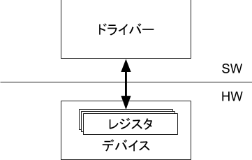

# PCIデバイスへのアクセス

PCIデバイスにデバイスドライバからアクセスする方法を調査する。（PCIとPCIeで仕様が異なる部分もあるが、互換のある部分について調査する。）
実験環境はArchLinuxで下記のkernelバージョンで実施した。

```
$ uname -r
5.3.8-arch1-1
```

PCに接続されているPCIデバイスの一覧は次のように表示できる。

```
$ lspci | head
00:00.0 Host bridge: Advanced Micro Devices, Inc. [AMD] Family 17h (Models 00h-0fh) Root Complex
00:00.2 IOMMU: Advanced Micro Devices, Inc. [AMD] Family 17h (Models 00h-0fh) I/O Memory Management Unit
00:01.0 Host bridge: Advanced Micro Devices, Inc. [AMD] Family 17h (Models 00h-1fh) PCIe Dummy Host Bridge
00:01.3 PCI bridge: Advanced Micro Devices, Inc. [AMD] Family 17h (Models 00h-0fh) PCIe GPP Bridge
00:02.0 Host bridge: Advanced Micro Devices, Inc. [AMD] Family 17h (Models 00h-1fh) PCIe Dummy Host Bridge
00:03.0 Host bridge: Advanced Micro Devices, Inc. [AMD] Family 17h (Models 00h-1fh) PCIe Dummy Host Bridge
00:03.1 PCI bridge: Advanced Micro Devices, Inc. [AMD] Family 17h (Models 00h-0fh) PCIe GPP Bridge
00:04.0 Host bridge: Advanced Micro Devices, Inc. [AMD] Family 17h (Models 00h-1fh) PCIe Dummy Host Bridge
00:07.0 Host bridge: Advanced Micro Devices, Inc. [AMD] Family 17h (Models 00h-1fh) PCIe Dummy Host Bridge
00:07.1 PCI bridge: Advanced Micro Devices, Inc. [AMD] Family 17h (Models 00h-0fh) Internal PCIe GPP Bridge 0 to Bus B
```

あるいはカーネルが管理しているオブジェクトがマッピングされた疑似ファイルシステム sysfs からも一覧を見ることができる。

```
$ ls /sys/bus/pci/devices 
0000:00:00.0  0000:00:02.0  0000:00:07.0  0000:00:14.0  0000:00:18.2  0000:00:18.6  0000:03:00.2  0000:1d:06.0  0000:26:00.1  0000:28:00.0
0000:00:00.2  0000:00:03.0  0000:00:07.1  0000:00:14.3  0000:00:18.3  0000:00:18.7  0000:1d:00.0  0000:1d:07.0  0000:27:00.0  0000:28:00.2
0000:00:01.0  0000:00:03.1  0000:00:08.0  0000:00:18.0  0000:00:18.4  0000:03:00.0  0000:1d:01.0  0000:25:00.0  0000:27:00.2  0000:28:00.3
0000:00:01.3  0000:00:04.0  0000:00:08.1  0000:00:18.1  0000:00:18.5  0000:03:00.1  0000:1d:04.0  0000:26:00.0  0000:27:00.3
$ ls /sys/bus/pci/devices/0000:00:00.0/ 
ari_enabled           consistent_dma_mask_bits  dma_mask_bits    irq            msi_bus    rescan     subsystem_device
broken_parity_status  d3cold_allowed            driver_override  local_cpulist  numa_node  resource   subsystem_vendor
class                 device                    enable           local_cpus     power      revision   uevent
config                devspec                   firmware_node    modalias       remove     subsystem  vendor
```

PCIデバイスはドメインごとにバス番号、デバイス番号、ファンクション番号で識別される。

```
$ man lspci
...
   Options for selection of devices
       -s [[[[<domain>]:]<bus>]:][<device>][.[<func>]]
              Show only devices in the specified domain (in case your machine has several host bridges, they can either share a common bus
              number  space  or each of them can address a PCI domain of its own; domains are numbered from 0 to ffff), bus (0 to ff), de‐
              vice (0 to 1f) and function (0 to 7).  Each component of the device address can be omitted or set to "*", both meaning  "any
              value". All numbers are hexadecimal.  E.g., "0:" means all devices on bus 0, "0" means all functions of device 0 on any bus,
              "0.3" selects third function of device 0 on all buses and ".4" shows only the fourth function of each device.
...
```

デバイスドライバはデバイスが持つレジスタへの読み書きによってデバイスを制御する。（正確にはデバイスが持つレジスタをIO空間やメモリ空間にマッピングすることで、デバイスドライバはデバイスが持つレジスタにアクセスすることができる。）



PCIデバイスは各デバイスごとにベンダIDやデバイスID、デバイス状態などの情報を保持するレジスタが実装されている。
それらのレジスタはコンフィグレーション空間と呼ばれる256byteの領域に設定されている。(PCIeの場合はコンフィグレーション空間のサイズが4096byteであるが、互換性のため先頭256byteはPCIと同じレイアウトになっている。)

コンフィグレーション空間のヘッダーは下図のようなレイアウトになっている（一部省略）。


デバイスドライバーがPCIデバイスを制御するためには、コンフィグレーション空間にアクセスする必要がある。

コンフィグレーション空間にアクセスする方法はIOポートかMMIOの２つがある。
今回は、Linux カーネルがPCIデバイスを初期化するときにコンフィグレーション空間へどのようにアクセスしているかftraceを使って調べてみた。

カーネルパラメータに`ftrace=function ftrace_filter=*pci*`を追加して起動すると以下のような結果になった。

```
# cat /sys/kernel/debug/tracing/trace
# tracer: function
#
# entries-in-buffer/entries-written: 57813/70138   #P:12
#
#                              _-----=> irqs-off
#                             / _----=> need-resched
#                            | / _---=> hardirq/softirq
#                            || / _--=> preempt-depth
#                            ||| /     delay
#           TASK-PID   CPU#  ||||    TIMESTAMP  FUNCTION
#              | |       |   ||||       |         |
          <idle>-0     [000] d..1     0.155635: pci_msi_create_irq_domain <-arch_init_msi_domain
          <idle>-0     [000] ...1     0.156933: pci_msi_create_irq_domain <-arch_create_remap_msi_irq_domain
##### CPU 2 buffer started ####
       swapper/0-1     [002] ....     0.853238: pci_realloc_setup_params <-do_one_initcall
       swapper/0-1     [002] ....     0.853854: pcibus_class_init <-do_one_initcall
       swapper/0-1     [002] ....     0.853855: pci_driver_init <-do_one_initcall
       swapper/0-1     [002] ....     0.853972: early_pci_allowed <-early_root_info_init
       swapper/0-1     [002] ....     0.853973: read_pci_config <-early_root_info_init
       swapper/0-1     [002] ....     0.853973: read_pci_config <-early_root_info_init
       swapper/0-1     [002] ....     0.853973: read_pci_config <-early_root_info_init
       swapper/0-1     [002] ....     0.853974: read_pci_config <-early_root_info_init
       swapper/0-1     [002] ....     0.853975: read_pci_config <-early_root_info_init
       swapper/0-1     [002] ....     0.853975: early_pci_allowed <-amd_postcore_init
...
```

`read_pci_config` という関数がコンフィグレーション空間にアクセスしていそうである。
実装は[arch/x86/pci/early.c](https://git.kernel.org/pub/scm/linux/kernel/git/torvalds/linux.git/tree/arch/x86/pci/early.c?h=v5.3#n11)にある。

```c
u32 read_pci_config(u8 bus, u8 slot, u8 func, u8 offset)
{
        u32 v;
        outl(0x80000000 | (bus<<16) | (slot<<11) | (func<<8) | offset, 0xcf8);
        v = inl(0xcfc);
        return v;
}
```

`outl`と`inl`はそれぞれIOポートへの読み書きの関数である。実装は[arch/x86/boot/boot.h](https://git.kernel.org/pub/scm/linux/kernel/git/torvalds/linux.git/tree/arch/x86/boot/boot.h?h=v5.3#n63)にある。

```c
static inline void outl(u32 v, u16 port)
{
        asm volatile("outl %0,%1" : : "a" (v), "dN" (port));
}
static inline u32 inl(u16 port)
{
        u32 v;
        asm volatile("inl %1,%0" : "=a" (v) : "dN" (port));
        return v;
}
```

上記のようにLinuxカーネルはPCの起動直後の初期化にはIOポートを使ったコンフィグレーション空間アクセスをしているようだ。

IOポートによるアクセスは、CONFIG_ADDRESS(CF8h)とCONFIG_DATA(CFCh)という特定のポート番地への読み書きによって行う。
まずCONFIG_ADDRESS番地に下図のようなレイアウトでアクセスしたいPCIデバイスのバス番号・デバイス番号・ファンクション番号・レジスタ番号を書き込む。


CONFIG_ADDRESS番地に書き込んだ後にCONFIG_DATA番地の32bitを読み込むと、指定したデバイスのコンフィグレーション空間のレジスタにアクセスすることができる。

実際にPCIデバイス 00:00.0 のコンフィグレーション空間 256byte にアクセスして表示するデバイスドライバを書いてみた。

```c
#include <linux/module.h>
#include <linux/init.h>

MODULE_LICENSE("Dual BSD/GPL");

u32 read_pci_config(u8 bus, u8 slot, u8 func, u8 offset)
{
  u32 v;
  /* CONFIG_ADDRESS レジスタへ書き込み */
  outl(0x80000000 | (bus<<16) | (slot<<11) | (func<<8) | offset, 0xcf8);
  /* CONFIG_DATA レジスタの読み込み */
  v = inl(0xcfc);
  return v;

}

static int pci_test_init(void)
{
  int i;
  printk("pci_test is loaded.\n");

  /* PCIデバイス 00:00.0 のコンフィグレーション空間にアクセス */
  for(i = 0; i < 0xff; i+=4) {
    printk("%02x = %08x",i , read_pci_config(0,0,0,i));
  }

  return 0;
}
module_init(pci_test_init);

static void pci_test_exit(void)
{
  printk("pci_test is unloaded.\n");
}
module_exit(pci_test_exit);
```

上のデバイスドライバをコンパイルして`insmod`すると以下の結果になった。

```
$ sudo dmesg
...
[ 4793.908006] pci_test is loaded.
[ 4793.908008] 00 = 14501022
[ 4793.908010] 04 = 00000000
[ 4793.908011] 08 = 06000000
[ 4793.908013] 0c = 00800000
[ 4793.908015] 10 = 00000000
[ 4793.908016] 14 = 00000000
[ 4793.908017] 18 = 00000000
[ 4793.908019] 1c = 00000000
[ 4793.908020] 20 = 00000000
[ 4793.908021] 24 = 00000000
[ 4793.908023] 28 = 00000000
[ 4793.908024] 2c = 14501849
[ 4793.908025] 30 = 00000000
[ 4793.908026] 34 = 00000000
[ 4793.908027] 38 = 00000000
[ 4793.908028] 3c = 00000000
...
```

例えば`00 = 14501022`はコンフィグレーション空間の先頭32bitの値で、上位`1450`がデバイスID、下位`1022`がベンダーIDである。

それぞれのIDの登録情報は https://pci-ids.ucw.cz/ から確認することができる。
- ベンダーID `1022 Advanced Micro Devices, Inc. [AMD]`
- デバイスID `1450 Family 17h (Models 00h-0fh) Root Complex`

実は`lspci`コマンドでも`-x`オプションを使うとコンフィグレーション空間を表示することができる。

```
$ lspci -x -s 00:00.0       
00:00.0 Host bridge: Advanced Micro Devices, Inc. [AMD] Family 17h (Models 00h-0fh) Root Complex
00: 22 10 50 14 00 00 00 00 00 00 00 06 00 00 80 00
10: 00 00 00 00 00 00 00 00 00 00 00 00 00 00 00 00
20: 00 00 00 00 00 00 00 00 00 00 00 00 49 18 50 14
30: 00 00 00 00 00 00 00 00 00 00 00 00 00 00 00 00
```

比べてみると同じ値が表示されていることが分かる。（リトルエンディアンであるため表示が逆順になっている。）


# 参考
- Linuxデバイスドライバプログラミング, 平田豊
