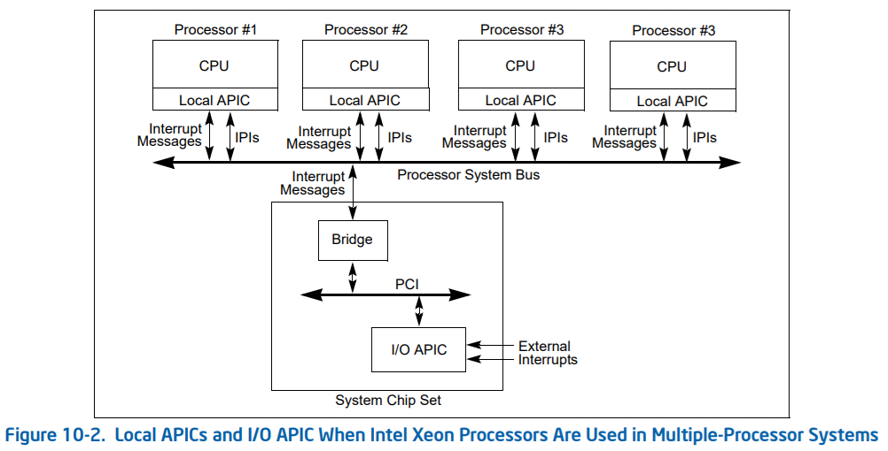

# x86 割込み

## LOCAL APIC と I/O APIC

# 参考
- Intel® 64 and IA-32 Architectures Software Developer Manuals, https://software.intel.com/en-us/articles/intel-sdm
  - Volume 3 : CHAPTER 10 ADVANCED PROGRAMMABLE INTERRUPT CONTROLLER (APIC)
- Linux generic IRQ handling - Linux Kernel Documentation, https://www.kernel.org/doc/html/latest/core-api/genericirq.html
- デバイスドライバと割り込み処理、inb()とoutb() - 筑波大学 システム情報系 オペレーティングシステム II, http://www.coins.tsukuba.ac.jp/~yas/coins/os2-2018/2019-01-25/index.html
