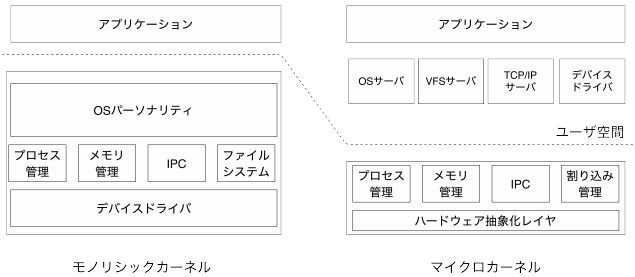

# L4マイクロカーネル

[CとRustで一から作るマイクロカーネルOS](https://seiya.me/writing-a-microkernel-from-scratch)の記事をみてマイクロカーネルが面白そうだったので、L4マイクロカーネルをビルドして動かしてみるメモ。

マイクロカーネルとは
> マイクロカーネルは従来のモノリシックカーネルが持っているデバイスドライバや，ファイルシステ
ム，TCP/IP といった主要機能を，ユーザランド（userland）*
1の普通のプログラムで実装できるように
したカーネルです。
\
マイクロカーネルの設計と実装(p.6), 技術書典, seiya.me

マイクロカーネルには様々な実装がある。
今回はL4Ka::PistachioというL4マイクロカーネルファミリの実装を利用してみたい。

\
[L4マイクロカーネルファミリー](https://ja.wikipedia.org/wiki/L4%E3%83%9E%E3%82%A4%E3%82%AF%E3%83%AD%E3%82%AB%E3%83%BC%E3%83%8D%E3%83%AB%E3%83%95%E3%82%A1%E3%83%9F%E3%83%AA%E3%83%BC)

# L4Ka::Pistachioのビルド

Pistachioのビルド手順は下記のドキュメントにある。
(プロジェクトのページは新しく l4hq.org に移行すると書かれているが、このサイトは落ちている)

[Getting Started with L4Ka::Pistachio on x86-x32](https://www.l4ka.org/120.php)

環境：

```
$ cat /etc/os-release 
NAME="CentOS Linux"
VERSION="8 (Core)"
ID="centos"
ID_LIKE="rhel fedora"
VERSION_ID="8"
PLATFORM_ID="platform:el8"
PRETTY_NAME="CentOS Linux 8 (Core)"
ANSI_COLOR="0;31"
CPE_NAME="cpe:/o:centos:centos:8"
HOME_URL="https://www.centos.org/"
BUG_REPORT_URL="https://bugs.centos.org/"

CENTOS_MANTISBT_PROJECT="CentOS-8"
CENTOS_MANTISBT_PROJECT_VERSION="8"
REDHAT_SUPPORT_PRODUCT="centos"
REDHAT_SUPPORT_PRODUCT_VERSION="8"
$ uname -a
Linux instance-1 4.18.0-147.8.1.el8_1.x86_64 #1 SMP Thu Apr 9 13:49:54 UTC 2020 x86_64 x86_64 x86_64 GNU/Linux
```

ビルドツールのインストール。

```
$ sudo yum install git ed make gcc-c++ autoconf
$ g++ --version
g++ (GCC) 8.3.1 20190507 (Red Hat 8.3.1-4)
Copyright (C) 2018 Free Software Foundation, Inc.
This is free software; see the source for copying conditions.  There is NO
warranty; not even for MERCHANTABILITY or FITNESS FOR A PARTICULAR PURPOSE.
$ cd /usr/bin/
$ sudo ln -s python2 python  # /usr/bin/pythonが求められたのでlink
```

ソースのダウンロード。

```
$ git clone https://github.com/l4ka/pistachio.git
$ ls pistachio/
AUTHORS  README  contrib  doc  kernel  tools  user
```

Pistachioのビルドは、カーネルとユーザで分かれている。

カーネルビルド：

```
$ cd pistachio/kernel/
$ make BUILDDIR=$(pwd)/../x86-kernel-build
$ cd ../x86-kernel-build/
$ make menuconfig  # Processor TypeをPentium1に設定
$ make
-snip-
/home/nozo/pistachio/kernel/src/api/v4/kernelinterface.cc: At global scope:
/home/nozo/pistachio/kernel/src/api/v4/kernelinterface.cc:131:1: error: narrowing conversion of ‘230’ from ‘int’ to ‘char’ inside { } [-Wnarrowing]
 };
 ^
make[1]: *** [/home/nozo/pistachio/kernel/Mk/Makeconf:208: src/api/v4/kernelinterface.o] Error 1
make[1]: Leaving directory '/home/nozo/pistachio/x86-kernel-build'
make: *** [Makefile:38: all] Error 2
```

暗黙の型変換(narrowing conversion)でエラーが出たので、`-Wno-narrowing`を追加する。

```diff
diff --git a/kernel/Mk/Makeconf b/kernel/Mk/Makeconf
index 9f899a8..754a5d8 100644
--- a/kernel/Mk/Makeconf
+++ b/kernel/Mk/Makeconf
@@ -169,7 +169,7 @@ VFLAGS =
 
 # use optimization level of at least 1 - otherwise inlining will fail
 CCFLAGS += -fno-rtti -fno-builtin  -fomit-frame-pointer -fno-exceptions \
-         -Wall -Wno-non-virtual-dtor -Wno-format   \
+         -Wall -Wno-non-virtual-dtor -Wno-format -Wno-narrowing \
          $(CFLAGS_$(ARCH)) $(CFLAGS_$(CPU)) $(CFLAGS_$(PLATFORM)) 
 
 ifeq ("$(CC_VERSION)", "4")
```

再ビルド。成功。

```
$ make
-snip-
===> Linking x86-kernel
ld  -static -O2 -melf_i386  -L/usr/lib/gcc/x86_64-redhat-linux/8/32/ -static -O2 -melf_i386  -L/usr/lib/gcc/x86_64-redhat-linux/8/32/   -Tlds.tmp -o x86-kernel  src/glue/v4-x86/x32/init.o  src/glue/v4-x86/x32/exception.o  src/glue/v4-x86/x32/space.o  src/glue/v4-x86/x32/user.o  src/glue/v4-x86/x32/thread.o src/glue/v4-x86/x32/trap.o src/glue/v4-x86/x32/trampoline.o  src/glue/v4-x86/x32/memcontrol.o  src/generic/linear_ptab_walker.o  src/generic/mapping_alloc.o  src/generic/mapping.o  kdb/arch/x86/x32/x86.o  kdb/generic/linear_ptab_dump.o  kdb/generic/mapping.o  kdb/glue/v4-x86/x32/space.o  src/generic/lib.o  src/generic/kmemory.o src/platform/pc99/startup.o  src/platform/generic/intctrl-pic.o  src/api/v4/exregs.o  src/api/v4/ipc.o  src/api/v4/ipcx.o  src/api/v4/kernelinterface.o  src/api/v4/thread.o  src/api/v4/schedule.o  src/api/v4/space.o  src/api/v4/interrupt.o  src/api/v4/smp.o  src/api/v4/processor.o  src/api/v4/sched-rr/schedule.o  src/glue/v4-x86/ctors.o  src/glue/v4-x86/exception.o  src/glue/v4-x86/space.o  src/glue/v4-x86/init.o  src/glue/v4-x86/resources.o  src/glue/v4-x86/idt.o  src/glue/v4-x86/debug.o  src/glue/v4-x86/cpu.o  src/glue/v4-x86/thread.o  src/glue/v4-x86/timer.o  kdb/generic/bootinfo.o  kdb/generic/cmd.o  kdb/generic/console.o  kdb/generic/entry.o  kdb/generic/init.o  kdb/generic/input.o  kdb/generic/kmemory.o  kdb/generic/linker_set.o  kdb/generic/memdump.o  kdb/generic/print.o  kdb/generic/tid_format.o  kdb/generic/tracepoints.o  kdb/platform/pc99/io.o  kdb/platform/pc99/intctrl.o  kdb/api/v4/input.o  kdb/api/v4/kernelinterface.o  kdb/api/v4/tcb.o  kdb/api/v4/thread.o  kdb/api/v4/schedule-rr.o  kdb/api/v4/sigma0.o  kdb/arch/x86/breakpoints.o  kdb/arch/x86/stepping.o  kdb/arch/x86/x86.o  kdb/glue/v4-x86/thread.o  kdb/glue/v4-x86/prepost.o  kdb/glue/v4-x86/readmem.o  kdb/glue/v4-x86/resources.o  kdb/glue/v4-x86/addrtranslation.o -lgcc
rm -f lds.tmp
Done.
make[1]: Leaving directory '/home/nozo/pistachio/x86-kernel-build'
```

ユーザビルド：

ドキュメントにはconfigureを実行するとあるが、存在しないのでまずconfigureファイルを生成する。

```
$ cd pistachio/user/
$ autoheader
$ autoconf
```

ビルドの実行。
`error: ISO C++ forbids comparison between pointer and integer [-fpermissive]`エラー。

```
$ mkdir pistachio/x86-x32-user-build
$ cd pistachio/x86-x32-user-build/
$ ../user/configure
$ make
-snip-
In file included from ../../../user/lib/l4/debug.cc:31:
../../../user/include/l4/kip.h: In function ‘L4_Bool_t L4_HasFeature(const char*)’:
../../../user/include/l4/kip.h:561:57: error: ISO C++ forbids comparison between pointer and integer [-fpermissive]
     for( L4_Word_t i = 0; (name = L4_Feature(kip,i)) != '\0'; i++ )
                                                         ^~~~
In file included from ../../../user/lib/l4/debug.cc:32:
../../../user/include/l4/tracebuffer.h: In function ‘void L4_Tbuf_StoreRecord(L4_TraceRecord_t*, L4_TraceConfig_t, L4_Word_t, L4_Word_t)’:
../../../user/include/l4/tracebuffer.h:104:20: warning: conversion from ‘L4_Word_t’ {aka ‘long unsigned int’} to ‘short unsigned int’ may change value [-Wconversion]
     rec->X.utype = type;
                    ^~~~
../../../user/include/l4/tracebuffer.h:105:17: warning: conversion from ‘L4_Word_t’ {aka ‘long unsigned int’} to ‘long unsigned int:48’ may change value [-Wconversion]
     rec->X.id = id;
                 ^~
../../../user/include/l4/tracebuffer.h:106:32: warning: conversion from ‘L4_Word_t’ {aka ‘long unsigned int’} to ‘short unsigned int’ may change value [-Wconversion]
     rec->X.cpu = L4_ProcessorNo();
                  ~~~~~~~~~~~~~~^~
make[2]: *** [../../../user/Mk/l4.build.mk:58: debug.o] Error 1
make[2]: Leaving directory '/home/nozo/pistachio/x86-x32-user-build/lib/l4'
make[1]: *** [../../user/Mk/l4.subdir.mk:41: subdirs-all] Error 2
make[1]: Leaving directory '/home/nozo/pistachio/x86-x32-user-build/lib'
make: *** [../user/Mk/l4.subdir.mk:41: subdirs-all] Error 2
```

場当たり修正。

```diff
diff --git a/user/apps/l4test/l4test.h b/user/apps/l4test/l4test.h
index 120c821..a1e09e1 100644
--- a/user/apps/l4test/l4test.h
+++ b/user/apps/l4test/l4test.h
@@ -124,7 +124,7 @@ L4_INLINE bool l4_has_feature( const char *feature_name )
     void *kip = L4_GetKernelInterface();
     char *name;
 
-    for( L4_Word_t i = 0; (name = L4_Feature(kip,i)) != '\0'; i++ )
+    for( L4_Word_t i = 0; *(name = L4_Feature(kip,i)) != '\0'; i++ )
        if( !strcmp(feature_name, name) )
            return true;
     return false;
diff --git a/user/include/l4/kip.h b/user/include/l4/kip.h
index 63e5b62..8a59640 100644
--- a/user/include/l4/kip.h
+++ b/user/include/l4/kip.h
@@ -558,7 +558,7 @@ L4_INLINE L4_Bool_t L4_HasFeature (const char *feature_name)
     void *kip = L4_GetKernelInterface();
     char *name;
 
-    for( L4_Word_t i = 0; (name = L4_Feature(kip,i)) != '\0'; i++ )
+    for( L4_Word_t i = 0; *(name = L4_Feature(kip,i)) != '\0'; i++ )
     {
         const char *n = name;
         const char *fn = feature_name;
```

ビルド。
`error: unable to find string literal operator ‘operator""_MKSTR’ with ‘const char [13]’, ‘unsigned int’ arguments`エラー。

```
$ make
-snip-
../../../user/util/kickstart/kickstart.cc: In function ‘void loader()’:
../../../user/util/kickstart/kickstart.cc:51:12: error: unable to find string literal operator ‘operator""_MKSTR’ with ‘const char [13]’, ‘unsigned int’ arguments
     printf("KickStart 0."_MKSTR(REVISION)"\n");
            ^~~~~~~~~~~~~~~~~~~~
make[2]: *** [../../../user/Mk/l4.build.mk:58: kickstart.o] Error 1
make[2]: Leaving directory '/home/nozo/pistachio/x86-x32-user-build/util/kickstart'
make[1]: *** [../../user/Mk/l4.subdir.mk:41: subdirs-all] Error 2
make[1]: Leaving directory '/home/nozo/pistachio/x86-x32-user-build/util'
make: *** [../user/Mk/l4.subdir.mk:41: subdirs-all] Error 2
```

文字列リテラルの扱いがよくわからないので、フォーマット記法に置き換える。

```diff
diff --git a/user/util/kickstart/kickstart.cc b/user/util/kickstart/kickstart.cc
index cc0f262..3566613 100644
--- a/user/util/kickstart/kickstart.cc
+++ b/user/util/kickstart/kickstart.cc
@@ -48,7 +48,7 @@ extern "C" void loader (void)
 {
     loader_format_t * fmt = NULL;
 
-    printf("KickStart 0."_MKSTR(REVISION)"\n");
+    printf("KickStart 0.%s\n", _MKSTR(REVISION));
 
     // Try to find a valid loader format.
     for (L4_Word_t n = 0; loader_formats[n].probe; n++)
```

再ビルド。成功。

```
$ make
-snip-
===> Linking util/kickstart/kickstart
ld -e_start -N -L../../lib -L/usr/lib/gcc/x86_64-redhat-linux/8 -nostdlib  -melf_x86_64 -b elf32-i386 --oformat elf32-i386 -N -m elf_i386 -L. -Ttext=00100000 -L../../../user/util/kickstart -Tkickstart.ld elf64.o bootinfo64.o crt0-amd64.o kickstart.o kipmgr.o elf.o lib.o bootinfo.o amd64.o mbi.o mbi-amd64.o mbi-loader.o    -lio32  -o kickstart
make[2]: Leaving directory '/home/nozo/pistachio/x86-x32-user-build/util/kickstart'
make[1]: Leaving directory '/home/nozo/pistachio/x86-x32-user-build/util'
make[1]: Entering directory '/home/nozo/pistachio/x86-x32-user-build/contrib'
make[1]: Leaving directory '/home/nozo/pistachio/x86-x32-user-build/contrib
```

# 参考
- マイクロカーネルの設計と実装, 技術書典, seiya.me, https://seiya.me/microkernel-book
- L4Ka Project, https://www.l4ka.org/
- L4Ka::Pistachio micro-kernel, https://github.com/l4ka/pistachio
