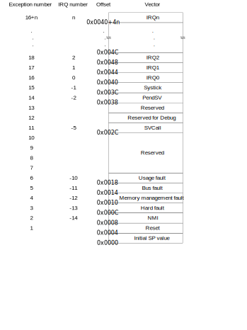

# 組み込みRust

組み込み環境(ARM Cortex-M)でRustを動かすチュートリアルを試してみた。

- [組込みRust / The Embedded Rust Book](https://tomoyuki-nakabayashi.github.io/book/intro/index.html)

ツールのインストール。

```
# ARM Cortex-M アーキテクチャ向けクロスコンパイル環境のインストール
$ rustup target add thumbv6m-none-eabi thumbv7m-none-eabi thumbv7em-none-eabi thumbv7em-none-eabihf

# objdump などのバイナリツールのインストール
$ cargo install cargo-binutils
$ rustup component add llvm-tools-preview
```

Cortex-M3マイクロコントローラのLM3S6965向けの例でコンパイル・実行してみる。
テンプレートプロジェクトをダウンロードしてくる。

```
$ git clone https://github.com/rust-embedded/cortex-m-quickstart app
$ tree app/
app/
├── build.rs
├── Cargo.toml
├── examples
│   ├── allocator.rs
│   ├── crash.rs
│   ├── device.rs
│   ├── exception.rs
│   ├── hello.rs
│   ├── itm.rs
│   ├── panic.rs
│   └── test_on_host.rs
├── memory.x
├── openocd.cfg
├── openocd.gdb
├── README.md
└── src
    └── main.rs

2 directories, 15 files
```

`example/hello.rs`のプログラム。
通常のRustプログラムとは以下の点で異なる。

- `#![no_std]`の宣言\
ベアメタル環境で動作させるプログラムなので、OSが存在することを前提とした標準ライブラリ`std`を使うことはできない。\
`#![no_std]`を宣言することで、`std`の代わりに`core` (OSなしで動作するライブラリ) を使うことを示す。

- `#![no_main]`の宣言\
標準のmainインターフェースを使わないことを示す。\
プログラムのエントリポイントは`#[entry]`で指定する。

```rust
//! Prints "Hello, world!" on the host console using semihosting

#![no_main]
#![no_std]

use panic_halt as _;

use cortex_m_rt::entry;
use cortex_m_semihosting::{debug, hprintln};

#[entry]
fn main() -> ! {
    hprintln!("Hello, world!").unwrap();

    // exit QEMU
    // NOTE do not run this on hardware; it can corrupt OpenOCD state
    debug::exit(debug::EXIT_SUCCESS);

    loop {}
}
```

`hello.rs`をコンパイルして実行する。
今回はQEMU上で動作確認をする。

```
$ cargo build --example hello
$ qemu-system-arm -cpu cortex-m3 \
                  -machine lm3s6965evb \
                  -nographic \
                  -semihosting-config enable=on,target=native \
                  -kernel target/thumbv7m-none-eabi/debug/examples/hello
Hello, world!
```

QEMUはLM3S6965を含む多数のARMの評価ボードのエミューレーションをサポートしている。

- [Arm System emulator](https://www.qemu.org/docs/master/system/target-arm.html)

実際のLM3S6965のデータシートは以下からダウンロードできる。

- [LM3S6965 データシート](https://www.ti.com/product/LM3S6965)

LM3S6965のブロック図:


コンパイルしたRustプログラムはLM3S6965のFLASH(256KB)領域に配置する必要がある。
LM3S6965のメモリレイアウトは以下のようになっている。(参照:Table 2-4. Memory Map)

|Start|End|Description|
|----|----|----|
|0x0000.0000|0x0003.FFFF|On-chip Flash|
|0x2000.0000|0x2000.FFFF|Bit-banded on-chip SRAM|

プログラムの配置はリンカスクリプトで指定される。
Rustのプロジェクト構成だと`memory.x`にリンカスクリプトを記載する。

```
MEMORY
{
  /* NOTE 1 K = 1 KiBi = 1024 bytes */
  /* TODO Adjust these memory regions to match your device memory layout */
  /* These values correspond to the LM3S6965, one of the few devices QEMU can emulate */
  FLASH : ORIGIN = 0x00000000, LENGTH = 256K
  RAM : ORIGIN = 0x20000000, LENGTH = 64K
}
```

読み込むリンカスクリプトはプロジェクトの`.cargo/config`で指定される。
実際に指定されているのは`memory.x`ではなく`link.x`というファイルのようである。

```
rustflags = [
  # LLD (shipped with the Rust toolchain) is used as the default linker
  "-C", "link-arg=-Tlink.x",
...
]
```

ビルドしたあと下記のディレクトリに`link.x`が生成されていた。

```
$ find | grep link.x
./target/thumbv7m-none-eabi/debug/build/cortex-m-rt-ebbf88af06aa4065/out/link.x
```

中身を見ると、`link.x`から`memory.x`がインクルードされているようである。
`link.x`でベクタテーブルや.text領域を配置するよう指定している。

```
...
/* Provides information about the memory layout of the device */
/* This will be provided by the user (see `memory.x`) or by a Board Support Crate */
INCLUDE memory.x

/* # Entry point = reset vector */
ENTRY(Reset);
EXTERN(__RESET_VECTOR); /* depends on the `Reset` symbol */
...
/* # Sections */
SECTIONS
{
  PROVIDE(_stack_start = ORIGIN(RAM) + LENGTH(RAM));

  /* ## Sections in FLASH */
  /* ### Vector table */
  .vector_table ORIGIN(FLASH) :
  {
    /* Initial Stack Pointer (SP) value */
    LONG(_stack_start);

    /* Reset vector */
    KEEP(*(.vector_table.reset_vector)); /* this is the `__RESET_VECTOR` symbol */
    __reset_vector = .;

    /* Exceptions */
    KEEP(*(.vector_table.exceptions)); /* this is the `__EXCEPTIONS` symbol */
    __eexceptions = .;

    /* Device specific interrupts */
    KEEP(*(.vector_table.interrupts)); /* this is the `__INTERRUPTS` symbol */
  } > FLASH

  PROVIDE(_stext = ADDR(.vector_table) + SIZEOF(.vector_table));

  /* ### .text */
  .text _stext :
  {
    *(.text .text.*);
    *(.HardFaultTrampoline);
    *(.HardFault.*);
    . = ALIGN(4);
    __etext = .;
  } > FLASH
...
}
...
```

Cortex-M3のベクタテーブルは以下のようになっている。

- [Cortex-M3 Devices Generic User Guide - Vector table](https://developer.arm.com/documentation/dui0552/a/the-cortex-m3-processor/exception-model/vector-table)



コンパイルされたプログラムからobjdumpで`.vector_table`セクションを表示してみる。

```
$ cargo objdump --example hello -- -s
hello:  file format ELF32-arm-little

Contents of section .vector_table:
 0000 00000120 a7120000 eb120000 e9140000  ... ............
 0010 eb120000 eb120000 eb120000 00000000  ................
 0020 00000000 00000000 00000000 eb120000  ................
 0030 eb120000 00000000 eb120000 eb120000  ................
 0040 eb120000 eb120000 eb120000 eb120000  ................
...
 03f0 eb120000 eb120000 eb120000 eb120000  ................
```

以下のようなアドレスが格納されていた。
(最下位1ビットはそのアドレスのハンドラがThumb codeであるかどうかを示すフラグ)

|Vector|Address|
|----|----|
|Initail SP value|0x2001_0000|
|Reset|0x0000_12a7|

コンパイルされたプログラムからobjdumpで`.text`セクションを表示してみる。

```
$ cargo objdump --example hello -- -d
hello:  file format ELF32-arm-little


Disassembly of section .text:

...
00000474 main:
     474: 80 b5                         push    {r7, lr}
     476: 6f 46                         mov     r7, sp
     478: 00 f0 01 f8                   bl      #2
     47c: fe de                         trap
...
000012a6 Reset:
    12a6: 80 b5                         push    {r7, lr}
    12a8: 6f 46                         mov     r7, sp
    12aa: 00 f0 26 f8                   bl      #76
    12ae: ff e7                         b       #-2 <Reset+0xa>
    12b0: 40 f2 00 00                   movw    r0, #0
    12b4: c2 f2 00 00                   movt    r0, #8192
    12b8: 40 f2 08 01                   movw    r1, #8
    12bc: c2 f2 00 01                   movt    r1, #8192
    12c0: 00 f0 1c f8                   bl      #56
    12c4: ff e7                         b       #-2 <Reset+0x20>
    12c6: 40 f2 00 00                   movw    r0, #0
    12ca: c2 f2 00 00                   movt    r0, #8192
    12ce: 40 f2 00 01                   movw    r1, #0
    12d2: c2 f2 00 01                   movt    r1, #8192
    12d6: 41 f6 28 02                   movw    r2, #6184
    12da: c0 f2 00 02                   movt    r2, #0
    12de: 00 f0 32 f8                   bl      #100
    12e2: ff e7                         b       #-2 <Reset+0x3e>
    12e4: ff f7 c6 f8                   bl      #-3700
    12e8: fe de                         trap
...
```

# 参考
- 組込みRust / The Embedded Rust Book, https://tomoyuki-nakabayashi.github.io/book/intro/index.html
- LM3S6965 データシートhttps://www.ti.com/product/LM3S6965
