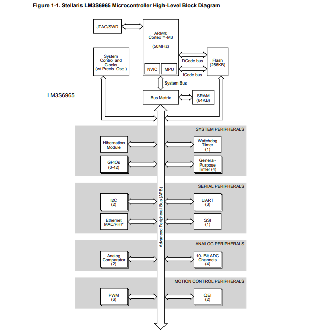

# 組み込みRust

組み込み環境(ARM Cortex-M)でRustを動かすチュートリアルを試してみた。

- [組込みRust / The Embedded Rust Book](https://tomoyuki-nakabayashi.github.io/book/intro/index.html)

ツールのインストール。

```
# ARM Cortex-M アーキテクチャ向けクロスコンパイル環境のインストール
$ rustup target add thumbv6m-none-eabi thumbv7m-none-eabi thumbv7em-none-eabi thumbv7em-none-eabihf

# objdump などのバイナリツールのインストール
$ cargo install cargo-binutils
$ rustup component add llvm-tools-preview
```

Cortex-M3マイクロコントローラのLM3S6965向けの例でコンパイル・実行してみる。

```
$ git clone https://github.com/rust-embedded/cortex-m-quickstart app
$ tree app/
app/
├── build.rs
├── Cargo.toml
├── examples
│   ├── allocator.rs
│   ├── crash.rs
│   ├── device.rs
│   ├── exception.rs
│   ├── hello.rs
│   ├── itm.rs
│   ├── panic.rs
│   └── test_on_host.rs
├── memory.x
├── openocd.cfg
├── openocd.gdb
├── README.md
└── src
    └── main.rs

2 directories, 15 files
```

`example/hello.rs`のプログラム。
通常のRustプログラムとは以下の点で異なる。

- `#![no_std]`の宣言\
ベアメタル環境で動作させるプログラムなので、OSが存在することを前提とした標準ライブラリ`std`を使うことはできない。\
`#![no_std]`を宣言することで、`std`の代わりに`core` (OSなしで動作するライブラリ) を使うことを示す。

- #![no_main]の宣言\
標準のmainインターフェースを使わないことを示す。\
プログラムのエントリポイントは`#[entry]`で指定する。

```rust
//! Prints "Hello, world!" on the host console using semihosting

#![no_main]
#![no_std]

use panic_halt as _;

use cortex_m_rt::entry;
use cortex_m_semihosting::{debug, hprintln};

#[entry]
fn main() -> ! {
    hprintln!("Hello, world!").unwrap();

    // exit QEMU
    // NOTE do not run this on hardware; it can corrupt OpenOCD state
    debug::exit(debug::EXIT_SUCCESS);

    loop {}
}
```

```diff
diff --git a/Cargo.toml b/Cargo.toml
index bd49d23..e22c8a7 100644
--- a/Cargo.toml
+++ b/Cargo.toml
@@ -1,8 +1,8 @@
 [package]
-authors = ["{{authors}}"]
+authors = ["nozo"]
 edition = "2018"
 readme = "README.md"
-name = "{{project-name}}"
+name = "app"
 version = "0.1.0"
 
 [dependencies]
@@ -26,7 +26,7 @@ panic-halt = "0.2.0"
 
 # this lets you use `cargo fix`!
 [[bin]]
-name = "{{project-name}}"
+name = "app"
 test = false
 bench = falsed
```

```
$ cargo build --example hello
$ qemu-system-arm -cpu cortex-m3 \
                  -machine lm3s6965evb \
                  -nographic \
                  -semihosting-config enable=on,target=native \
                  -kernel target/thumbv7m-none-eabi/debug/examples/hello
Hello, world!
```

```
$ cargo objdump --example hello -- -d
hello:  file format ELF32-arm-little


Disassembly of section .text:

...
00000474 main:
     474: 80 b5                         push    {r7, lr}
     476: 6f 46                         mov     r7, sp
     478: 00 f0 01 f8                   bl      #2
     47c: fe de                         trap
...
000012a6 Reset:
    12a6: 80 b5                         push    {r7, lr}
    12a8: 6f 46                         mov     r7, sp
    12aa: 00 f0 26 f8                   bl      #76
    12ae: ff e7                         b       #-2 <Reset+0xa>
    12b0: 40 f2 00 00                   movw    r0, #0
    12b4: c2 f2 00 00                   movt    r0, #8192
    12b8: 40 f2 08 01                   movw    r1, #8
    12bc: c2 f2 00 01                   movt    r1, #8192
    12c0: 00 f0 1c f8                   bl      #56
    12c4: ff e7                         b       #-2 <Reset+0x20>
    12c6: 40 f2 00 00                   movw    r0, #0
    12ca: c2 f2 00 00                   movt    r0, #8192
    12ce: 40 f2 00 01                   movw    r1, #0
    12d2: c2 f2 00 01                   movt    r1, #8192
    12d6: 41 f6 28 02                   movw    r2, #6184
    12da: c0 f2 00 02                   movt    r2, #0
    12de: 00 f0 32 f8                   bl      #100
    12e2: ff e7                         b       #-2 <Reset+0x3e>
    12e4: ff f7 c6 f8                   bl      #-3700
    12e8: fe de                         trap
...
```

```
$ cargo objdump --example hello -- -s
hello:  file format ELF32-arm-little

Contents of section .vector_table:
 0000 00000120 a7120000 eb120000 e9140000  ... ............
 0010 eb120000 eb120000 eb120000 00000000  ................
 0020 00000000 00000000 00000000 eb120000  ................
 0030 eb120000 00000000 eb120000 eb120000  ................
 0040 eb120000 eb120000 eb120000 eb120000  ................
...
 03f0 eb120000 eb120000 eb120000 eb120000  ................
```

LM3S6965のブロック図



LM3S6965のメモリレイアウ(参照:Table 2-4. Memory Map)

|Start|End|Description|
|----|----|----|
|0x0000.0000|0x0003.FFFF|On-chip Flash|
|0x2000.0000|0x2000.FFFF|Bit-banded on-chip SRAM|

# 参考
- 組込みRust / The Embedded Rust Book, https://tomoyuki-nakabayashi.github.io/book/intro/index.html
- LM3S6965 データシートhttps://www.ti.com/product/LM3S6965
