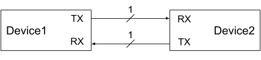
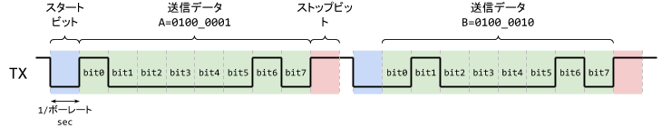
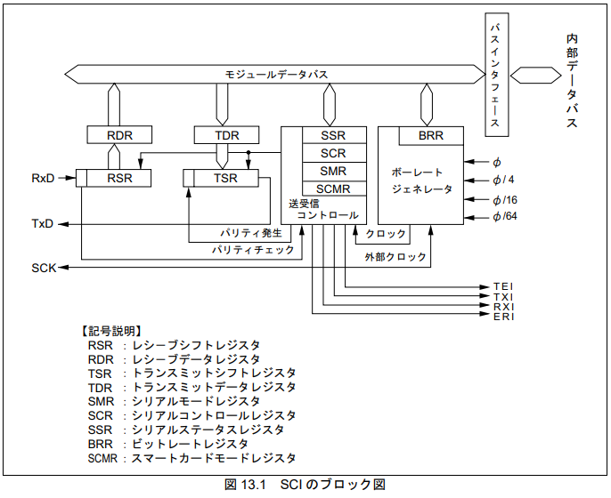
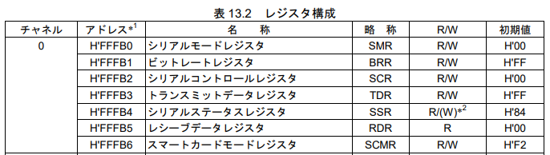

# UART

Universal Asynchronous Receiver/Transmitter (UART) はデバイス間のシリアル通信方式で、下図のように送信(TX)と受信(RX)の2本の信号を使って通信する。



シリアル通信にはデバイス間で同期をとる方法として、クロック同期式と調歩同期式と呼ばれる方式がある。

クロック同期方式では、デバイス間にデータ送受信信号線のほかにクロック信号線を持ち、クロックに合わせてデータの同期をとる。
一方、調歩同期式では、クロック信号線は持たず、送信するデータに同期をとるための情報(スタートビット、ストップビット)を含める。

UARTは調歩同期式である。下図に２つのキャラクタ'A'と'B'を送信する例を示す。



送信線(TX)は使われていないときは常に1にしておき、データを送り始めるときに0にして送信開始を受信側に伝える。
そのあと、8bitの送信データ送り、データの送信が終わったことを示すために1を送る。
このデータの始まりと終わりに送る1bitのデータをそれぞれスタートビットとストップビットと呼ぶ。

データを送信する速度をボーレートと呼び、例えばボーレートが9600のときは9600 bit/secの速度でデータを送信する。
送受信デバイス間で事前にボーレートを決めておくことで、正しいタイミングでデータを送受信することができる。

UARTによるシリアル通信は様々なデバイス間で利用されている。
ここではH8/3069Fマイコンボードを例に見てみる。

H8/3069Fに内蔵されているシリアルコントローラのブロック図を下図に示す。

> \
> HD64F3069RF25データシート

ブロック図の左側を見ると、外部に対して受信線(RxD)と送信線(TxD)が出ていることがわかる。

※ このシリアルコントローラではクロック同期式モードによる通信も行えるためクロック信号線(SCK)が出ている。

データを送信するときの流れは以下のとおりである。

1) TDRレジスタに送信したい8bitのデータをセットする
1) TDRのデータがシフトレジスタであるTSRに転送される
1) TSRが0bitから順番にTxDに信号を送り出す

ここで、シフトレジスタとは下図のような回路のパラレルデータ(D0-D2)をシリアルデータ(Q)に変換するものである。
WE(Write Enable)が有効なとき、Dが各フリップフロップに書き込まれ、クロックが立ち上がるたびにQから順にデータが出力される。

> \
> ACRi, シリアル通信で Hello, FPGA (1), https://www.acri.c.titech.ac.jp/wordpress/archives/123

ここから、シリアルコントローラにアクセスするCプログラムをみてみる。
シリアルコントローラの各種レジスタは下の表に示すようにアドレス`H'FFFB0`番地からアクセスすることができる。

> \
> HD64F3069RF25データシート

Cプログラムからは下記のように構造体を定義してアクセスすると楽。

```c
struct sci_regs {
  volatile uint8 smr;
  volatile uint8 brr;
  volatile uint8 scr;
  volatile uint8 tdr;
  volatile uint8 ssr;
  volatile uint8 rdr;
  volatile uint8 scmr;
};

volatile struct sci_regs *sci = 0xffffb0;
```

シリアルコントローラの初期化は以下のように書ける。

```c
#define SCI_SCR_RE     (1<<4) /* 受信有効 */
#define SCI_SCR_TE     (1<<5) /* 送信有効 */

int serial_init()
{
  sci->scr = 0;
  sci->smr = 0;
  sci->brr = 64;
  sci->scr = SCI_SCR_RE | SCI_SCR_TE;
  sci->ssr = 0;

  return 0;
}
```

データの送信は以下のように書ける。

```c
#define H8_3069F_SCI_SSR_TDRE   (1<<7) /* 送信完了 */

int serial_is_send_enable()
{
  return (sci->ssr & SCI_SSR_TDRE);
}

int serial_send_byte(unsigned char c)
{
  while (!serial_is_send_enable(index)) ;
  sci->tdr = c;
  sci->ssr &= ~SCI_SSR_TDRE;

  return 0;
}
```

# 参考
- 坂井 弘亮，12ステップで作る組込みOS自作入門，カットシステム
- 秋月電子, HD64F3069RF25 PDFデータシート, "13. SCI"
https://akizukidenshi.com/download/ds/renesas/hd64f3069r.pdf
- ACRi, シリアル通信で Hello, FPGA
https://www.acri.c.titech.ac.jp/wordpress/archives/category/20q1-10a
