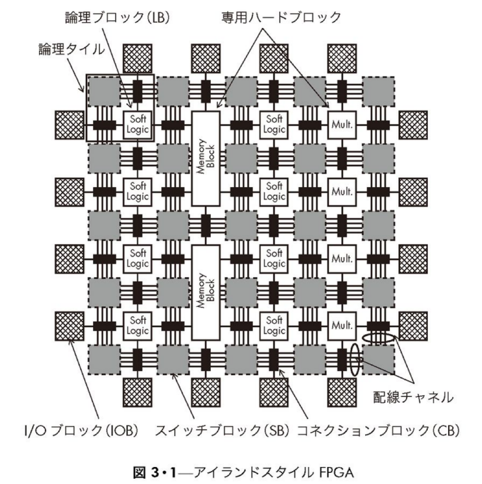
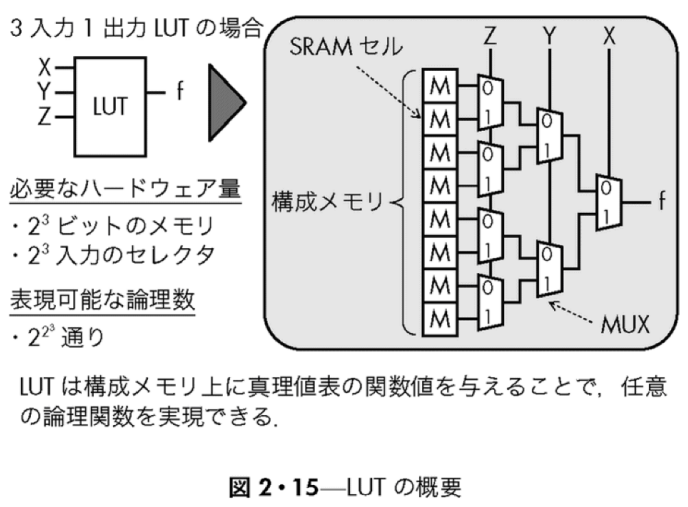
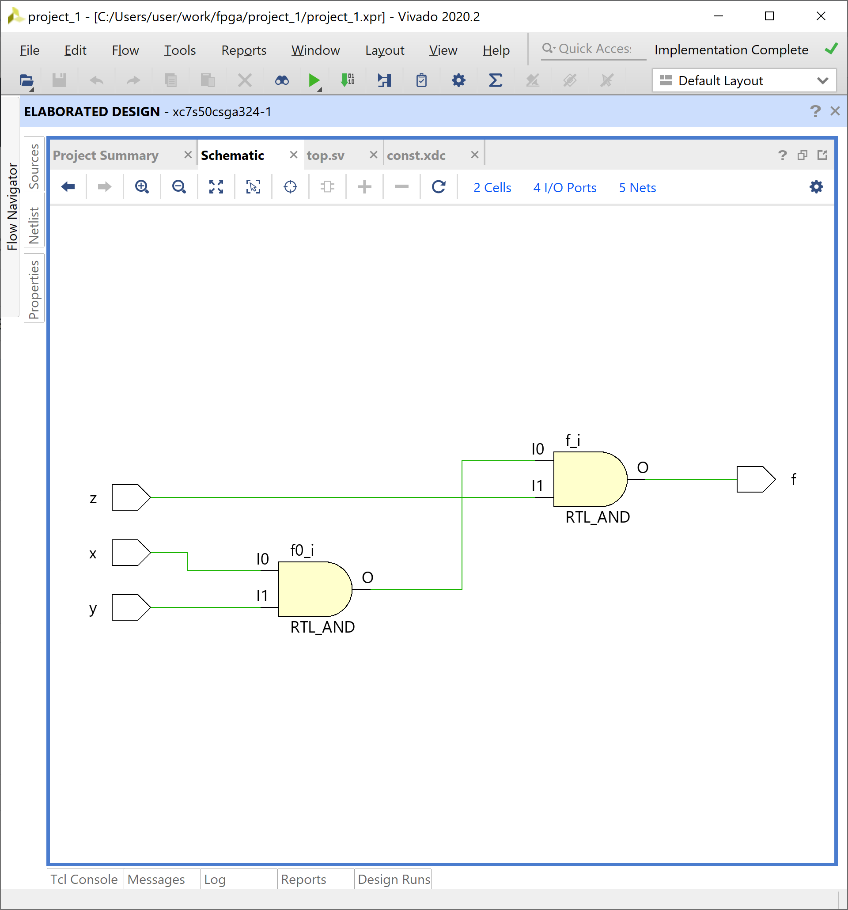
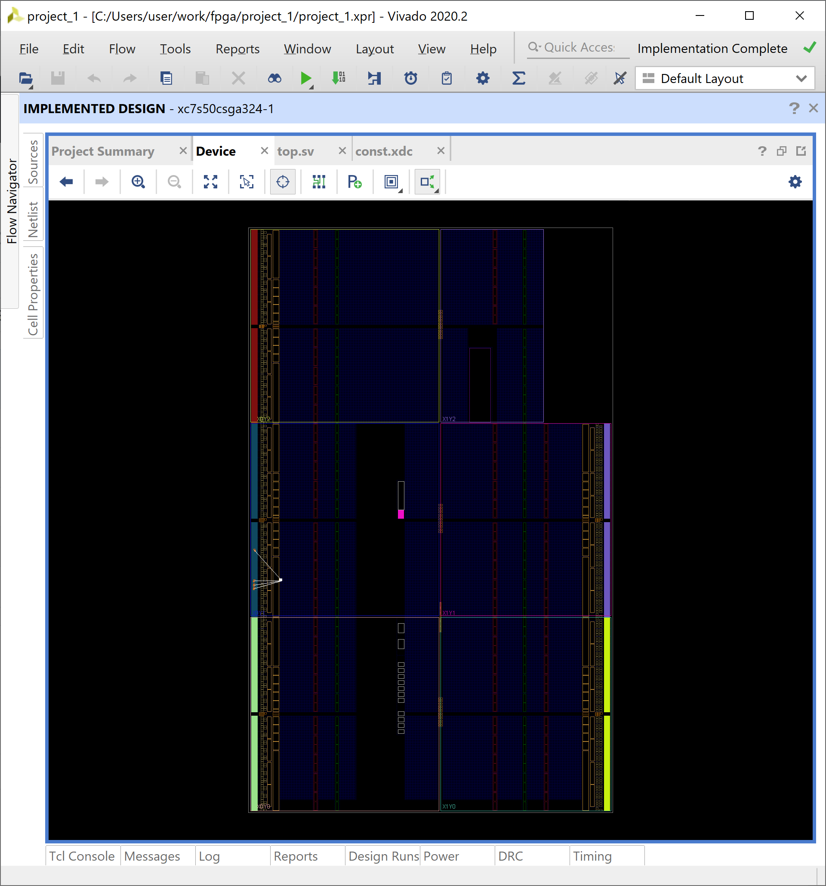
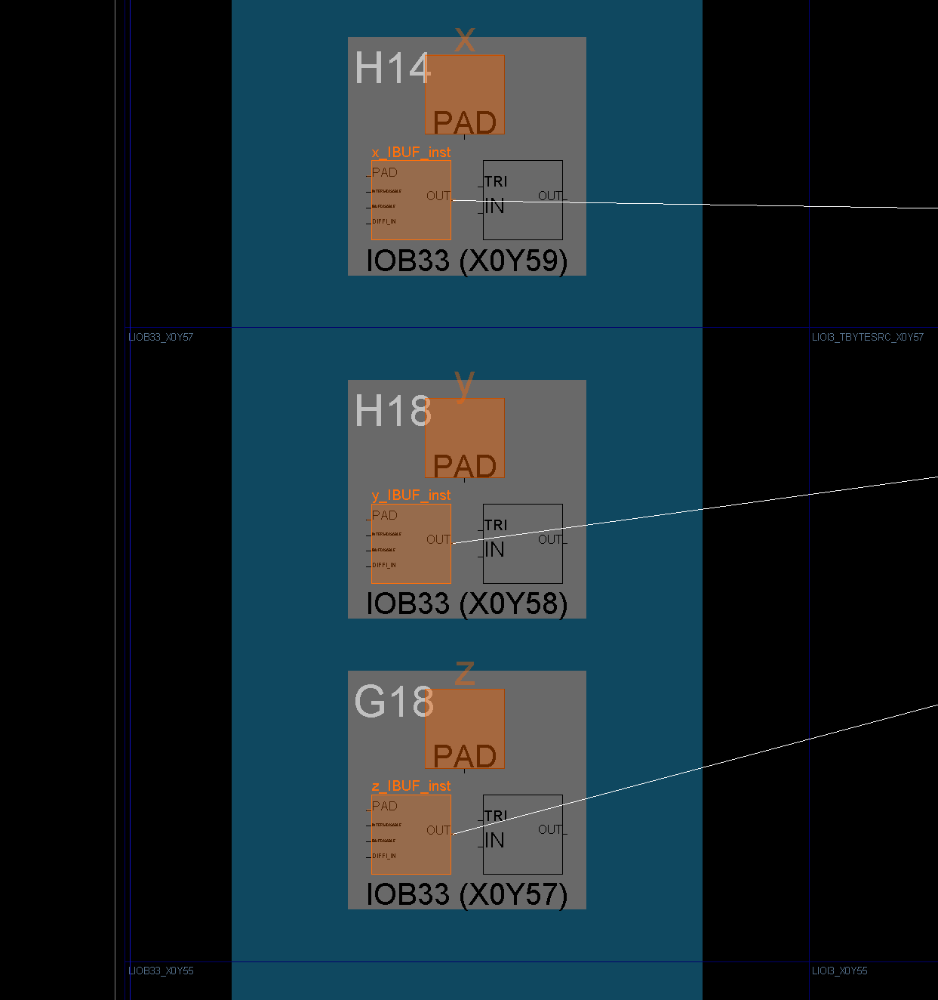
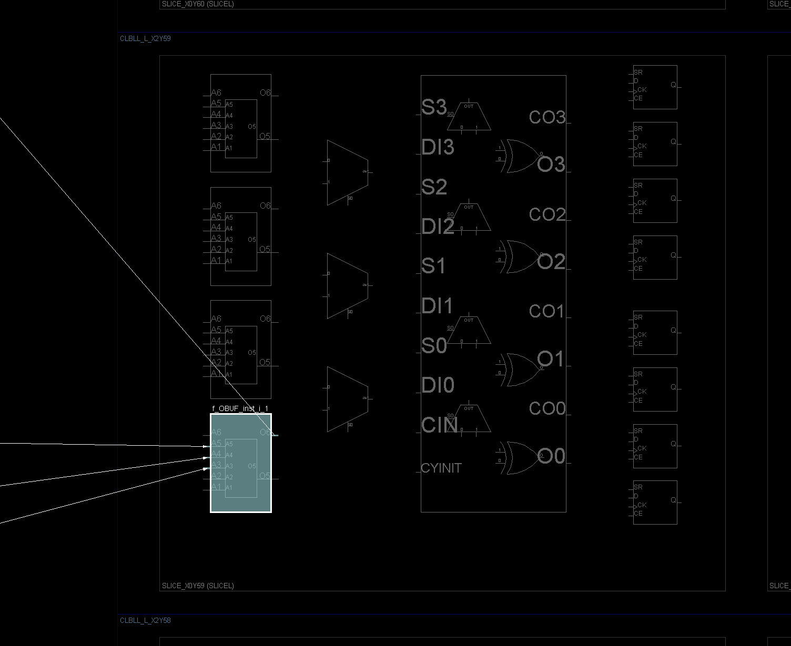

# Bitstreamについて調査

SystemVerilog, VHDLなどのHDL(Hardware Description Language)はツールによってバイナリ(Bitstream)に変換されFPGAに書き込まれる。
このBitstreamの中身は何なのか調査する。

## FPGAの内部構成

まずFPGAの内部構成について見てみる。

FPGAは下図のようなブロックの並びで構成されている。

> 
> 
> 天野 英晴, FPGAの原理と構成, 図3.1 より

これらのブロックはそれぞれ次のような役割を持ち任意の回路を実現している。

- 論理ブロック(LB) ... 任意の論理回路を実現する要素
- I/Oブロック(IOB) ... 外部との信号の入出力を行う要素
- コネクションブロック(CB)、スイッチブロック(SB) ... LBやIOBを接続して任意の配線経路を形成する要素

LBはLook-Up-Table(LUT)とフリップフロップ(FF)で構成される。

LUTはメモリテーブルであり、組み合わせ回路の真理値表をLUTで表すことで任意の回路を実現する。

> 
> 
> 天野 英晴, FPGAの原理と構成, 図2.15 より

例えば`f = X・Y・Z`という２つのANDゲートによる組み合わせ回路の真理値表は次のように書ける。
この真理値表のX,Y,Zをアドレス、fを出力とみればLUTとして表現することができる。

| X | Y | Z | f |
|---|---|---|---|
| 0	| 0	| 0	| 0	|
| 0	| 0	| 1	| 0	|
| 0	| 1	| 0	| 0	|
| 0	| 1	| 1	| 0	|
| 1	| 0	| 0	| 0	|
| 1	| 0	| 1	| 0	|
| 1	| 1	| 0	| 0	|
| 1	| 1	| 1	| 1	|

また、LUTの出力をFFで保持するか選択することで任意の順序回路を実現することができる。

## HDLからBitstreamが生成されるまでの流れ

- 論理合成(Logic Synthesis)
  - RLT記述からAND/ORやFFなどの論理素子の集合とその接続関係を表すネットリストに変換する
- テクノロジーマッピング(Technology mapping)
- 配置配線(Place & Route)

## Bitstreamファイルのフォーマット

XilinxのArityS7のスペック
ヘッダとコンフィグレーションデータ

## オープンソースなFPGAツール

> 
> https://symbiflow.readthedocs.io/en/latest/toolchain-desc/design-flow.html より

# 参考
- 天野 英晴, FPGAの原理と構成, https://www.ohmsha.co.jp/book/9784274218644/
- Xilinx - 7 シリーズ FPGA コンフィギュレーション ユーザー ガイド (日本語版) (v1.9), https://japan.xilinx.com/support/documentation/user_guides/j_ug470_7Series_Config.pdf
- Lattice - iCE40 LP/HX/LM シリーズ, https://www.latticesemi.com/ja-JP/Products/FPGAandCPLD/iCE40
