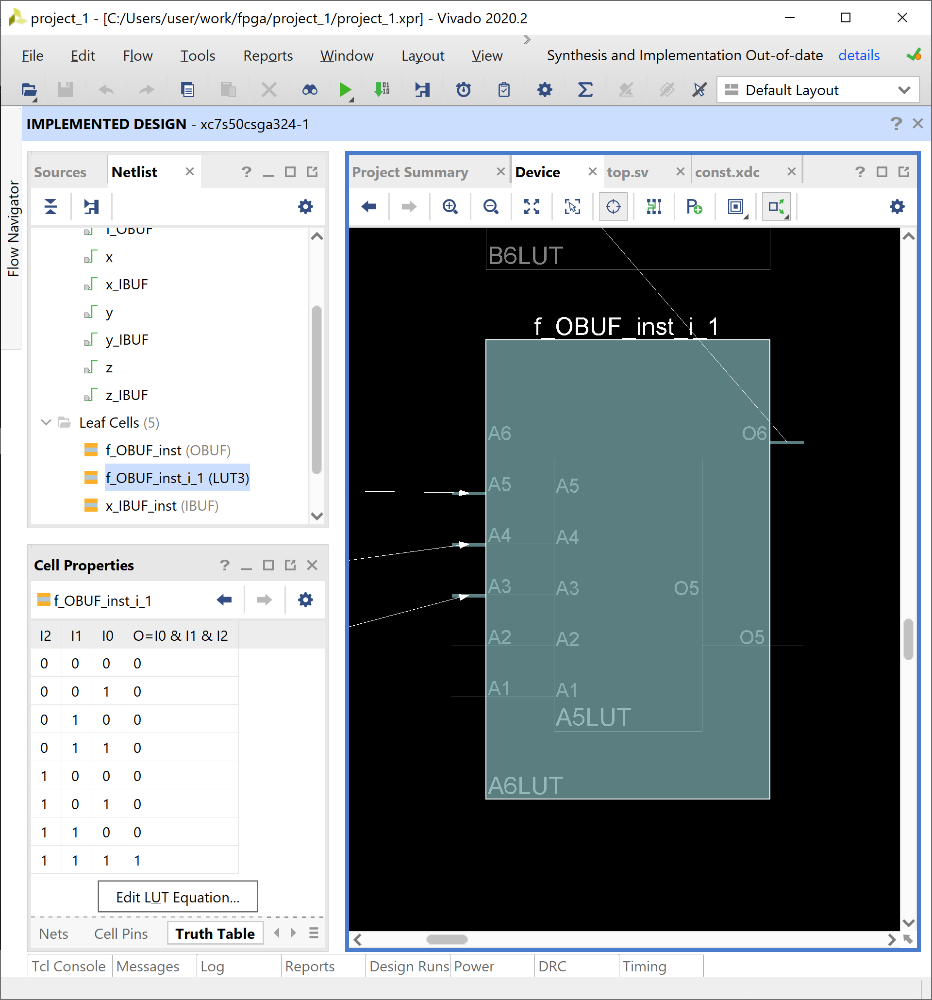

# Bitstreamについて調査

SystemVerilog, VHDLなどのHDL(Hardware Description Language)で書かれたRTL(レジスタ転送レベル)記述はツールによってバイナリ(Bitstream)に変換されFPGAに書き込まれる。
このBitstreamの中身は何なのか調査する。

## FPGAの内部構成

まずFPGAの内部構成について見てみる。

FPGAは下図のようなブロックの並びで構成されている。

> 
> 
> 天野 英晴, FPGAの原理と構成, 図3.1 より

これらのブロックはそれぞれ次のような役割を持ち任意の回路を実現している。

- 論理ブロック(LB) ... 任意の論理回路を実現する要素
- I/Oブロック(IOB) ... 外部との信号の入出力を行う要素
- コネクションブロック(CB)、スイッチブロック(SB) ... LBやIOBを接続して任意の配線経路を形成する要素

LBはLook-Up-Table(LUT)とフリップフロップ(FF)で構成される。

LUTはメモリテーブルであり、組み合わせ回路の真理値表をLUTで表すことで任意の回路を実現する。

> 
> 
> 天野 英晴, FPGAの原理と構成, 図2.15 より

例えば`f = X・Y・Z`という２つのANDゲートによる組み合わせ回路の真理値表は次のように書ける。
この真理値表のX,Y,Zをアドレス、fを出力とみればLUTとして表現することができる。

| X | Y | Z | f |
|---|---|---|---|
| 0	| 0	| 0	| 0	|
| 0	| 0	| 1	| 0	|
| 0	| 1	| 0	| 0	|
| 0	| 1	| 1	| 0	|
| 1	| 0	| 0	| 0	|
| 1	| 0	| 1	| 0	|
| 1	| 1	| 0	| 0	|
| 1	| 1	| 1	| 1	|

また、LUTの出力をFFで保持するか選択することで任意の順序回路を実現することができる。

## RTL記述からBitstreamが生成されるまでの流れ

SystemVerilog, VHDLなどのHDLで書かれたRTL記述は次のような流れでBitstreamに変換される。

- 論理合成(Logic Synthesis)
  - RLT記述からAND/ORやFFなどの論理素子の集合とその接続関係を表すネットリストに変換する
- テクノロジーマッピング(Technology mapping)
  - ネットリストで表される論理回路をLUTを用いた回路に変換する
- 配置配線(Place & Route)
  - LUTレベルの回路をチップ上の論理資源や配線資源に割り当てる

こうして得られたFPGA上の論理素子や配線スイッチをプログラムするためのデータをコンフィギュレーションデータやBitstreamと呼ぶ。
BitstreamはプログラムツールによってFPGAデバイスに書き込まれる。

ここで例としてXilinxのツールであるvivadoを使ってRLT記述がBitstreamに変換される流れを見てみる。
対象となるFPGAボードはArtyS7-50を選んだ。

https://reference.digilentinc.com/reference/programmable-logic/arty-s7/start

まずSystemVerilogでボード上の３つのスイッチを入力`x, y, z`、１つのLEDを出力`f`とした`f = x & y & z`という回路を記述する。

 ```verilog
 module top(
    input  logic x, y, z, 
    output logic f
    );
    
    assign f = x & y & z;
    
endmodule
 ```
 
外部I/Oはボードごとに異なるので次のような制約ファイルで割り当てを記述する。
ArtyS7-50の制約ファイルのテンプレートは以下にある。

https://github.com/Digilent/digilent-xdc/blob/master/Arty-S7-50-Master.xdc
 
 ```
 ## Switches
set_property -dict { PACKAGE_PIN H14   IOSTANDARD LVCMOS33 } [get_ports { x }];
set_property -dict { PACKAGE_PIN H18   IOSTANDARD LVCMOS33 } [get_ports { y }];
set_property -dict { PACKAGE_PIN G18   IOSTANDARD LVCMOS33 } [get_ports { z }];

## LEDs
set_property -dict { PACKAGE_PIN E18   IOSTANDARD LVCMOS33 } [get_ports { f }];
 ```

このRTL記述を論理合成すると次のようなネットリストが得られる。


そしてテクノロジーマッピングと配置配線まで実行すると次のようなチップ上の配線情報が得られる。
今回の回路はFPGAチップ規模に比べてかなり小さいので、ほんの一部のブロックしか利用されていない。（画面左真ん中の白く光っている部分）


拡大してみると、ボード上のスイッチがIOBとして割り当てられている。


また、`x & y & z`を表すLBは次のようになっていて、LBの中の１つのLUTが使われている。
今回は値を保持するような回路ではないので右側にあるFFは使われていない。


さらにLUTを選択すると`x & y & z`を表す真理値表が保持されていることがわかる。（画面左下のCell Propertiesの部分）



## Bitstreamファイルの中身

上で生成されたBitstreamファイルの中身を見てみる。

```
$ hexdump -C top.bit | head
00000000  00 09 0f f0 0f f0 0f f0  0f f0 00 00 01 61 00 25  |.............a.%|
00000010  74 6f 70 3b 55 73 65 72  49 44 3d 30 58 46 46 46  |top;UserID=0XFFF|
00000020  46 46 46 46 46 3b 56 65  72 73 69 6f 6e 3d 32 30  |FFFFF;Version=20|
00000030  32 30 2e 32 00 62 00 0c  37 73 35 30 63 73 67 61  |20.2.b..7s50csga|
00000040  33 32 34 00 63 00 0b 32  30 32 31 2f 30 33 2f 31  |324.c..2021/03/1|
00000050  33 00 64 00 09 31 34 3a  31 35 3a 33 35 00 65 00  |3.d..14:15:35.e.|
00000060  21 72 8c ff ff ff ff ff  ff ff ff ff ff ff ff ff  |!r..............|
00000070  ff ff ff ff ff ff ff ff  ff ff ff ff ff ff ff ff  |................|
00000080  ff ff ff 00 00 00 bb 11  22 00 44 ff ff ff ff ff  |........".D.....|
00000090  ff ff ff aa 99 55 66 20  00 00 00 30 02 20 01 00  |.....Uf ...0. ..|
```

先頭にはファイルの情報などが書かれたヘッダになっている。

ヘッダのフォーマットはドキュメントを見つけることができなかったが、fileコマンドはxilinxの.bitファイルに対応していた。

```
$ file top.bit
top.bit: Xilinx BIT data - from top;UserID=0XFFFFFFFF;Version=2020.2 - for 7s50csga324 - built 2021/03/13(14:15:35) - data length 0x21728c
```

fileコマンドの実装を見てみると下記のファイルでBitstreamのヘッダのパースの仕方？を定義をしていた。

https://github.com/file/file/blob/master/magic/Magdir/xilinx

ヘッダ以降のコンフィギュレーションデータの仕様は次のマニュアルに書かれている。

- [7 シリーズ FPGA コンフィギュレーション ユーザー ガイド (日本語版) (v1.9)](https://japan.xilinx.com/support/documentation/user_guides/j_ug470_7Series_Config.pdf)
  > ザイリンクスの 7 シリーズ FPGA におけるコンフィギュレーション インターフェイス、複数ビットストリームの管理、ビットストリームの暗号化、バウンダリスキャンと JTAG コンフィギュレーション、リコンフィギュレーション テクニックについて説明しています。

マニュアルをもとにXilinxのBitstreamファイルをデコードするプログラムを実装してみた。

https://github.com/isNozo/bitdump

プログラムの実行結果：

```
$ cargo run sample/top.bit
== Header Information ==
NCD name          : top;UserID=0XFFFFFFFF;Version=2020.2^@
model/part number : 7s50csga324^@
built date        : 2021/03/13^@
built time        : 14:15:35^@
data length       : 0x0021728c

== Configuration Data ==
00000000 : ffffffff 
00000004 : ffffffff 
00000008 : ffffffff 
0000000c : ffffffff 
*
00000020 : 000000bb 
00000024 : 11220044 
00000028 : ffffffff 
0000002c : ffffffff 
00000030 : aa995566 
00000034 : 20000000 Type1 NOOP
00000038 : 30022001 Type1 WRITE TIMER   word_cnt=1
0000003c : 00000000
00000040 : 30020001 Type1 WRITE WBSTAR  word_cnt=1
00000044 : 00000000 
00000048 : 30008001 Type1 WRITE CMD     word_cnt=1
0000004c : 00000000 
00000050 : 20000000 Type1 NOOP
00000054 : 30008001 Type1 WRITE CMD     word_cnt=1
00000058 : 00000007 
0000005c : 20000000 Type1 NOOP
00000060 : 20000000 Type1 NOOP
...
```

上の結果のようにコンフィギュレーションデータはFPGAデバイスのレジスタの読み・書きなどの命令列になっている。

ただ、肝心のLUTや配線スイッチなどの情報はおそらく下の547420ワードのType2パケットで表されていて、その中身の仕様は上のマニュアルでは書かれていなかった。（読みこみが足りないだけかもしれない）

```
...
000000e0 : 20000000 Type1 NOOP
000000e4 : 30004000 Type1 WRITE FDRI    word_cnt=0
000000e8 : 50085a5c Type2 word_cnt=547420
000000ec : 00000000 
000000f0 : 00000000 
000000f4 : 00000000 
*
0000045c : 00800000 
00000460 : 00000000 
00000464 : 00000000 
00000468 : 00000000 
0000046c : 00000000 
*
000004dc : 00000597 
000004e0 : 00000000 
...
```

## オープンソースなFPGAツール

> 
> https://symbiflow.readthedocs.io/en/latest/toolchain-desc/design-flow.html より

# 参考
- 天野 英晴, FPGAの原理と構成, https://www.ohmsha.co.jp/book/9784274218644/
- Xilinx - 7 シリーズ FPGA コンフィギュレーション ユーザー ガイド (日本語版) (v1.9), https://japan.xilinx.com/support/documentation/user_guides/j_ug470_7Series_Config.pdf
- Lattice - iCE40 LP/HX/LM シリーズ, https://www.latticesemi.com/ja-JP/Products/FPGAandCPLD/iCE40
