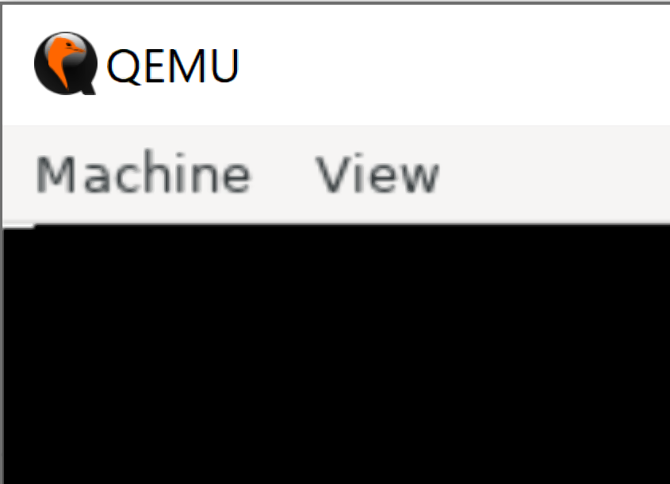
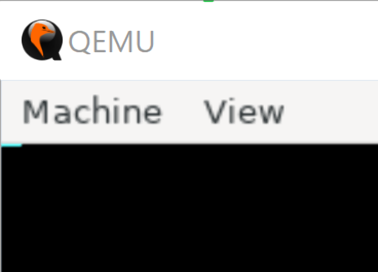

# VGA
VGA（Video Graphics Array) は640x480のグラフィック表示が可能。

x86の起動直後のリアルモード(16bitモード)でBIOS割り込みルーチン 0x10 の機能を使ってVGAモードに移行することができる。

BIOS割込みルーチン 0x10:
https://en.wikipedia.org/wiki/INT_10H

BIOS割り込みルーチン 0x10 はビデオ関連の機能を提供している。
レジスタAH(AXの上位8bit)に`0x00`、AL(AXの下位8bit)にビデオモードを指定して割り込み命令`int 0x10`を実行することでビデオモードを変更できる。

ビデオモードは以下の表のものを指定することが可能。
テキストだけを出力するモードや、1ピクセル単位で描画するモードが選択できる。

https://wiki.osdev.org/Drawing_In_Protected_Mode

|AL|mode|
|----|----|
|00|text 40*25 16 color (mono) |
|01|text 40*25 16 color |
|02|text 80*25 16 color (mono) |
|03|text 80*25 16 color |
|04|CGA 320*200 4 color |
|05|CGA 320*200 4 color (m) |
|06|CGA 640*200 2 color |
|07|MDA monochrome text 80*25 |
|08|PCjr |
|09|PCjr |
|0A|PCjr |
|0B|reserved |
|0C|reserved |
|0D|EGA 320*200 16 color |
|0E|EGA 640*200 16 color |
|0F|EGA 640*350 mono |
|10|EGA 640*350 16 color |
|11|VGA 640*480 mono |
|12|VGA 640*480 16 color |
|13|VGA 320*200 256 color |

例えばVGAの640x480ピクセルの16色のモードに移行する場合は次のような命令になる。

```
    mov ax, 0x0012
    int 0x10
```

VGAの画面上への描画は`0x000A_0000`番地にマッピングされたVRAM領域へ書き込むことで行われる。

https://wiki.osdev.org/Memory_Map_(x86)

|Address|description|
|----|----|
|0x0000_0000|Real Mode IVT (Interrupt Vector Table)|
|0x0000_0400|BDA (BIOS data area)|
|0x0000_0500|Conventional memory|
|0x0000_7C00|Your OS BootSector|
|0x0000_7E00|Conventional memory|
|0x0008_0000|EBDA (Extended BIOS Data Area)|
|0x000A_0000|Video display memory|
|0x000C_0000|Video BIOS|
|0x000C_8000|BIOS Expansions|
|0x000F_0000|Motherboard BIOS|

例えば`0x000A_0000`番地に1byteの`0xFF`を書き込むプログラムは次のようになる。

※ リアルモードではアドレスに16bitしか指定できないので、セグメントレジスタ(es)を使って`0x000A_0000`番地にアクセスしている。

```
    mov ax, 0xA000
    mov es, ax
    mov [es:0x0000], byte 0xFF
```

実行すると8ピクセル分の白線が描画される。



また、描画する色は輝度（Intensity）、赤（Red）、緑（Green）、青（Blue）を各1bitで指定し2^4=16色を表現することができる。

色の指定はI/OポートからVGAハードのレジスタへ書き込むことで行われる。
シーケンサに関するI/Oポートアドレスは次のように割り当てられている。

|I/Oポートアドレス|詳細|
|----|----|
|0x03CE|アドレスレジスタ|
|0x03CF|データレジスタ|

シーケンサのレジスタは5個あり、アドレスレジスタにアクセスするレジスタ番号を指定して、データレジスタでデータを読み書きする。
書き込みプレーン選択レジスタはアドレスレジスタに0x02を設定してアクセスし、データレジスタの下位4ビットでIRGBを表す。

次のプログラムはIRGBを1011と指定して描画する。

```
    mov ah, 0b1011 ; データレジスタ(----IRGB)
    mov al, 0x02 ; アドレスレジスタ
    mov dx, 0x03C4 ; VGA制御のI/Oポートアドレス
    out dx, ax

    mov ax, 0xA000
    mov es, ax
    mov [es:0x0000], byte 0xFF
```




# 参考
- 作って理解するOS x86系コンピュータを動かす理論と実装, https://gihyo.jp/book/2019/978-4-297-10847-2
