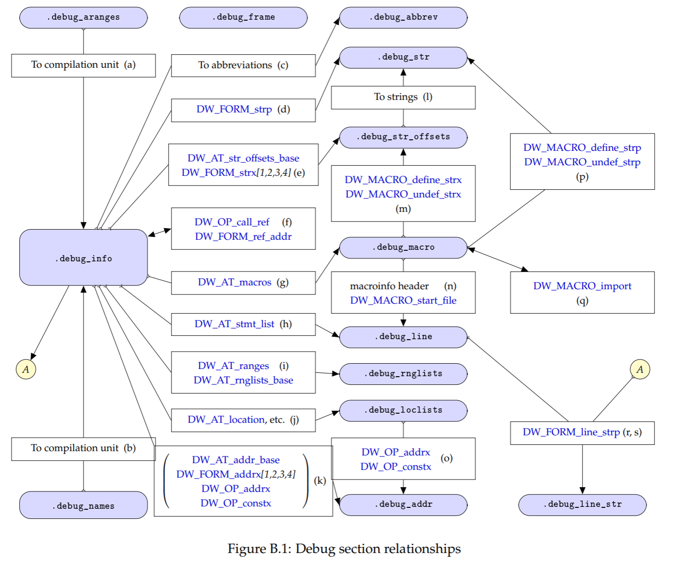

# DWARF

DWARF(Debugging With Attributed Record Formats)はバイナリファイルに埋め込まれるデバッグ情報のフォーマット規格で、ソース行番号/バイナリの対応や変数・型などの情報が格納されていてソースレベルのデバッグで用いられる。

現在では DWARF Version 5 が最新のようである。

- DWARF 5 Standard, http://www.dwarfstd.org/Dwarf5Std.php

試しに次のCプログラムをデバッグ情報付きでコンパイルしてみる。

```
struct test {
    int  field1;
    char field2;
} t1;

int func1(int arg1) {
    return arg1;
}

int main(void)
{
    int local1 = func1(1);
    return 0;
}
```

gccでは`-g`オプションをつけるとデバッグ情報を付加することができる。

```
       -g  Produce debugging information in the operating system's native format (stabs, COFF, XCOFF, or DWARF).  GDB can work with this debugging
           information.

           On most systems that use stabs format, -g enables use of extra debugging information that only GDB can use; this extra information makes debugging
           work better in GDB but probably makes other debuggers crash or refuse to read the program.  If you want to control for certain whether to generate
           the extra information, use -gstabs+, -gstabs, -gxcoff+, -gxcoff, or -gvms (see below).
...
       -gdwarf
       -gdwarf-version
           Produce debugging information in DWARF format (if that is supported).  The value of version may be either 2, 3, 4 or 5; the default version for
           most targets is 4.  DWARF Version 5 is only experimental.

           Note that with DWARF Version 2, some ports require and always use some non-conflicting DWARF 3 extensions in the unwind tables.

           Version 4 may require GDB 7.0 and -fvar-tracking-assignments for maximum benefit.

           GCC no longer supports DWARF Version 1, which is substantially different than Version 2 and later.  For historical reasons, some other DWARF-
           related options such as -fno-dwarf2-cfi-asm) retain a reference to DWARF Version 2 in their names, but apply to all currently-supported versions of
           DWARF.
```

`-gdwarf`オプションをつけてコンパイルする。

```
$ gcc -O0 -gdwarf -o main main.c
```

生成されたELFバイナリのセクション一覧を見ると、`.debug_*`という名前のセクションがあることがわかる。

```
$ eu-readelf -S main
There are 34 section headers, starting at offset 0x3d08:

Section Headers:
[Nr] Name                 Type         Addr             Off      Size     ES Flags Lk Inf Al
[ 0]                      NULL         0000000000000000 00000000 00000000  0        0   0  0
[ 1] .interp              PROGBITS     0000000000000318 00000318 0000001c  0 A      0   0  1
[ 2] .note.gnu.property   NOTE         0000000000000338 00000338 00000020  0 A      0   0  8
[ 3] .note.gnu.build-id   NOTE         0000000000000358 00000358 00000024  0 A      0   0  4
[ 4] .note.ABI-tag        NOTE         000000000000037c 0000037c 00000020  0 A      0   0  4
[ 5] .gnu.hash            GNU_HASH     00000000000003a0 000003a0 00000024  0 A      6   0  8
[ 6] .dynsym              DYNSYM       00000000000003c8 000003c8 00000090 24 A      7   1  8
[ 7] .dynstr              STRTAB       0000000000000458 00000458 0000007d  0 A      0   0  1
[ 8] .gnu.version         GNU_versym   00000000000004d6 000004d6 0000000c  2 A      6   0  2
[ 9] .gnu.version_r       GNU_verneed  00000000000004e8 000004e8 00000020  0 A      7   1  8
[10] .rela.dyn            RELA         0000000000000508 00000508 000000c0 24 A      6   0  8
[11] .init                PROGBITS     0000000000001000 00001000 0000001b  0 AX     0   0  4
[12] .plt                 PROGBITS     0000000000001020 00001020 00000010 16 AX     0   0 16
[13] .plt.got             PROGBITS     0000000000001030 00001030 00000010 16 AX     0   0 16
[14] .text                PROGBITS     0000000000001040 00001040 00000195  0 AX     0   0 16
[15] .fini                PROGBITS     00000000000011d8 000011d8 0000000d  0 AX     0   0  4
[16] .rodata              PROGBITS     0000000000002000 00002000 00000004  4 AM     0   0  4
[17] .eh_frame_hdr        PROGBITS     0000000000002004 00002004 00000044  0 A      0   0  4
[18] .eh_frame            PROGBITS     0000000000002048 00002048 00000110  0 A      0   0  8
[19] .init_array          INIT_ARRAY   0000000000003df0 00002df0 00000008  8 WA     0   0  8
[20] .fini_array          FINI_ARRAY   0000000000003df8 00002df8 00000008  8 WA     0   0  8
[21] .dynamic             DYNAMIC      0000000000003e00 00002e00 000001c0 16 WA     7   0  8
[22] .got                 PROGBITS     0000000000003fc0 00002fc0 00000040  8 WA     0   0  8
[23] .data                PROGBITS     0000000000004000 00003000 00000010  0 WA     0   0  8
[24] .bss                 NOBITS       0000000000004010 00003010 00000010  0 WA     0   0  8
[25] .comment             PROGBITS     0000000000000000 00003010 0000002a  1 MS     0   0  1
[26] .debug_aranges       PROGBITS     0000000000000000 0000303a 00000030  0        0   0  1
[27] .debug_info          PROGBITS     0000000000000000 0000306a 000000d9  0        0   0  1
[28] .debug_abbrev        PROGBITS     0000000000000000 00003143 000000bb  0        0   0  1
[29] .debug_line          PROGBITS     0000000000000000 000031fe 0000004a  0        0   0  1
[30] .debug_str           PROGBITS     0000000000000000 00003248 000000f9  1 MS     0   0  1
[31] .symtab              SYMTAB       0000000000000000 00003348 00000678 24       32  49  8
[32] .strtab              STRTAB       0000000000000000 000039c0 000001f9  0        0   0  1
[33] .shstrtab            STRTAB       0000000000000000 00003bb9 0000014c  0        0   0  1
```

`.debug_info`セクションがメインのデバッグ情報を持ち、他のセクションは`.debug_info`から参照される。
セクション間の関係は下図のようになっている。

> 
> 
> DWARF Debugging Information Format Version 5, Appendix B

`.debug_info`セクションの中身は以下のようになっている。

```
$ eu-readelf -winfo main

DWARF section [27] '.debug_info' at offset 0x306a:
 [Offset]
 Compilation unit at offset 0:
 Version: 4, Abbreviation section offset: 0, Address size: 8, Offset size: 4
 [     b]  compile_unit         abbrev: 1
           producer             (strp) "GNU C17 9.3.0 -mtune=generic -march=x86-64 -gdwarf -O0 -fasynchronous-unwind-tables -fstack-protector-strong -fstack-clash-protection -fcf-protection"
           language             (data1) C99 (12)
           name                 (strp) "main.c"
           comp_dir             (strp) "/home/nozo/ShachikuSection/nozo/29-DWARF/src"
           low_pc               (addr) +0x0000000000001129 <func1>
           high_pc              (data8) 48 (+0x0000000000001159)
           stmt_list            (sec_offset) 0
 [    2d]    structure_type       abbrev: 2
             name                 (strp) "test"
             byte_size            (data1) 8
             decl_file            (data1) main.c (1)
             decl_line            (data1) 1
             decl_column          (data1) 8
             sibling              (ref4) [    55]
 [    3a]      member               abbrev: 3
               name                 (strp) "field1"
               decl_file            (data1) main.c (1)
               decl_line            (data1) 2
               decl_column          (data1) 10
               type                 (ref4) [    55]
               data_member_location (data1) 0
 [    47]      member               abbrev: 3
               name                 (strp) "field2"
               decl_file            (data1) main.c (1)
               decl_line            (data1) 3
               decl_column          (data1) 10
               type                 (ref4) [    5c]
               data_member_location (data1) 4
 [    55]    base_type            abbrev: 4
             byte_size            (data1) 4
             encoding             (data1) signed (5)
             name                 (string) "int"
 [    5c]    base_type            abbrev: 5
             byte_size            (data1) 1
             encoding             (data1) signed_char (6)
             name                 (strp) "char"
 [    63]    variable             abbrev: 6
             name                 (string) "t1"
             decl_file            (data1) main.c (1)
             decl_line            (data1) 4
             decl_column          (data1) 3
             type                 (ref4) [    2d]
             external             (flag_present) yes
             location             (exprloc)
              [ 0] addr +0x4018 <t1>
 [    78]    subprogram           abbrev: 7
             external             (flag_present) yes
             name                 (strp) "main"
             decl_file            (data1) main.c (1)
             decl_line            (data1) 10
             decl_column          (data1) 5
             prototyped           (flag_present) yes
             type                 (ref4) [    55]
             low_pc               (addr) +0x0000000000001139 <main>
             high_pc              (data8) 32 (+0x0000000000001159)
             frame_base           (exprloc)
              [ 0] call_frame_cfa
             GNU_all_tail_call_sites (flag_present) yes
             sibling              (ref4) [    aa]
 [    9a]      variable             abbrev: 8
               name                 (strp) "local1"
               decl_file            (data1) main.c (1)
               decl_line            (data1) 12
               decl_column          (data1) 9
               type                 (ref4) [    55]
               location             (exprloc)
                [ 0] fbreg -20
 [    aa]    subprogram           abbrev: 9
             external             (flag_present) yes
             name                 (strp) "func1"
             decl_file            (data1) main.c (1)
             decl_line            (data1) 6
             decl_column          (data1) 5
             prototyped           (flag_present) yes
             type                 (ref4) [    55]
             low_pc               (addr) +0x0000000000001129 <func1>
             high_pc              (data8) 16 (+0x0000000000001139 <main>)
             frame_base           (exprloc)
              [ 0] call_frame_cfa
             GNU_all_call_sites   (flag_present) yes
 [    c8]      formal_parameter     abbrev: 10
               name                 (strp) "arg1"
               decl_file            (data1) main.c (1)
               decl_line            (data1) 6
               decl_column          (data1) 15
               type                 (ref4) [    55]
               location             (exprloc)
                [ 0] fbreg -20
```

例えばプログラム中に定義した構造体の情報は次のように格納されている。

```
 [    2d]    structure_type       abbrev: 2
             name                 (strp) "test"
             byte_size            (data1) 8
             decl_file            (data1) main.c (1)
             decl_line            (data1) 1
             decl_column          (data1) 8
             sibling              (ref4) [    55]
 [    3a]      member               abbrev: 3
               name                 (strp) "field1"
               decl_file            (data1) main.c (1)
               decl_line            (data1) 2
               decl_column          (data1) 10
               type                 (ref4) [    55]
               data_member_location (data1) 0
 [    47]      member               abbrev: 3
               name                 (strp) "field2"
               decl_file            (data1) main.c (1)
               decl_line            (data1) 3
               decl_column          (data1) 10
               type                 (ref4) [    5c]
               data_member_location (data1) 4
```

# 参考
- The DWARF Debugging Standard, http://www.dwarfstd.org
- デバッグ情報の歩き方, https://qiita.com/mhiramat/items/8df17f5113434e93ff0c
