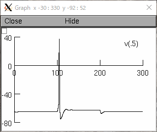

# NEURON Simulator

NEURONは神経細胞・神経回路モデルのシミュレーションをするためのツールのひとつ。
ニューロン（神経細胞）は細胞の一種で、核が存在する細胞体、他のニューロンから情報を受け取る樹状突起、ほかのニューロンへ情報を伝える軸索からなる。ニューロン間の接続部分をシナプスという。

> 
> 
> https://en.wikipedia.org/wiki/Neuron, Diagram of the components of a neuron

細胞膜の内外には電位差(膜電位)があり、通常時は約-75mVで（静止電位という）、信号を伝えるときインパルスのように一瞬電位差が正の方向に大きく変化する(活動電位という)。
この活動電位が軸索に沿って伝導して次のニューロンに信号を伝達する。

膜電位は細胞内外のイオン濃度差によって生じる。
細胞外はナトリウムイオン(Na⁺)が多く、細胞内はカリウムイオン(K⁺)が多く存在する。
細胞膜にはそれぞれのイオンを通すイオンチャネルが存在して、刺激によってイオンチャネルの活性・不活性が変化して活動電位が生じる。

> 
> 
> https://en.wikipedia.org/wiki/Action_potential, Ion movement during an action potential.

神経細胞膜をRC回路とみなすことで膜電位の挙動をモデル化することができる。
Na⁺チャネルとK⁺チャネルの透過性を抵抗値パラメータとして持つ細胞膜の等価回路をHodgkin-Huxleyモデルという。

> 
> 
> https://en.wikipedia.org/wiki/Action_potential, Equivalent electrical circuit for the Hodgkin–Huxley model of the action potential.

NEURONシミュレータは、神経細胞膜の等価回路から膜電位の挙動を計算することで神経細胞・回路のシミュレーションを行う。
プログラムは神経細胞の形状やイオンチャネルの抵抗、与える刺激などのパラメータを指定することで、神経細胞の膜電位の推移をシミュレーションすることができる。
次のプログラムは、直径20.0[μm], 長さ20.0[μm], Na⁺チャネルコンダクタンス0.12[S/cm²], K⁺チャネルコンダクタンス0.04[S/cm²]の神経細胞に0.05[nA]の刺激を100[msec]与えるプログラムになる。

ソース元：https://cns.neuroinf.jp/modules/pico/index.php?content_id=22

```
load_file("nrngui.hoc")

create cell
objref stim

cell{
    diam=20.0               // 細胞の直径[μm]
    L=20.0                  // 細胞の長さ[μm]
    insert hh               // Hodgkin-Huxleyモデルを使う
    gnabar_hh=0.12          // Na⁺チャネルコンダクタンス[S/cm²]
    gkbar_hh=0.04           // K⁺チャネルコンダクタンス[S/cm²]

    stim=new IClamp(0.5)    // 細胞の真ん中(0.5)に刺激を与える
    stim.del=100            // 刺激の開始時刻[msec]
    stim.dur=100            // 刺激の持続時間[msec]
    stim.amp=0.05           // 刺激の強度[nA]
}
tstop=300
```

このプログラムをNEURONでシミュレーションすると次のような結果になる。




# 参考文献
- 神崎亮平, 昆虫の脳をつくる ─君のパソコンに脳をつくってみよう─, https://www.asakura.co.jp/books/isbn/978-4-254-10277-2/
- NEURON, https://www.neuron.yale.edu/neuron/
