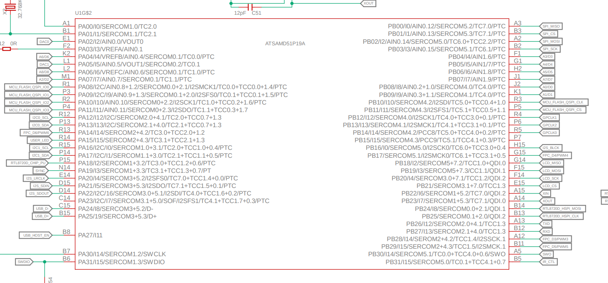

# Rustの組込みフレームワーク

Rustのembedded-hal(HAL: Hardware Abstraction Layer)の実装がどうなっているのか見てみる。

> 
>
> 移植性 - The Embedded Rust Book, https://tomoyuki-nakabayashi.github.io/book/assets/rust_layers.svg

Board Support Crateとしてwio_terminal-0.5.0をみてみる。

https://docs.rs/wio_terminal/0.5.0/wio_terminal/index.html

以下はLEDを点灯するだけのプログラム。

```rust
#![no_std]
#![no_main]

use panic_halt as _;
use wio_terminal as wio;

use wio::entry;
use wio::pac::Peripherals;
use wio::prelude::*;

#[entry]
fn main() -> ! {
    // 1. マイコンのペリフェラルを取得
    let peripherals = Peripherals::take().unwrap();
    
    // 2. I/Oピンを取得する
    let pins = wio::Pins::new(peripherals.PORT);
    // 3. LEDにつながったI/Oピンを出力設定にして取得する
    let mut user_led = pins.user_led.into_push_pull_output();
    // 4. LEDを点灯させる
    user_led.set_high().unwrap();

    loop {}
}
```

## 1. マイコンのペリフェラルを取得

`Peripherals::take()`はATSAMD51PというマイコンのPAC(一番下の層のクレート)で提供される関数。
マイコン上のすべてのペリフェラルにアクセスするためのデータ構造をまとめた`Peripherals`を返す。

https://docs.rs/atsamd51p/0.11.0/atsamd51p/struct.Peripherals.html

```rust
static mut DEVICE_PERIPHERALS: bool = false;

pub struct Peripherals {
    pub AC: AC,
    pub ADC0: ADC0,
    pub ADC1: ADC1,
    pub AES: AES,
...
}

impl Peripherals {
    pub fn take() -> Option<Self> {
        cortex_m::interrupt::free(|_| {
            if unsafe { DEVICE_PERIPHERALS } {
                None
            } else {
                Some(unsafe { Peripherals::steal() })
            }
        })
    }

    pub unsafe fn steal() -> Self {
        DEVICE_PERIPHERALS = true;
        Peripherals {
...
        }
    }
}
```

マイコン上のペリフェラルにはタイマやシリアル通信デバイスなどがあるが、それぞれ物理的に１つしかないものをプログラムのあちこちからアクセスされるとおかしな状態になってしまう。
そのため、上の`take`関数は1回目の呼び出しでは`Peripherals`を返しているが、2回目以降は`None`を返すように、グローバルな`DEVICE_PERIPHERALS`変数を使って実装されている。
(rust ではグローバルな変数へのアクセスは unsafe)

## 2. I/Oピンを取得する

`wio::Pins::new(peripherals.PORT)`はBSC(一番上の層のクレート)で提供される関数で、PACで取得したペリフェラルの`PORT`(マイコンのI/Oピンコントローラ)を受け取って、ボード上のLEDやボタンがそれぞれどのI/Oピンに割り当てられているかを表す`Pins`を返す。

https://docs.rs/wio_terminal/0.5.0/wio_terminal/struct.Pins.html

```rust
pub struct Pins {
    pub user_led: Pin<PA15, Reset>,
    pub button1: Pin<PC26, Reset>,
    pub button2: Pin<PC27, Reset>,
    pub button3: Pin<PC28, Reset>,
...
}
```

PACはあくまでマイコンに対するアクセス方法を提供するクレートで、マイコンのI/Oピンが実際にボード上のどのデバイスに接続されているかは知らない。
そのため、BSCでマイコンのI/Oピンとボード上のデバイスの関係を定義している。

以下はWio Terminalに搭載されているマイコンと周辺機器の接続関係の一部の回路図。
PA15ピン(PortのAグループの15番ピン)がuser_ledに接続されていることがわかる。

> 
> 
> https://files.seeedstudio.com/wiki/Wio-Terminal/res/ATSAMD51.pdf


## 3. LEDにつながったI/Oピンを出力設定にして取得する

`sets.user_led.into_push_pull_output()` は `Pin<PA15, Output<PushPull>>` を返す。

```rust
impl<I, C> OutputPin for Pin<I, Output<C>>
where
    I: PinId,
    C: OutputConfig,
{
    type Error = Infallible;
    #[inline]
    fn set_high(&mut self) -> Result<(), Self::Error> {
        self._set_high();
        Ok(())
    }
    #[inline]
    fn set_low(&mut self) -> Result<(), Self::Error> {
        self._set_low();
        Ok(())
    }
}
```

```rust
impl<I, C> InputPin for Pin<I, Input<C>>
where
    I: PinId,
    C: InputConfig,
{
    type Error = Infallible;
    #[inline]
    fn is_high(&self) -> Result<bool, Self::Error> {
        Ok(self._is_high())
    }
    #[inline]
    fn is_low(&self) -> Result<bool, Self::Error> {
        Ok(self._is_low())
    }
}
```

```rust
impl<I, M> Pin<I, M>
where
    I: PinId,
    M: PinMode,
{
...
    #[inline]
    pub(crate) fn _is_low(&self) -> bool {
        self.regs.read_pin() == false
    }

    #[inline]
    pub(crate) fn _is_high(&self) -> bool {
        self.regs.read_pin() == true
    }

    #[inline]
    pub(crate) fn _set_low(&mut self) {
        self.regs.write_pin(false);
    }

    #[inline]
    pub(crate) fn _set_high(&mut self) {
        self.regs.write_pin(true);
    }
...
}
```

## 4. LEDを点灯させる

```rust
pub(super) unsafe trait RegisterInterface {
...
    /// Write the logic level of an output pin
    #[inline]
    fn write_pin(&mut self, bit: bool) {
        let mask = self.mask_32();
        // Safety: OUTSET & OUTCLR are "mask" registers, and we only write the
        // bit for this pin ID
        unsafe {
            if bit {
                self.group().outset.write(|w| w.bits(mask));
            } else {
                self.group().outclr.write(|w| w.bits(mask));
            }
        }
    }
...
}
```

# 参考
- 中林 智之／井田 健太，基礎から学ぶ 組込みRust，C&R研究所, https://www.c-r.com/book/detail/1403
- The Embedded Rust Book, https://tomoyuki-nakabayashi.github.io/book/
