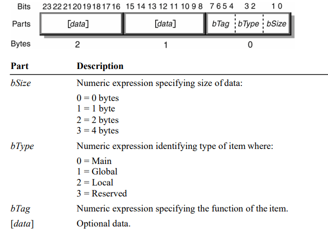
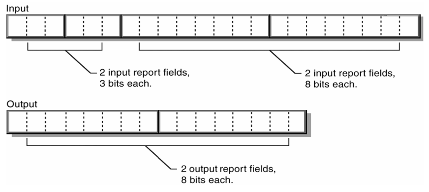
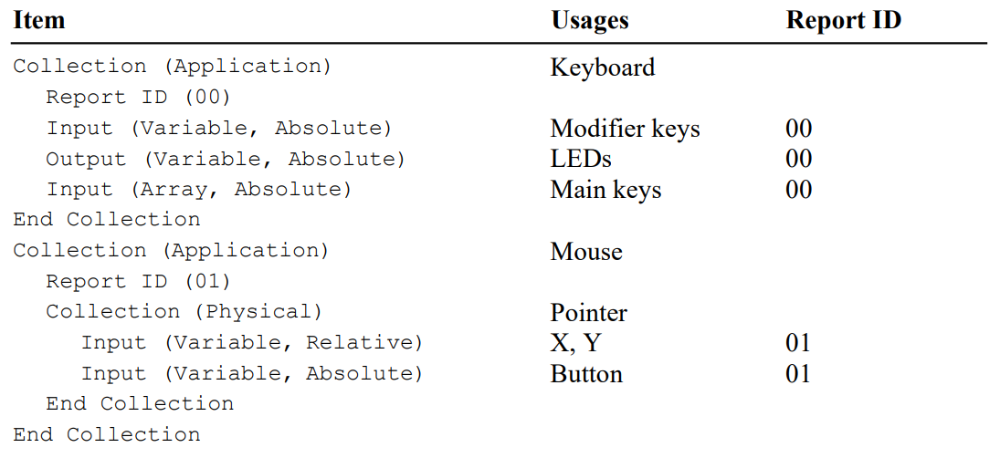
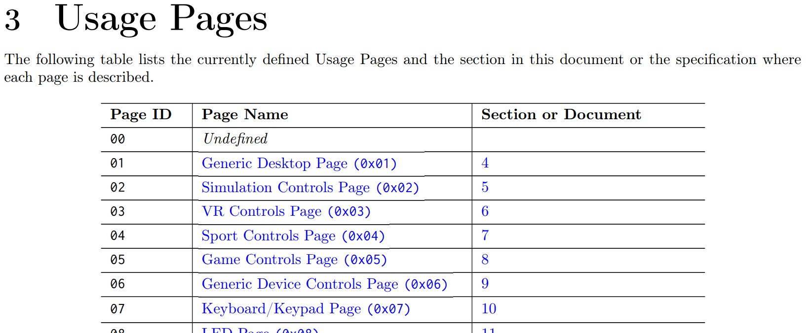
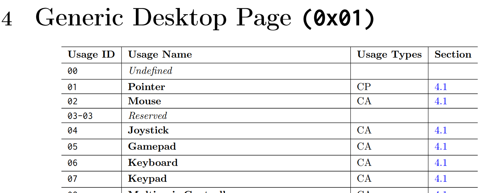

# HID

Human Interface Device(HID)がPCとどんなやりとりをしているのか気になったので調べる。
とっかかりとして以下の技術解説記事がわかりやすい。(ほかのUSBの解説記事も参考になる)

> 
> 
> HID (Human Interface Device) クラスでは、レポートと呼ばれる単位でデータを転送します。例えばマウスの場合、各ボタンが押されているかどうか、水平方向の移動量、垂直方向の移動量、ホイールの移動量といった情報をまとめたレポートを定期的に転送します。
> 
> HID (Human Interface Device) クラスについて - インターフェイス株式会社, https://www.itf.co.jp/tech/road-to-usb-master/hid_class

また、wio-terminalのサンプルにHIDマウスの実装例があった。これはArduinoのライブラリを使っているので、ライブラリの実装を見てみる。

https://wiki.seeedstudio.com/Wio-Terminal-USBCLIENT-Mouse/

まずサンプルをコンパイルすると以下のログが出るので使っているライブラリがMouse.cppとHID.cppであることがわかる。
HID.cppはパスにsamdが入っているのでマイコンごとの実装っぽい。

```
Using cached library dependencies for file: C:\Program Files (x86)\Arduino\libraries\Mouse\src\Mouse.cpp
Using cached library dependencies for file: C:\Users\user\AppData\Local\Arduino15\packages\Seeeduino\hardware\samd\1.8.3\libraries\HID\HID.cpp
```

ライブラリの呼び出しをさかのぼっていくと、だいたい以下のソースが見つかった。
(下の方はどっちかというとUSB規格のものであまり深堀できなかったので、今回見るのはMouse.cppだけ。)

- https://github.com/arduino-libraries/Mouse/blob/master/src/Mouse.cpp
- https://github.com/arduino/ArduinoCore-samd/blob/master/libraries/HID/HID.cpp
- https://github.com/arduino/ArduinoCore-API/blob/master/api/PluggableUSB.h
- https://github.com/arduino/ArduinoCore-API/blob/master/api/USBAPI.h

以下の部分がレポートディスクリプタというものの定義っぽい。HIDはレポートという単位でデータをやり取りする。レポートディスクリプタはレポートの構造を定義するバイト列。

https://github.com/arduino-libraries/Mouse/blob/master/src/Mouse.cpp#L26-L57
```cpp
static const uint8_t _hidReportDescriptor[] PROGMEM = {
  
  //  Mouse
    0x05, 0x01,                    // USAGE_PAGE (Generic Desktop)  // 54
    0x09, 0x02,                    // USAGE (Mouse)
    0xa1, 0x01,                    // COLLECTION (Application)
    0x09, 0x01,                    //   USAGE (Pointer)
    0xa1, 0x00,                    //   COLLECTION (Physical)
    0x85, 0x01,                    //     REPORT_ID (1)
    0x05, 0x09,                    //     USAGE_PAGE (Button)
    0x19, 0x01,                    //     USAGE_MINIMUM (Button 1)
    0x29, 0x03,                    //     USAGE_MAXIMUM (Button 3)
    0x15, 0x00,                    //     LOGICAL_MINIMUM (0)
    0x25, 0x01,                    //     LOGICAL_MAXIMUM (1)
    0x95, 0x03,                    //     REPORT_COUNT (3)
    0x75, 0x01,                    //     REPORT_SIZE (1)
    0x81, 0x02,                    //     INPUT (Data,Var,Abs)
    0x95, 0x01,                    //     REPORT_COUNT (1)
    0x75, 0x05,                    //     REPORT_SIZE (5)
    0x81, 0x03,                    //     INPUT (Cnst,Var,Abs)
    0x05, 0x01,                    //     USAGE_PAGE (Generic Desktop)
    0x09, 0x30,                    //     USAGE (X)
    0x09, 0x31,                    //     USAGE (Y)
    0x09, 0x38,                    //     USAGE (Wheel)
    0x15, 0x81,                    //     LOGICAL_MINIMUM (-127)
    0x25, 0x7f,                    //     LOGICAL_MAXIMUM (127)
    0x75, 0x08,                    //     REPORT_SIZE (8)
    0x95, 0x03,                    //     REPORT_COUNT (3)
    0x81, 0x06,                    //     INPUT (Data,Var,Rel)
    0xc0,                          //   END_COLLECTION
    0xc0,                          // END_COLLECTION
};
```

マウスの例だと以下でレポートを送信している。レポートは4byteの大きさで、ボタン、X座標、Y座標、ホイールが1byteずつ並んでる。

https://github.com/arduino-libraries/Mouse/blob/master/src/Mouse.cpp#L96-L104
```cpp
void Mouse_::move(int x, int y, signed char wheel)
{
	uint8_t m[4];
	m[0] = _buttons;
	m[1] = limit_xy(x);
	m[2] = limit_xy(y);
	m[3] = wheel;
	HID().SendReport(1,m,4);
}
```

まずはレポートディスクリプタのバイト列の構造についてみていく。仕様書の"6.2.2 Report Descriptor"あたりから説明されている。

- Device Class Definition for Human Interface Devices (HID) Version 1.11
https://www.usb.org/sites/default/files/hid1_11.pdf

レポートディスクリプタはItemというデータが並んでいるもので、Itemのフォーマットは下のようになっていうる。(ItemにはShort ItemとLong Itemがあって、下のはShort Item)

> 
> 
> Device Class Definition for Human Interface Devices (HID) Version 1.11, 6.2.2.2

まず初めの1byteにTag/Type/Sizeという情報が入っている。
Sizeは後ろに続くDataの大きさを表していて、0byte,1byte,2byte,4byteがある。
TypeはこのItemの種類を表していて、Main,Global,Localがある。
TagはItemの識別を表す(オペコードみたいなもの)。

例えば、Mouse.cppで定義されているレポートディスクリプタの一部をフォーマットに当てはめると次のようになる。

```
    Tag  Type Size         Data
    0000|  01|  01 (0x05), 0x01,                    // USAGE_PAGE (Generic Desktop)  // 54
    0000|  10|  01 (0x09), 0x02,                    // USAGE (Mouse)
    1010|  00|  01 (0xa1), 0x01,                    // COLLECTION (Application)
    0000|  10|  01 (0x09), 0x01,                    //   USAGE (Pointer)
    1010|  00|  01 (0xa1), 0x00,                    //   COLLECTION (Physical)
    1000|  01|  01 (0x85), 0x01,                    //     REPORT_ID (1)
...
    1000|  00|  01 (0x81), 0x06,                    //     INPUT (Data,Var,Rel)
    1100|  00|  00 (0xc0),                          //   END_COLLECTION
    1100|  00|  00 (0xc0),                          // END_COLLECTION
```

Main, Local, GlobalそれぞれのItemの役割は以下の通り。

- MainのItemにはホスト・デバイス間の送信・受信するデータフィールドを表すInput(デバイスからホストへのデータ), Output(ホストからデバイスへのデータ), Feature(デバイス設定)と、
データのグループを表すCollection, End Collectionがある。
- LocalとGlobalはMainのItemを修飾するもので、Localは次に来るMainの属性を表し、Globalは後続のすべてのデータの属性を表す。

例えば、以下のItemの並び(説明のためいろいろ省いている)は、
最初の`Input`に対して`Report Size (3)`と`Report Count (2)`がかかり、
後ろの`Input`と`Output`には`Report Count (2)`と`Report Size (8)`がかかる。
(Report Sizeはデータのbit数、Report Countはデータの数を表す)

```
[Global] Report Size (3)
[Global] Report Count (2)
[Main  ] Input
[Global] Report Size (8)
[Main  ] Input
[Main  ] Output
```

その結果、レポートは次のようなフィールドになる。

> 
> 
> Device Class Definition for Human Interface Devices (HID) Version 1.11, 6.2.2

Mouse.cppの例をMain毎に分けると以下のようになる。

```
    0x05, 0x01,             Global // USAGE_PAGE (Generic Desktop)  // 54
    0x09, 0x02,              Local // USAGE (Mouse)
    0xa1, 0x01,               Main // COLLECTION (Application)
--------------------------------------------------------------------------
    0x09, 0x01,              Local //   USAGE (Pointer)
    0xa1, 0x00,               Main //   COLLECTION (Physical)
--------------------------------------------------------------------------
    0x85, 0x01,             Global //     REPORT_ID (1)
    0x05, 0x09,             Global //     USAGE_PAGE (Button)
    0x19, 0x01,              Local //     USAGE_MINIMUM (Button 1)
    0x29, 0x03,              Local //     USAGE_MAXIMUM (Button 3)
    0x15, 0x00,             Global //     LOGICAL_MINIMUM (0)
    0x25, 0x01,             Global //     LOGICAL_MAXIMUM (1)
    0x95, 0x03,             Global //     REPORT_COUNT (3)
    0x75, 0x01,             Global //     REPORT_SIZE (1)
    0x81, 0x02,               Main //     INPUT (Data,Var,Abs)
--------------------------------------------------------------------------
    0x95, 0x01,             Global //     REPORT_COUNT (1)
    0x75, 0x05,             Global //     REPORT_SIZE (5)
    0x81, 0x03,               Main //     INPUT (Cnst,Var,Abs)
--------------------------------------------------------------------------
    0x05, 0x01,             Global //     USAGE_PAGE (Generic Desktop)
    0x09, 0x30,              Local //     USAGE (X)
    0x09, 0x31,              Local //     USAGE (Y)
    0x09, 0x38,              Local //     USAGE (Wheel)
    0x15, 0x81,             Global //     LOGICAL_MINIMUM (-127)
    0x25, 0x7f,             Global //     LOGICAL_MAXIMUM (127)
    0x75, 0x08,             Global //     REPORT_SIZE (8)
    0x95, 0x03,             Global //     REPORT_COUNT (3)
    0x81, 0x06,               Main //     INPUT (Data,Var,Rel)
--------------------------------------------------------------------------
    0xc0,                     Main //   END_COLLECTION
    0xc0,                     Main // END_COLLECTION
```

## Collection

CollectionはCollectionとEnd Collectionで囲まれたMain Item(Input, Output, Feature)を入れ子構造でグループ化している。
Collection ItemはData部分でCollectionの種類を表していて、Dataが0x00のときはPhysical、0x01のときはApplicationを表す。

Physical Collectionはデバイスのセンサーなどの測定データを表すデータのグループに使う。

Application Collectionはトップレベルのグループで、デバイスの機能ごとにグループ分けするのに使う。
例えば、ポインティングデバイスを持つキーボードは次のようにApplication Collectionを2つ持ち、それぞれでキーボードとマウスのレポートを定義している。

> 
> 
> Device Class Definition for Human Interface Devices (HID) Version 1.11, 8.5

## Usage Page, Usage

UsageはレポートのMain Itemが実際にどのように使われるかを表すもので、例えばマウスであれば1byte × 2のInputフィールドがそれぞれX座標、Y座標であること定義する。

それぞれの機能ごとにIDが決まっていて、次のUsage Tableで定義されている。
大分類としてUsage Pageという区分があり、その中でUsage IDごとに機能が定義されている。

- HID Usage Tables 1.3, https://usb.org/document-library/hid-usage-tables-13

> 
>
> 
> 
> HID Usage Tables 1.3

複数のデータに対するUsageの指定方法は、`USAGE (X)`, `USAGE (Y)`, `USAGE (Wheel)`のように１つずつ順番に並べるか、`USAGE_MINIMUM (Button 1)`と`USAGE_MAXIMUM (Button 3)`のように始まりと終わりを指定する方法がある。

## Logical Minimum, Logical Maximum

そのデータがとりうる値の範囲を定義する。


以上から、Mouse.cppのレポートディスクリプタは以下のような定義になる。

```
    0x05, 0x01,             Global // USAGE_PAGE (Generic Desktop)  // 54
    0x09, 0x02,              Local // USAGE (Mouse)
    0xa1, 0x01,               Main // COLLECTION (Application) ;; Generic Desktop:Mouseとして解釈されるCollection
--------------------------------------------------------------------------
    0x09, 0x01,              Local //   USAGE (Pointer)
    0xa1, 0x00,               Main //   COLLECTION (Physical)  ;; Generic Desktop:Pointerとして解釈されるCollection
--------------------------------------------------------------------------
    0x85, 0x01,             Global //     REPORT_ID (1)
    0x05, 0x09,             Global //     USAGE_PAGE (Button)
    0x19, 0x01,              Local //     USAGE_MINIMUM (Button 1)
    0x29, 0x03,              Local //     USAGE_MAXIMUM (Button 3)
    0x15, 0x00,             Global //     LOGICAL_MINIMUM (0)
    0x25, 0x01,             Global //     LOGICAL_MAXIMUM (1)
    0x95, 0x03,             Global //     REPORT_COUNT (3)
    0x75, 0x01,             Global //     REPORT_SIZE (1)
    0x81, 0x02,               Main //     INPUT (Data,Var,Abs) ;; Butoon1～Butoon3として解釈される、0～1の値をとる、1bit*3 のフィールド
--------------------------------------------------------------------------
    0x95, 0x01,             Global //     REPORT_COUNT (1)
    0x75, 0x05,             Global //     REPORT_SIZE (5)
    0x81, 0x03,               Main //     INPUT (Cnst,Var,Abs) ;; 解釈されない5bit*1のフィールド
--------------------------------------------------------------------------
    0x05, 0x01,             Global //     USAGE_PAGE (Generic Desktop)
    0x09, 0x30,              Local //     USAGE (X)
    0x09, 0x31,              Local //     USAGE (Y)
    0x09, 0x38,              Local //     USAGE (Wheel)
    0x15, 0x81,             Global //     LOGICAL_MINIMUM (-127)
    0x25, 0x7f,             Global //     LOGICAL_MAXIMUM (127)
    0x75, 0x08,             Global //     REPORT_SIZE (8)
    0x95, 0x03,             Global //     REPORT_COUNT (3)
    0x81, 0x06,               Main //     INPUT (Data,Var,Rel) ;; X, Y, Wheelとして解釈される、-127～127の値をとる、8bit*3 のフィールド
--------------------------------------------------------------------------
    0xc0,                     Main //   END_COLLECTION
    0xc0,                     Main // END_COLLECTION
```

# 参考
- Device Class Definition for HID 1.11 - USB-IF, https://www.usb.org/document-library/device-class-definition-hid-111
- HID Usage Tables 1.3, https://usb.org/document-library/hid-usage-tables-13
- HID (Human Interface Device) クラスについて - インターフェイス株式会社, https://www.itf.co.jp/tech/road-to-usb-master/hid_class
- Introduction to Human Interface Devices (HID), https://docs.microsoft.com/en-us/windows-hardware/drivers/hid/
- USB Device Tree Viewer, https://www.uwe-sieber.de/usbtreeview_e.html
