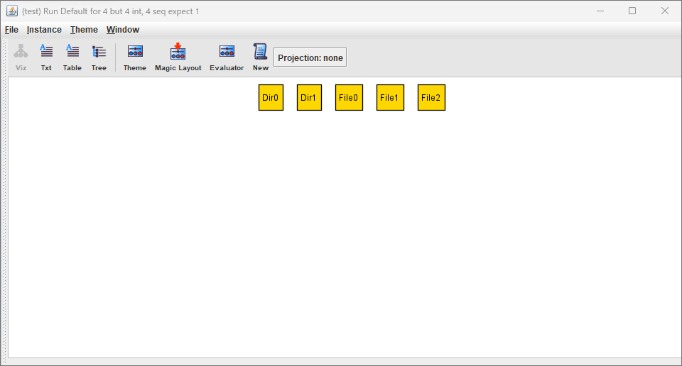
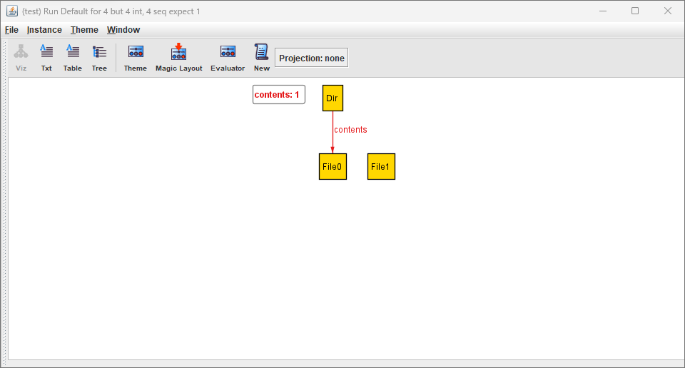
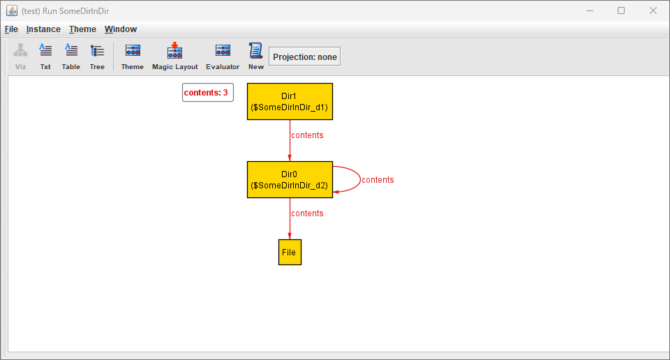
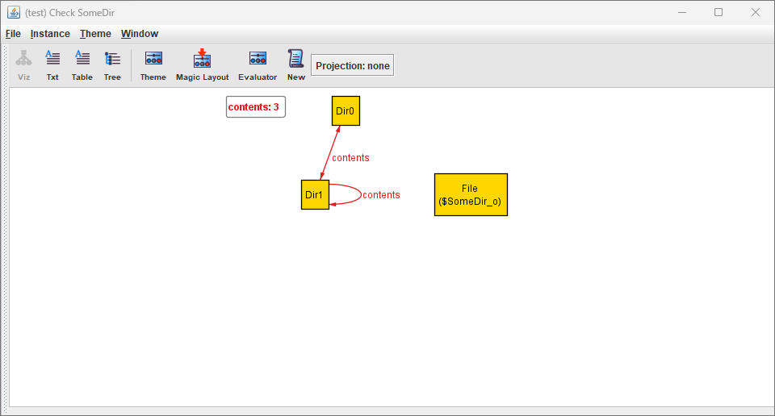
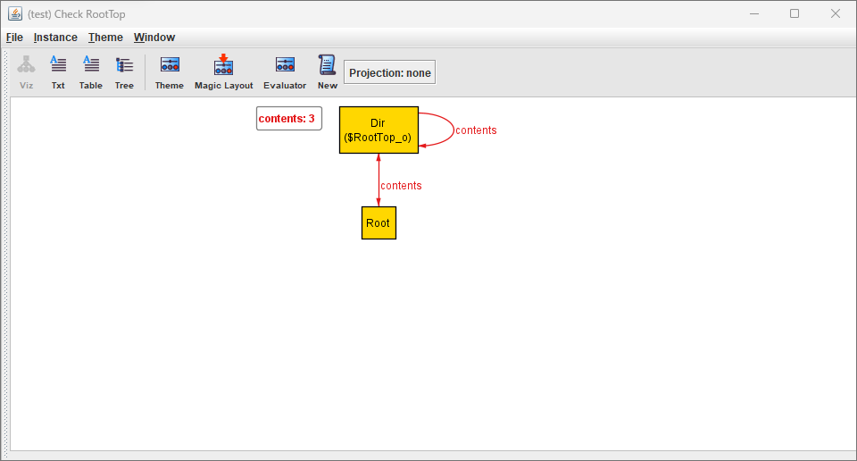

# Alloy

Alloy は、構造を記述するための言語であり、構造を探索するためのツールです。セキュリティメカニズムの穴の発見から電話交換網の設計まで、幅広い用途で使用されています。

> Alloy is a language for describing structures and a tool for exploring them. It has been used in a wide range of applications from finding holes in security mechanisms to designing telephone switching networks.
> 
> https://alloytools.org/about.html

Alloyは次のような特徴を持つ。

- 一階の関係論理に基づく仕様言語
- SATソルバーによって制約の充足例や反例を網羅的に探索する

Alloyでファイルシステムのモデルを記述して、特定の性質を検証する例を見ていく。
まずは、ファイルとディレクトリを次のように定義する。

```Alloy
sig File, Dir {}
```

`sig`で宣言されるシグネチャはオブジェクトの集合を表す。
シグネチャのインスタンスは`File0`や`Dir0`などで表される。



次に、ディレクトリは任意個のファイルを持つ、という性質を集合`Dir`と集合`File`の間の関係(relation)`contents`として定義する。

```Alloy
sig File {}
sig Dir {
    contents : set File
}
```



関係はシグネチャのフィールドのような形で定義する。
‘set‘は集合多重度を表し、以下のような種類がある、

集合多重度
- set 任意個
- one ちょうど1個
- lone 0か1個
- some 1個以上

次は、ディレクトリにディレクトリがある入れ子構造をモデル化してみる。

```Alloy
abstract sig Object {}

sig File extends Object {}
sig Dir extends Object {
    contents : set Object
}

pred SomeDirInDir {
    some disj d1, d2 : Dir | d2 in d1.contents
}
run SomeDirInDir
```

`sig A extends B`という宣言は、AがBの部分集合であることを示す。
`abstract`で宣言されたシグネチャは、それ自身は要素を持たないことを示す。
上の例では、‘Dir‘と‘File‘は‘Object‘の部分集合であることを表し、関係‘contents‘を‘Object‘への関係としている。

上の例の後半では、Alloyの解析器を使って特定の制約を満たすインスタンス例を探索させようとしている。
`pred`は述語の宣言であり、Alloyで検査したい制約を定義する。
‘SomeDirInDir‘は、「`d1.contents`に`d2`が含まれるような`d1`,`d2`が存在する」、つまりディレクトリの入れ子構造が存在する、という制約になっている。
（‘disj‘は‘d1‘と‘d2‘は異なるものであることを示している。）

`.`は関係演算子で、関係の結合を表す。
関係`R1 = s_1 -> ... -> s_m`と関係`R2 = t_1 -> ... -> t_n`があるとき、関係同士の結合は`R1.R2 = s_1 -> ... -> s_m-1 -> t2 -> ... -> tn`という意味になる。
`d1.contents`は`d1`が単項関係、`contents`が2項関係の結合となっている。

`run`コマンドは、与えられた述語の充足例を探索するコマンド。
これをAlloyで実行するといくつかの充足例を表示することができる。



今度は、モデルが満たすべき制約を`assert`として定義して、反例がないか検査する。
`assert`は`pred`と同じように制約を定義するもので、`check`コマンドによってその制約の反例がないか検査するのにつかわれる。
以下の例は、`all o : Object | some contents.o`という制約で、「すべての`o : Object`について、`contents.o`が1つ以上存在する」、つまりすべてのディレクトリ・ファイルは何かのディレクトリに所属している、という制約になっている。

```Alloy
abstract sig Object {}

sig File extends Object {}
sig Dir extends Object {
    contents : set Object
}

assert SomeDir {
    all o : Object | some contents.o
}
check SomeDir //NG
```

この`assert`をAlloyで実行すると、ファイルが単体で存在する反例が見つかる。

```
Starting the solver...

Executing "Check SomeDir"
Solver=sat4j Bitwidth=4 MaxSeq=4 SkolemDepth=1 Symmetry=20 Mode=batch
Generating CNF...
146 vars. 18 primary vars. 214 clauses. 1ms.
Solving...
Counterexample found. Assertion is invalid. 2ms.
```



ディレクトリ・ファイルが必ず何かのディレクトリに所属するように、モデルを変更する。
以下の例は、新しく`Root`というディレクトリを追加している。
`fact`は`pred`や`assert`と同じように制約を定義するが、`fact`に定義された制約は常に成り立つ。
ここでは、`all o : Object | o in Root.*contents`として、「すべての`o : Object`は、`Root`から`contents`を0回以上適用した集合に含まれる」、つまりすべてのディレクトリ・ファイルはルートディレクトリからたどれる、という制約になっている。
(`*`は関係の反射推移閉包。)

この例でも同じように、`assert SomeDir`をチェックする。
ただし、ルートディレクトリはどのディレクトリにも含まれないはずなので、`all o : Object - Root`で`Root`を除いている。
(`-`は集合差の演算子。)

```Alloy
abstract sig Object {}

sig File extends Object {}
sig Dir extends Object {
    contents : set Object
}

one sig Root extends Dir {}

fact {
    all o : Object | o in Root.*contents
}

assert SomeDir {
    all o : Object - Root | some contents.o
}
check SomeDir //OK
```

`check SomeDir`を検査すると、反例は見つからないため`assert`の制約は満たされていると考えられる。

```
Starting the solver...

Executing "Check SomeDir"
Solver=sat4j Bitwidth=4 MaxSeq=4 SkolemDepth=1 Symmetry=20 Mode=batch
Generating CNF...
No counterexample found. Assertion may be valid. 0ms.
```

先ほどの「ルートディレクトリはどのディレクトリにも含まれないはず」というのが本当なのかも検証する。
以下のように`no o: Object | Root in o.contents`で、「`o.contents`に`Root`が含まれるような`o : Object`は存在しない」という制約を検査する。

```Alloy
abstract sig Object {}

sig File extends Object {}
sig Dir extends Object {
    contents : set Object
}

one sig Root extends Dir {}

fact {
    all o : Object | o in Root.*contents
}

assert SomeDir {
    all o : Object - Root | some contents.o
}
check SomeDir //OK

assert RootTop {
    no o: Object | Root in o.contents
}
check RootTop //NG
```

`check RootTop`を検査すると、以下の反例が見つかる。
`contents`がループしているような例になっている。



ループをさせないように`fact`に制約を追加する。
`no o : Object | o in o.^contents`は、「`o`から`contents`を1回以上適用した集合に`o`自身が含まれるような`o : Object`は存在しない」という制約になる。
(`^`は関係の推移閉包。)

```Alloy
abstract sig Object {}

sig File extends Object {}
sig Dir extends Object {
    contents : set Object
}

one sig Root extends Dir {}

fact {
    all o : Object | o in Root.*contents
    no o : Object | o in o.^contents
}

assert SomeDir {
    all o : Object - Root | some contents.o
}
check SomeDir //OK

assert RootTop {
    no o: Object | Root in o.contents
}
check RootTop //OK
```

`check RootTop`を検査すると、反例は見つからない。
Alloyは有限の範囲内での組み合わせで充足例・反例を探索している。
デフォルトでは各インスタンスが4個までの範囲で探索しているが、`check RootTop for 10`のように範囲を増やすこともできる。

```Alloy
abstract sig Object {}

sig File extends Object {}
sig Dir extends Object {
    contents : set Object
}

one sig Root extends Dir {}

fact {
    all o : Object | o in Root.*contents
    no o : Object | o in o.^contents
}

assert SomeDir {
    all o : Object - Root | some contents.o
}
check SomeDir for 10//OK

assert RootTop {
    no o: Object | Root in o.contents
}
check RootTop for 10//OK
```

範囲を増やしても反例は見つからないため、`assert`の制約は妥当だと考えられる。


## 余力があれば

```Alloy
abstract sig Object {}
sig File, Dir extends Object {}
one sig Root extends Dir {}

sig FS {
    contents : Dir -> set Object,
    live : set Object
} {
    all o : live | o in Root.*contents
    no o : live | o in o.^contents
    contents in (live -> live)
    Root in live
}

assert SomeDir {
    all fs : FS |
    all o : fs.live - Root | some (fs.contents).o
}
check SomeDir

assert RootTop {
    all fs : FS |
    no o: fs.live | Root in o.(fs.contents)
}
check RootTop

pred rmFile(fs1, fs2 : FS, f : File) {
    f in fs1.live and
    fs2.contents = fs1.contents - ((fs1.contents).f -> f)
}

assert rmFileOkay {
    all disj fs1, fs2: FS, o: File |
    rmFile [fs1, fs2, o] => fs2.live = fs1.live - o
} 
check rmFileOkay
```


# 参考
- Alloy, https://alloytools.org/about.html
- 抽象によるソフトウェア設計 ― Alloyではじめる形式手法 第1版, https://www.ohmsha.co.jp/book/9784274068584/
- Software Abstractions: Models Repository, http://softwareabstractions.org/models/a4-models-index.html
- Tutorial for Alloy Analyzer 4.0, https://alloytools.org/tutorials/online/index.html

