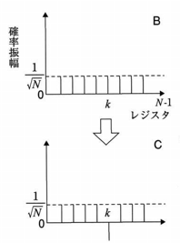

# 量子計算の紹介
量子ビットと量子ゲートによって構成される量子回路による量子計算について紹介する。

## 量子ビット
### ブロッホ球
量子ビットの状態はブロッホ球と呼ばれる球面上の１点として表される。
Z軸は0と1それぞれの重み(確率)を、XY平面は位相を示す。
球面を指す矢印がZ軸正の端のとき`|0>`、Z軸負の端のとき`|1>`と書く。
  
_竹内繁樹. 量子コンピュータ 超並列計算のからくり. 図4-16より_

### 重ね合わせ
量子ビットの重ね合わせ状態とは`|0>`と`|1>`がそれぞれある割合の重みを持っている状態を指す。
例えば、ある量子ビットがブロッホ球の赤道上に位置するとき、`|0>`と`|1>`が同じ重みで重なっている状態を表す。
  
_竹内繁樹. 量子コンピュータ 超並列計算のからくり. 図4-19より_

### 観測
量子ビットの値を結果として得るためには観測と呼ばれる操作を行う。
量子ビットは観測されると`|0>`と`|1>`の重みに応じて**確率で`|0>`か`|1>`のどちらかが検出される。**

例えば上のような`|0>`と`|1>`の重みが同じである（ブロッホ球の赤道上に位置する）とき、その量子ビットを観測すると50%の確率で`|0>`か`|1>`が検出される。

## 量子ゲート
量子ゲートとは量子ビットに作用させることで演算を行う量子回路を構成する基本要素である。
古典論理回路でANDゲートとNOTゲートの２種で任意の回路が構成することができたように、量子回路では回転ゲートと制御NOTゲートで任意の量子回路を構成することができる。

### 回転ゲート
回展ゲートはある軸回りに一定の角度回転させる操作を量子ビットに作用させる。

  
_竹内繁樹. 量子コンピュータ 超並列計算のからくり. 図4-20より_

#### Pauliゲート
角度πだけ回転させるゲートをPauliゲートと呼び、X軸,Y軸,Z軸回りに回転させるものをそれぞれPauli-X, Pauli-Y, Pauli-Zと呼ぶ。
例えば、`|0>`にPauli-Xゲートを適用すると`|1>`となる。

#### Hadamardゲート
X=Zとなる軸周りに角度πだけ回転させるゲートをHadamardゲートと呼ぶ。
Hadmardゲートを`|0>`にPauli-Xゲートを適用すると`|0>`と`|1>`が等しく重なった状態となる。
さらにもう一度Hadmardゲートを適用すると元の`|0>`へ戻される。

  
_竹内繁樹. 量子コンピュータ 超並列計算のからくり. 図4-22より_

### 制御NOTゲート
制御NOTゲートは２つの量子ビットを入力にうけとり、２つの量子ビットを出力する。
制御ビット`|a>`が`|1>`の場合のみ信号ビット`|b>`を反転させる。

  
_竹内繁樹. 量子コンピュータ 超並列計算のからくり. 図4-23より_

## 重ね合わせによる並列計算
上記の量子ビットと量子ゲートを組み合わせることで量子計算を行うことができる。
量子計算の強みは量子ビットの重ね合わせ状態を利用することで超並列な計算が可能となる点である。

例えば制御NOTゲートを例に見てみる。
制御NOTゲートは２つの量子ビットを入力に持ち、`|00>`, `|01>`, `|10>`, `|11>`の４通りの入力が存在する。
当然これらの４つの入力のうち１つを制御NOTゲートに入力すると、対応した１つの出力が得られる。

量子回路が従来の古典論理回路と異なる点は**入力に重ね合わせ状態の量子ビットをとることができる**点である。
下の図は入力の制御ビット`|a>`に対して`|0>`と`|1>`の重ね合わせ状態を、信号ビット`|b>`に対して`|0>`を入力した場合を示す。

  
_竹内繁樹. 量子コンピュータ 超並列計算のからくり. 図4-24より_

これは、入力が`|ab> = |00> + |10>`のように２通りの状態の重ね合わせとなっている。
そしてその入力に制御NOTゲートを適用した結果は`|cd> = |00> + |11>`という重ね合わせの状態として得られる。

このように、量子回路は１回の演算で２通りの入力に対する計算が可能である並列性を持つ。
同様にN量子ビットを用いれば2^N通りの入力に対する計算を一度に行うことが可能である。

#### 補足
逆に言えば、重ね合わせを用いない量子回路において量子ビットは古典ビットと同じふるまいとなる。つまり、量子回路は古典論理回路をエミュレートすることが可能である。

## 量子アルゴリズム
N量子ビットを用いれば2^N通りの入力に対する計算を一度に行うことが可能であることが分かったが、実はそのままでは意味のある結果を得ることはできない。

例えば１量子ビット同士の足し算を行う量子回路について考えてみる。

  
_竹内繁樹. 量子コンピュータ 超並列計算のからくり. 図4-25より_

これは入力`|a>`と`|b>`の足し算の結果を`|c>`と`|c'>`に出力する回路である。
ここで、入力`|a>`と`|b>`をそれぞれ重ね合わせ状態にすると入力のすべての組み合わせの計算ができる。

実際に`|abcc'> = |0000> + |0100> + |1000> + |1100>`という重ね合わせ状態でこの量子回路に入力すると、`|abcc'> = |0000> + |0110> + |1010> + |1101>`という重ね合わせ状態の出力が得られる。
この出力の重ね合わせ状態は`0+0=0`, `0+1=1`, `1+0=1`, `1+1=2`という４通りの計算結果の重ね合わせであり４つの足し算が並列に計算されたことを示す。

しかし、この出力から情報を得ようと「観測」をしても`0+0=0`, `0+1=1`, `1+0=1`, `1+1=2`の４つのうちどれか１つだけが確率で得られる。つまり４通りの足し算の結果がでたらめに１つ得られるだけで、４通りすべての計算結果が同時に得ることはできない。

そのため、量子アルゴリズムでは重ね合わせの計算結果から「特徴を抽出する」操作によって目的の計算結果を得るようにアルゴリズムを組む。

### Groverのアルゴリズム
重ね合わせの計算結果から特徴を抽出する例としてGroverのアルゴリズムを紹介する。

Groverのアルゴリズムはデータベースの探索問題で、Nビットのアドレス空間を持つデータベースから目的の中身を持つアドレスを探索する量子アルゴリズムである。
古典論理回路ではソートされていないデータベースから目的の値を持つアドレスを探索しようとすると最悪の場合で`2^N`回データベースに問い合わせが発生する。
ところが、量子回路を用いたGroverのアルゴリズムではデータの探索が`√(2^N)`回で可能となる。

量子回路によるデータベースを次のように構成する。
- 量子データベース回路は４ビットのアドレスを入力にとり、出力は入力したアドレスがそのままでてくる
- ただし、特定のアドレス(検索対象のアドレス)の場合のみ出力の位相が反転する

  
_竹内繁樹. 量子コンピュータ 超並列計算のからくり. 図5-6より_

このような量子データベース回路から目的のアドレスを探索したい場合、すべてのアドレスビットを重ね合わせ状態にして入力すれば良い。
重ね合わせによってアドレスが`|0000>`から`|1111>`のすべてのパターンについての計算結果が得られる。

重ね合わせによる計算結果は下図のようになり、特定のアドレスビットのパターン`k`のみ位相が反転している。
しかし、この重ね合わせの出力を観測しても`|0000>`から`|1111>`のすべてのパターンから１つが等しい確率で得られるだけで意味のある結果はとれない。

  
_竹内繁樹. 量子コンピュータ 超並列計算のからくり. 図5-9より_

そこでGroverのアルゴリズムでは「折り返し回路」によって重ね合わせの出力から特定のパターン`k`のみ抽出する。
折り返し回路は入力された重ね合わせ状態にあるビット列に対して、確率振幅の平均値を中心に各ビットの確率振幅を折り返す回路である。

  
_竹内繁樹. 量子コンピュータ 超並列計算のからくり. 図5-10より_

この折り返し処理によって特定のアドレスパターン`k`の確率振幅が大きくなり、この状態の重ね合わせの出力を観測すると`k`が得られやすくなる。
さらにデータベース回路と折り返し回路を繰り返しつなげていくと`k`の確率振幅が１に近づき他のパターンの確率振幅は０に近づく。
およそ`√(2^N)`個のデータベース回路と折り返し回路をつなげると`k`の確率振幅が１になる。

  
_竹内繁樹. 量子コンピュータ 超並列計算のからくり. 図5-8より_

## IBM Quantum Computing
IBMがクラウド上で量子計算を実行することができるサービスを提供している。
ビギナー向けにグラフィカルなインターフェースで量子回路を設計できる[Composer](https://quantumexperience.ng.bluemix.net/qx/editor)がある。

[実際に4bitのGroverのアルゴリズム回路をComposerで構成したもの](https://quantumexperience.ng.bluemix.net/share/code/5b6993adb2e101003a4bacd6/execution/5b6994624217e60038b3f931)
(この回路は書籍や論文を見て構成したわけではないので間違っている可能性もあります)

# 参考文献
- 竹内繁樹. 量子コンピュータ 超並列計算のからくり. 講談社, 2005.
- [IBM Quantum Computing で計算してみよう](https://www.ibm.com/developerworks/jp/cloud/library/cl-quantum-computing/index.html)
